## Cloud Computing

### Definition

Cloud computing lets you use servers, storage, and applications on the Internet instead of owning or managing your own hardware. It’s an easy, flexible, and cost-effective way to get the technology you need without the hassle.

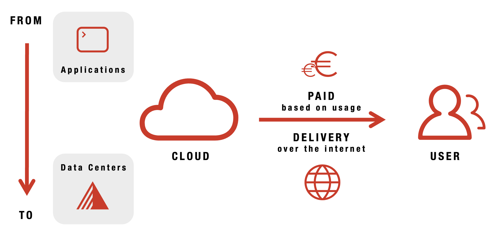

## Service Models

### Explained

Cloud service models let you easily use software, development tools, or virtual computers over the Internet. This gives your organization more flexibility and the ability to grow, without having to manage complex IT systems yourself.

#### Software as a Service (SaaS) 
* Provides ready-to-use applications over the Internet.
* No need to install or maintain software on your own devices.
* Access applications through a web browser or app.
* Offers easy scalability and flexibility at a lower cost.

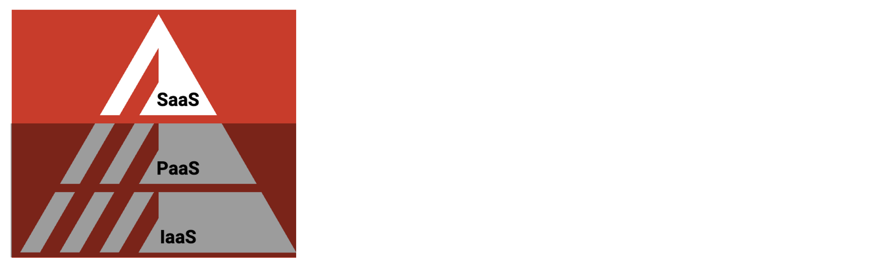

#### Platform as a Service (PaaS) 
* Provides developers with a complete online environment for building, testing, and deploying applications.
* All necessary tools and infrastructure are included.
* Developers don’t need to manage servers or system setup.
* Enables easy scaling and collaborative development.

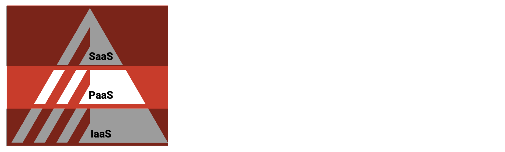

#### Infrastructure as a Service (IaaS) 
* Delivers virtual servers, storage, and networking over the cloud.
* The provider manages physical hardware, while users control their virtual resources.
* Offers high flexibility and scalability.
* No need for users to invest in or maintain hardware.

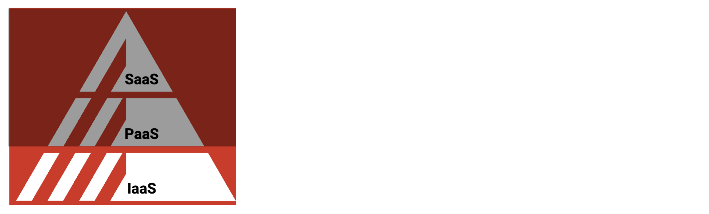

## Deployment Models

### Explained

Cloud deployment models are different ways to set up cloud services, such as public, private, or hybrid (mixed). Each model offers its own mix of access, control, security, and cost, so organizations can choose the one that best fits their needs.

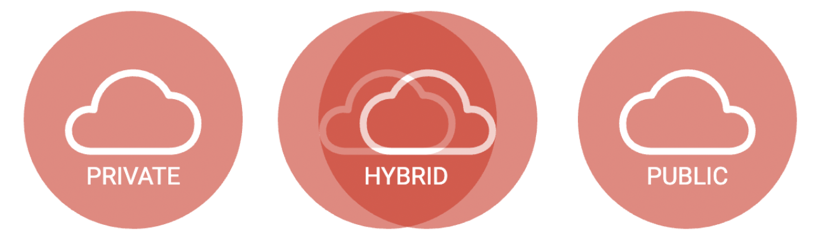

#### Private Cloud
* Cloud resources are used exclusively by one organization.
* Infrastructure can be on-site or hosted in a provider's Virtual Private Cloud (VPC).
* Greater control, customization, and security over data and infrastructure.
* Managed by the organization or by a third-party provider.
* Ideal for organizations with strict data security or compliance needs.

#### Hybrid Cloud
* Combines private (on-premises or VPC) and public cloud resources in one flexible setup.
* Allows moving data and workloads between private and public clouds as needed.
* Offers the benefits of both models: control and security from private, flexibility and scalability from public.
* Helps optimize costs, enhance performance, and address specific business needs.
* Suitable for organizations seeking both security and efficient scalability.

#### Public Cloud
* The cloud provider owns and manages all physical infrastructure (servers, storage, network, etc.).
* Users access resources (like computing power and storage) over the internet.
* Services are available to anyone and can be scaled quickly as needed.
* Pay only for what you use—no need to buy or maintain hardware.
* Best for cost savings, scalability, and reducing IT management complexity.

## Scenarios

### Overview

These three models illustrate different stages of cloud use. You can start by just moving your current systems as they are (“Lift & Shift”), then make some improvements while driving (“Improve & Move”), or go further by entirely redesigning everything to work best in the cloud (“Design & Build”).

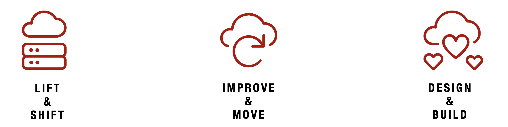

### Use Cases IaaS 

#### Lift & Shift
* Moves existing applications to the cloud with minimal or no changes.
* Keeps current processes and management tools from the existing data center.
* Does not use many cloud-native features or capabilities.
* Fastest migration, but less efficient in taking advantage of cloud benefits.

#### Improve & Move
* Modifies and optimizes IT processes during migration to use some cloud-native features.
* Aims for more automation and standardization.
* Helps shed legacy limitations and improves efficiency.
* Balances familiarity with the gradual adoption of cloud enhancements.

#### Design & Build
* Completely rethinks and redesigns business and IT processes for the cloud.
* Uses cloud-native and agile development methods throughout.
* Emphasizes automation, DevOps practices, and Infrastructure-as-Code (IaC).
* Delivers maximum flexibility, efficiency, and modern capabilities.

## Overview

### History

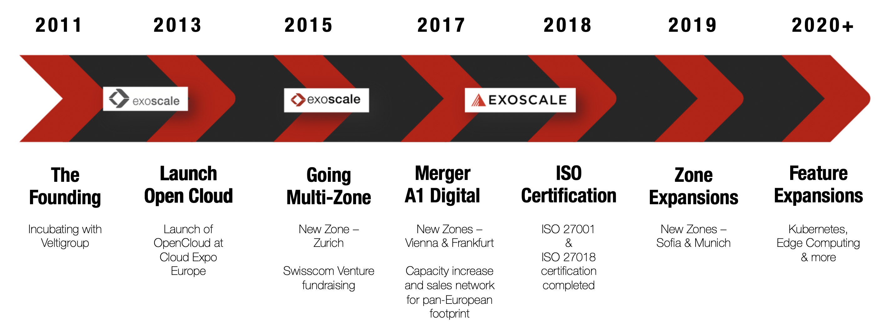

### Cloud Market Today 

> _There are many options for cloud services today, offering tools to fit all business needs._

#### Why IaaS?  
IaaS (Infrastructure as a Service) is a cloud model that can extend or even replace your own data center. Trends show more companies are moving to the cloud because it’s flexible and easy to scale. By 2028, most IT systems will run in public clouds, while using your own hardware will become less common.

#### Who uses IaaS?  
IaaS is popular because you can quickly start and stop servers as needed, avoiding the hassle of buying and maintaining physical computers. It reduces costs and makes IT simpler for businesses of all sizes.

#### Who uses Exoscale?  
Engineers and companies across Europe trust Exoscale to help run their important cloud applications. Our expert team has helped many clients move and grow their projects in the cloud.

#### Why Exoscale?  
Exoscale focuses on strong security and privacy. We follow strict data laws, especially the GDPR. Your data stays in the country where you started it—like Austria, for example. We run data centers in Switzerland, Austria, Germany, Bulgaria, and Croatia, and we follow industry-leading certifications to keep your information safe.

### Why Exoscale Details

Exoscale is a European cloud company focused on ease of use, environmental friendliness, and protecting your digital independence. On top of these values, there are 12 more reasons why Exoscale could be the perfect fit for you.

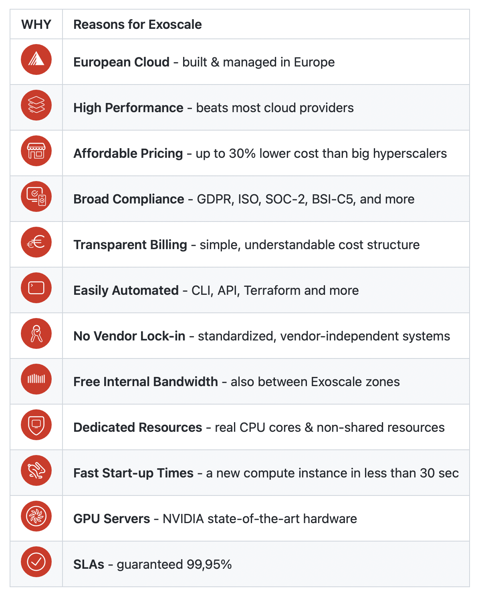

> “At Exoscale, we’re a team of IT operations veterans turned cloud enthusiasts, building a solid European alternative cloud platform. Our focus on cloud native technologies empowers European teams to develop the applications of the future on a powerful, user-friendly platform.” — Exoscale, a trademark of Akenes SA, Switzerland

### Simple, Sovereign & Sustainable 

#### Local Data Centers
We have up-to-date data centers all over Europe. Your data is kept close, secure, and protected by strong local privacy laws. Fast, reliable connections mean your services always run smoothly.

#### Flexible Cloud Choices  
Exoscale gives you different ways to use the cloud. Pick public cloud for easy growth or private cloud for extra privacy—whatever works best for your business. You can easily adjust as your needs change.

#### Easy-to-Use Interfaces
Our tools are designed so anyone can use them, no matter the size of your team. It’s simple to set up secure servers, control who can access what, and look after your applications—all in just a few steps.

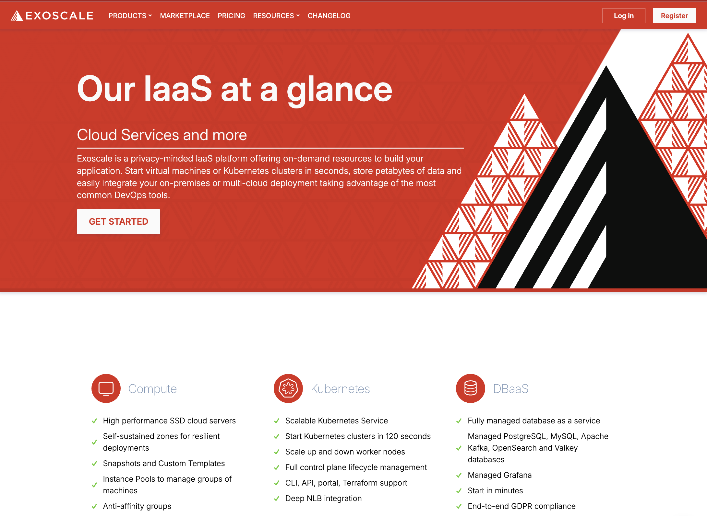

#### CNCF Certified Kubernetes
The Exoscale Scalable Kubernetes Service (SKS) is officially certified by the Cloud Native Computing Foundation (CNCF) through the Certified Kubernetes Conformance Program. This certification guarantees full data portability and ensures that the service supports all required Kubernetes APIs. As a result, organizations gain greater flexibility in choosing providers and can more easily establish multi-cloud or hybrid cloud environments.

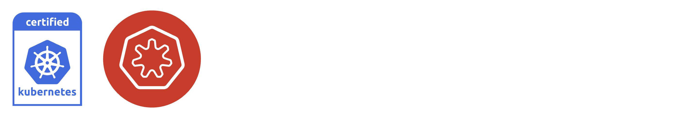

## Unique Selling Points

### Exoscale

Exoscale is a European cloud company that delivers fast, reliable services at clear, fair prices. Your data stays private and protected under strict European laws. With secure data centers in Europe and easy pay-as-you-go billing, Exoscale is a trustworthy choice for businesses of all sizes.

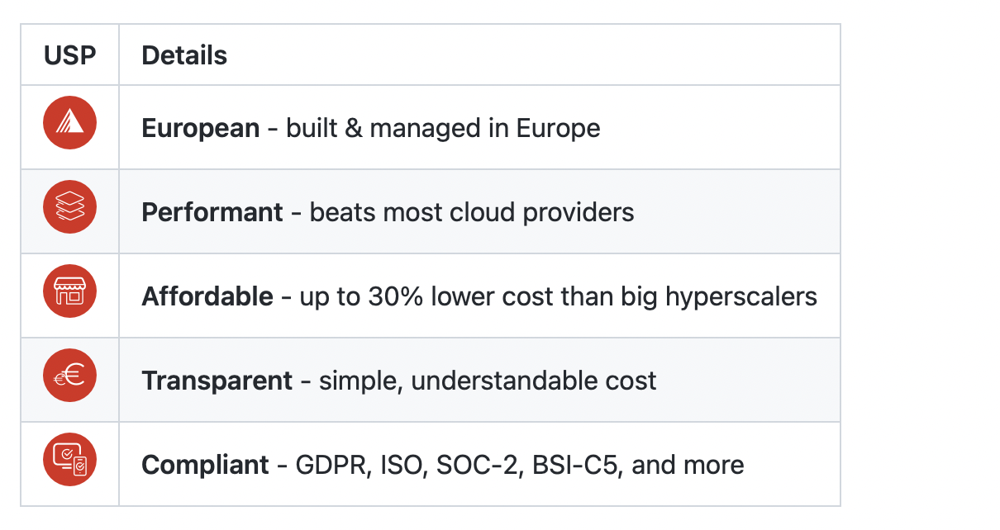

#### European
We use top-quality, secure data centers in central Europe to deliver both high performance and strong data protection.

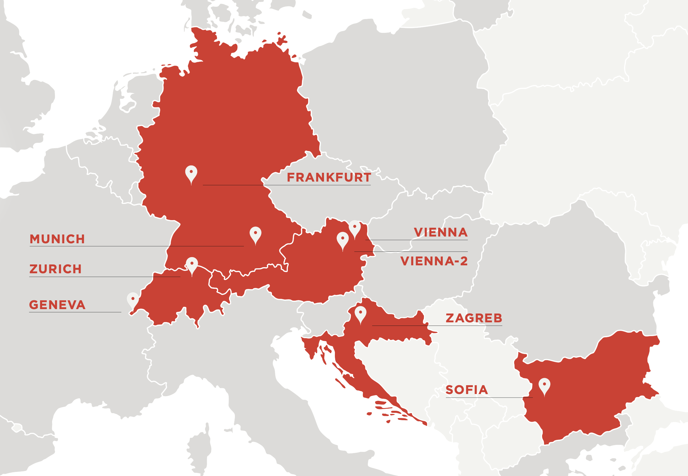

#### Performant
__Single Score__ *

* CPU Performance 
* Non-transparent Bars

__Multi Score__ *

* System Performance 
* Transparent Bars

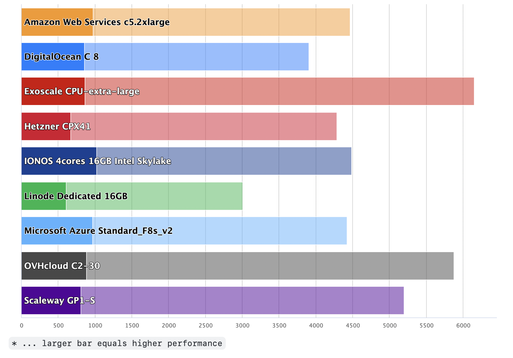

[cloud-mercato.com](https://cloud-mercato.com) 

#### Affordable
All prices shown are based on what vendors charge for using servers in European data centers, with pay-as-you-go options and no long-term contracts. 

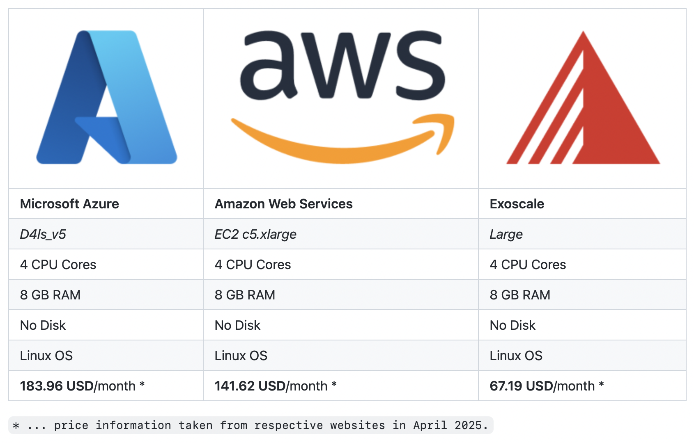

#### Transparent
You only pay for what you use, down to the second, with no upfront payments or long-term contracts. You can use resources whenever you need them and change your usage at any time, without extra fees. 
	
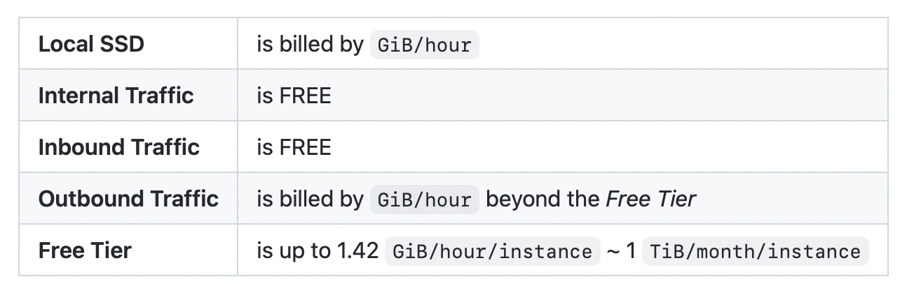

Our standard servers offer a good balance of processing power, memory, and fast storage, making them suitable for many tasks. For a simple view of our standard server prices, visit our [Exoscale Pricing](https://www.exoscale.com/pricing/) page.

#### Compliant
With Exoscale, your data is processed and stored in full compliance with strict European privacy laws (GDPR). Because Exoscale is a European provider, your information is not affected by U.S. regulations like the Cloud Act, giving you extra peace of mind about data privacy and control.

## Compliance

### GDPR vs CLOUD Act

#### EU GDPR
The GDPR (_General Data Protection Regulation_) is a European law that protects your personal data. All companies in the EU must follow it, and there are penalties if they don’t.

#### US CLOUD Act 
The CLOUD Act (_Clarifying Lawful Overseas Use of Data Act_) is a US law that can require US companies to give personal data to the US government if asked. Not following it can mean fines or jail time.

> __! NOTE__
If a company doesn’t follow GDPR rules, it can be fined up to €20 million or 4% of its total worldwide income, whichever is higher. 

### Exoscale's Compliance Frameworks

### Exoscale's Compliance Web
Exoscale follows important security standards from around the world and is checked by top auditors. This means businesses of all kinds can safely and easily use our cloud services.

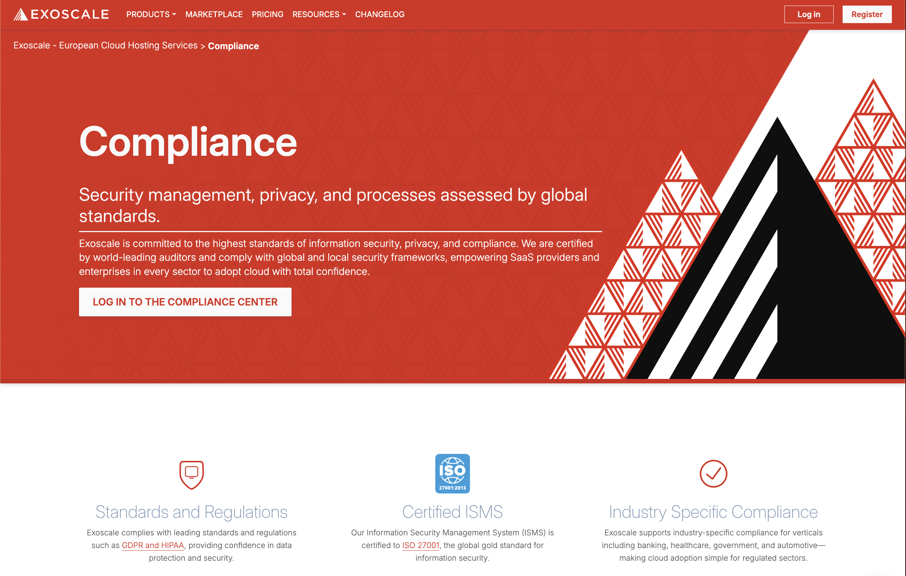

[exoscale.com/compliance/](https://www.exoscale.com/compliance/)

### Exoscale's Compliance Center
Exoscale helps you meet important industry and government rules. You can find all the details about our compliance in our Compliance Center.

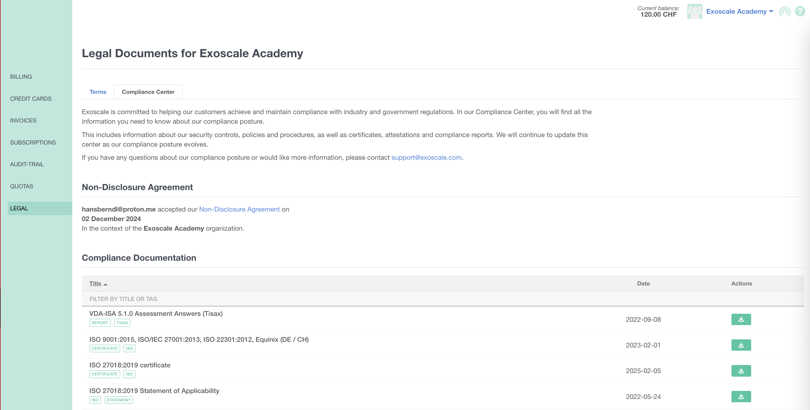

In our Compliance Center, you’ll find details about our security measures, policies, certificates, and reports. We keep this information up to date. If you have questions or want to know more, just reach out to us.

[support@exoscale.com](mailto:support@exoscale.com)

## Community

### Exoscale Documentation

Our easy-to-use documentation helps you get started and make the most of Exoscale’s services, step by step.  

[community.exoscale.com/](https://community.exoscale.com/)

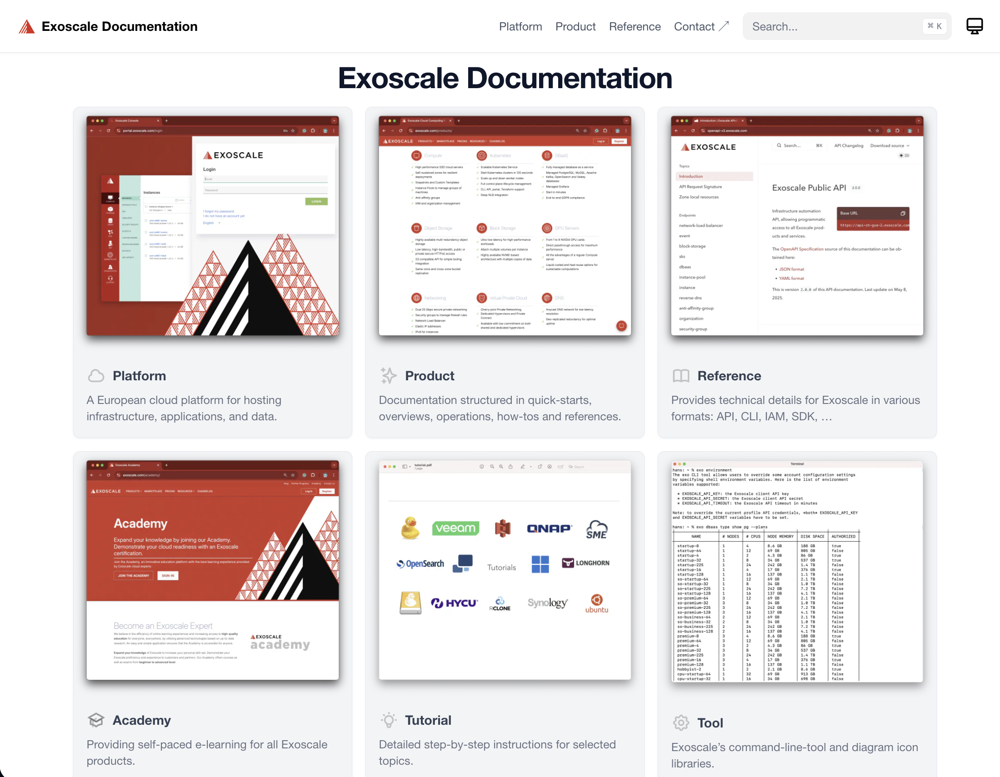

Everything is sorted into six main sections: Platform, Product, Reference, Academy, Tutorial, and Tool—so it’s easy to find what you need.

#### Sections
The Product section lets you see everything available on Exoscale.

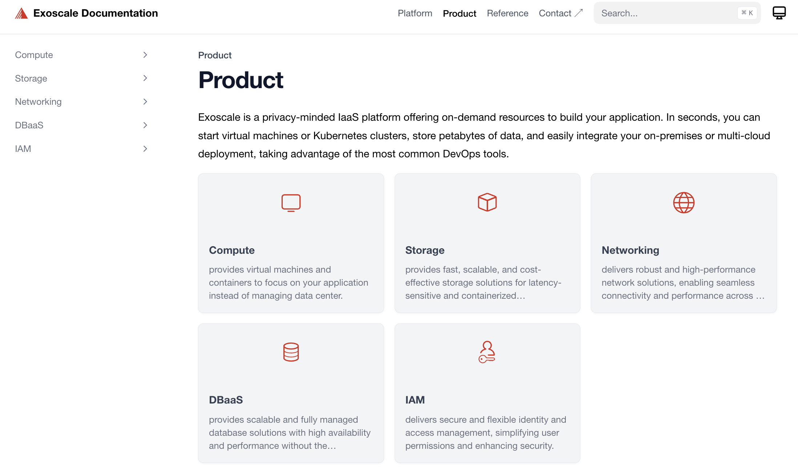

#### Categories
Each section contains categories. For example, the Compute category includes servers (Instances) and containers (SKS).

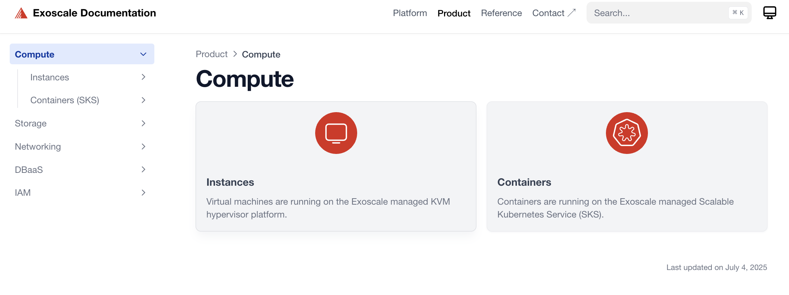

#### Guides
Every product has its own guide, and they’re all laid out the same way. You can easily browse and find information without needing to search.

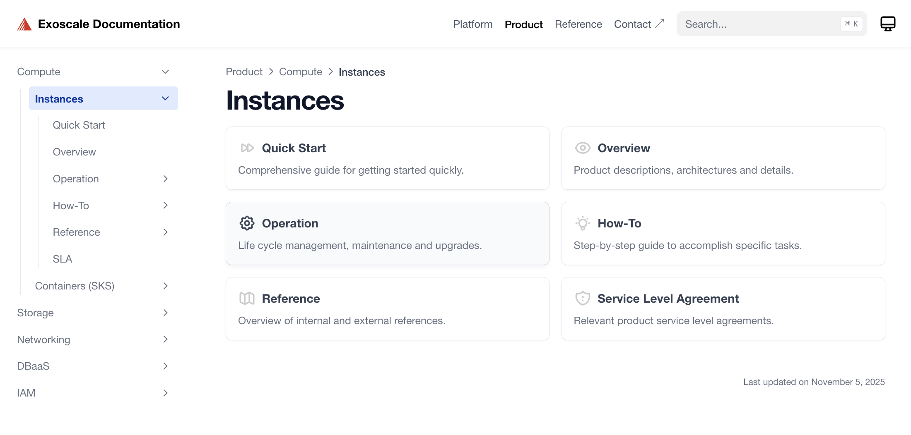

Each guide includes six main parts: Quick Start for fast setup, Overview for details, Operation for managing and updates, How-To for step-by-step help, Reference for more info, and a Service Level Agreement for that product.

#### Quick Start
If you’re new to a product, start with Quick Start. It helps you get up and running quickly.

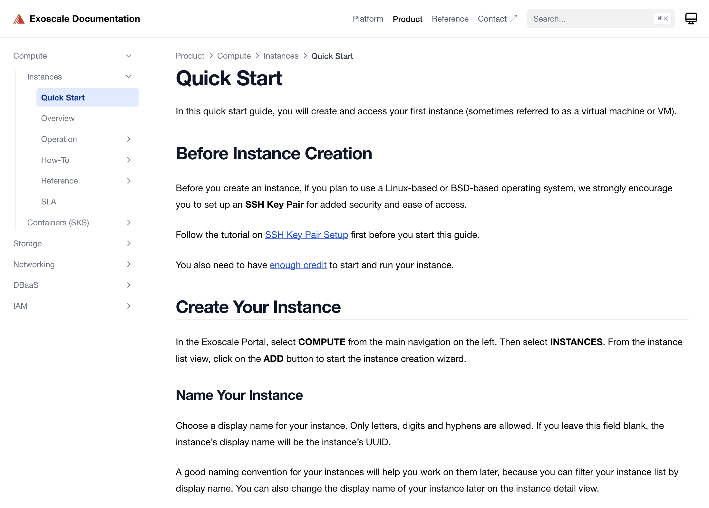

## Integrations

### Available for Exoscale

We use and support popular tools to make working with Exoscale easy.

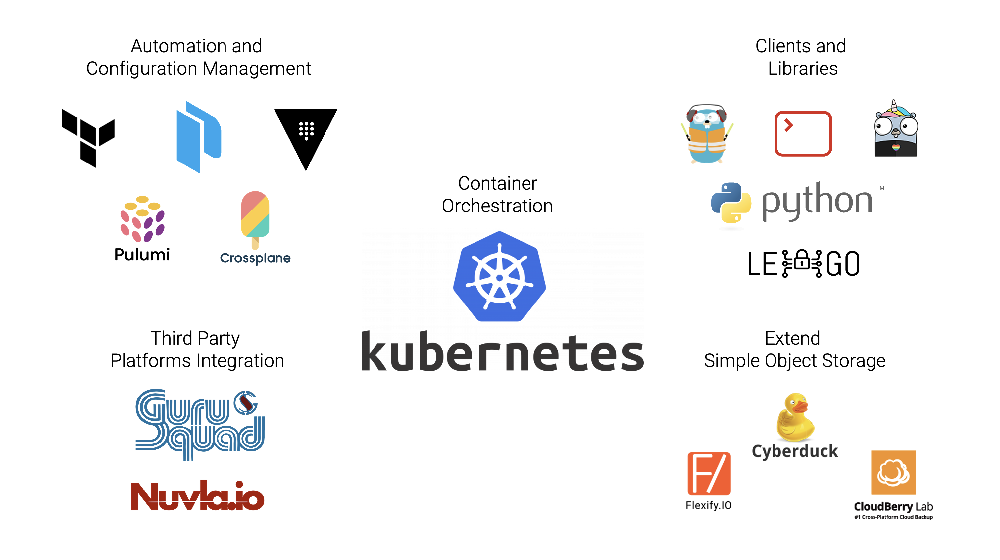

### Container Orchestration
Cloud tools use containers to help you easily build, send, and run your apps.

#### Kubernetes
Kubernetes is a popular tool for managing groups of containers. Exoscale offers an easy-to-use, managed Kubernetes service.

#### Cloud Controller Manager
This tool helps connect Kubernetes clusters more closely with Exoscale, so everything works smoothly together.

#### NGINX Ingress Controller
The recommended way to set up the NGINX Ingress Controller on Exoscale for easier traffic management.

---

### Configuration Management and Automation
We use time-saving, automated tools to help you manage everything in the cloud.

#### Terraform
Terraform lets you set up and organize all your cloud resources, from servers to domain names, using simple instructions.

#### Packer
This tool helps you create ready-to-use machine images on Exoscale.

#### Vault
Vault helps you safely manage and create security keys for your Exoscale services.

#### Pulumi
Pulumi is a tool that makes building and running cloud apps simpler, and helps teams work together.

#### Crossplane
Crossplane lets you manage different cloud services easily, without writing any code.

---

### Clients and Libraries
We offer easy-to-use tools and programs to help you work with Exoscale.

#### Traefik
A modern traffic manager and load balancer that works well with Exoscale.

#### CLI
A simple command line tool to help you control Exoscale services from your computer.

#### Egoscale
A helper tool for developers who want to connect their software directly to Exoscale.

#### Python
A tool for those who use the Python programming language to interact with Exoscale.

#### Lego
Automates setting up security certificates for your websites and works with Exoscale’s DNS service.

---

### Third-party Platform Integrations
You can connect Exoscale with other popular platforms.

#### GuruSquad
An easy solution for saving, moving, and copying large amounts of data, whether it’s on Exoscale, another cloud, or your own servers.

#### Nuvla.io
Lets you quickly launch and manage your applications from the cloud to local devices—with extra flexibility.

---

### Object Storage Extensions
Use extra tools with Exoscale’s Object Storage to manage your files.

#### Cyberduck
A free app for securely moving and organizing files, available for Windows, Mac, and Linux.

#### Flexify.IO
Helps you copy files smoothly between Exoscale and other cloud or in-house storage.

#### CloudBerry
Tools for Windows that let you browse, back up, and work with files easily on Exoscale.

## References

### Overview

### CERN - powered by Exoscale
> _Big science, big computing power._

* Supported the Helix Nebula Science Cloud project  
* Gave access to 10,000 computer cores  
* Helped 1.7 million scientists work together  
* Made it easy to store, share, and use research data

### whalebone - powered by Exoscale
> _Blocks harmful software and keeps data safe._

* Protects against viruses and malware  
* Handles large amounts of data quickly  
* Backs up important information  
* Can automatically start new servers when needed

### SchoolFox - powered by Exoscale
> _Secure and easy school communication._  

* Connects teachers and parents safely  
* Moved their service to Exoscale for better privacy  
* Choose Exoscale because it follows strict GDPR rules  
* Switched from one type of cloud service to another for flexibility

## IaaS+

### Overview

Infrastructure as a Service is the cloud service model we support with the Exoscale platform and a bit more, hence, IaaS+.

### Platform

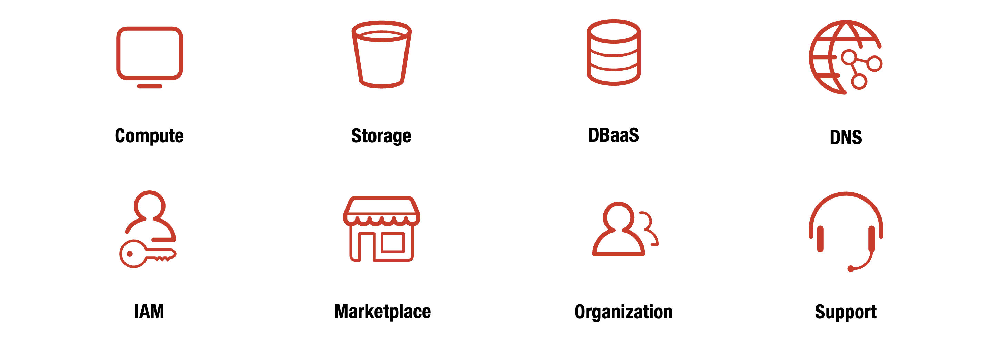

## Compute

### Overview

Exoscale is a complete and flexible cloud platform that helps businesses of any size. It offers powerful servers, easy networking, and simple tools to manage everything in one place.

#### Instances
> _Exoscale Instances: Powerful & Easy Cloud Servers_

* Flexible and scalable virtual machines  
* Dedicated resources for strong performance  
* Supports your own system images  
* Simple integration with Exoscale networking and storage  
* Reliable and easy to manage  
* Control through website, app, or automation tools  
* Great for many types of projects and businesses

#### Instance Pools
> _Exoscale Instance Pools: Manage Many Servers Easily_

* Quickly create and manage groups of identical servers  
* Automate setup and updates for all servers at once  
* Easily add or remove servers as needed  
* Built for reliable and flexible cloud applications

#### SKS (Scalable Kubernetes Service)
>Exoscale SKS: Easy Managed Kubernetes

* Run and manage containers without the hassle  
* Automatic setup and management of Kubernetes clusters  
* Connects smoothly with Exoscale cloud features  
* Effortless scaling and updates  
* Reliable and efficient for your apps and services

#### Block Storage
> _Exoscale Block Storage: Reliable Cloud Storage_

* Attach powerful storage to your cloud servers  
* Keeps your data safe and always available  
* Easily increase space when you need it  
* Great for apps that handle lots of data

#### Templates
> _Exoscale Templates: Fast & Easy Server Setup_

* Quickly launch new servers with ready-made images  
* Ensures all servers have the same setup  
* Can include special settings or pre-installed apps  
* Makes starting new projects simple and consistent

#### Security Groups
> _Exoscale Security Groups: Easy Cloud Protection_

* Control who can connect to your cloud servers  
* Set simple rules for safety and privacy  
* Keep your apps and data secure  
* Helps you manage security in one place

#### Elastic IP
> _Exoscale Elastic IP: Stay Connected with a Fixed Address_

* Gives your cloud server a permanent, public address  
* Easy to move to another server if needed  
* Ensures constant, reliable connections  
* Supports smooth changes and quick recovery

#### Load Balancers
> _Exoscale Network Load Balancer: Smoothly Share the Work_

* Spreads visitor traffic across several servers  
* Keeps your apps available and running fast  
* Automatically checks server health  
* Handles lots of visitors with speed and reliability

#### Private Networks
> _Exoscale Private Networks: Safe, Separated Connections_

* Create your own private space for servers in the cloud  
* Let servers talk securely, just to each other  
* Keep different apps or environments separate  
* Adds extra privacy and protection for your data

#### SSH Keypairs
> _Exoscale SSH Keys: Simple & Secure Server Access_

* Log in to servers without a password  
* Manage access to all your servers in one place  
* Makes connecting to cloud resources safe and easy

#### Anti-Affinity
> _Exoscale Anti-Affinity Groups: Extra Reliability for Important Servers_

* Keeps your servers on separate physical machines  
* Reduces the risk of outages  
* Helps keep critical apps running smoothly and reliably

## Storage

### Overview

Exoscale’s storage makes it easy to keep your data safe, organized, and quickly available anywhere in the world. It’s designed to work smoothly with your existing tools and helps you manage and share files easily and affordably.

### SOS - Simple Object Storage
> _Exoscale Object Storage: Safe & Scalable File Storage_

* Store and manage lots of files easily  
* Keeps your data safe with extra copies  
* Great for photos, backups, and important documents  
* Your files always stay in their original location  
* Affordable and grows with your needs

### CDN - Content Delivery Network
> _Exoscale CDN: Fast Global Delivery for Your Files_

* Speeds up your websites and apps by caching files worldwide  
* Uses Akamai’s delivery network for great performance  
* Easy to connect with Exoscale file storage (SOS)  
* Makes your content quick and reliable for users everywhere

## DBaaS

### Overview

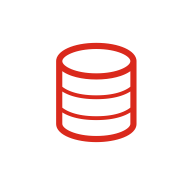

Exoscale’s Database as a Service lets you quickly set up and use secure, ready-to-go databases in the cloud. It handles updates, security, and privacy rules, so you can focus on your projects without worrying about database management.

> _Exoscale DBaaS: Easy, Secure Cloud Databases_

* Quickly set up powerful, ready-to-use databases  
* Data is always protected with encryption  
* No need to worry about updates or maintenance  
* Supports popular open-source database options  
* Reliable, compliant, and managed for you

### DBaaS Products

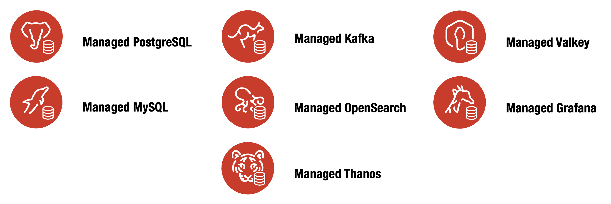

## DNS

### Overview

Exoscale’s DNS service makes sure your websites and apps are always easy to find and quick to access, no matter where your users are. It’s reliable, automatic, and built to keep everything running smoothly.

> _Exoscale DNS: Simple & Reliable Domain Management_

* Easily manage website addresses and records  
* Fast, always-on service with worldwide reach  
* Flexible pricing—pay per domain zone  
* Supports easy redirects and advanced features  
* Built-in security with Let's Encrypt for safe connections

## IAM

### Overview

Exoscale IAM helps you safely control who can access different parts of your cloud, making it easy to manage permissions for your team and services.

> _Exoscale IAM: Control Who Can Access Your Cloud_

* Manage who can use or change your cloud resources  
* Set permissions for team members or automated tools  
* Keeps your data and services secure  
* Helps with safety rules and easier team management

## Marketplace

### Overview

Exoscale Marketplace lets you quickly add ready-made apps and services to your cloud, making it simple to grow and improve your projects.

> _Exoscale Marketplace: Ready-to-Use Cloud Solutions_

* Browse and choose from pre-built apps and services  
* Quickly add tools to your cloud with just a few clicks  
* Access everything online or from your Exoscale dashboard  
* Easily scale your projects with trusted solutions

## Organization

### Overview

The Organization section helps you easily manage payments, usage, subscriptions, and account details—all in one place—so you have full control and a clear view of everything in your Exoscale account.

> _Exoscale Billing: All Your Cloud Payments in One Place_

* Manage accounts, invoices, and payments easily  
* See clear details on your resources and usage  
* Keep track of activity and stay compliant  
* Access everything securely from the Exoscale Portal

## Support

### Overview

Exoscale’s support services give you the help you need, with options from free support for everyone to 24/7 expert assistance for businesses. This way, you always get the right level of help for your needs.

> _Exoscale Support: Help When You Need It_

* Manage all your support requests in one place  
* Choose a support plan that fits your needs  
* Options from free help to 24/7 expert support  
* Fast response times and dedicated help for businesses  
* Reliable, scalable assistance for every user

## Cloud-Native

### The Four Pillars

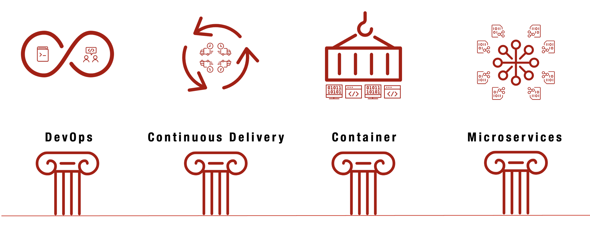

### Why Cloud-Native?

> _Cloud-native means delivering better software faster, with greater reliability and lower cost._

#### Scalability
Easily handles more users or traffic when needed, without slowing down.

#### Agility
Let's you quickly build, test, and release new features or updates.

#### Resilience
Keeps working even if part of the system fails, so there’s less downtime.

#### Flexibility
Can run on different clouds, giving you more choices and freedom.

#### Cost-Efficiency
Grows or shrinks automatically, helping you save money by only using what you need.

## DevOps

### Explained

DevOps brings software and IT teams together to work as one, using automated tools. 
This helps companies build, test, and release software faster and with fewer errors. DevOps improves teamwork and makes it easier to respond to changes. 
While it can be more challenging in large systems or when security isn't well managed, DevOps is growing in popularity because it helps deliver better software more quickly and reliably.

## Continuous Delivery

### Explained

Continuous Delivery is a way for companies to automatically build, test, and release software updates with little manual work. 
This means updates can happen faster and more reliably, so businesses can quickly meet customer needs. 
It saves developers time and helps catch problems early, improving software quality. 
Setting up Continuous Delivery can take some effort and new tools, but it helps businesses deliver better software more often and with fewer errors.

## Container

### Explained

Containers are lightweight, portable packages that include everything an app needs to run, keeping apps separate and consistent wherever they run—on any computer or in the cloud. 
They make it easy to move, update, and manage software, and are great for businesses that need to grow quickly. 
While containers require some special tools and careful setup, they are a popular, flexible way to run and manage today’s software.

## Microservices

### Explained

Microservice architecture means building software as a group of small, independent parts, each with its own job. 
These parts talk to each other but can be updated or scaled separately, making it easier to add features or fix problems. 
This approach gives businesses more flexibility and can save resources, but managing many parts can be complex and requires strong teamwork and communication.

