## Container

### Application Deployment

Observing the evolution of application deployment highlights the advantages that containers offer.

#### Traditional Deployment
Initially, organizations ran applications directly on physical servers, lacking resource boundaries between applications. This often led to resource contention and underperformance. Running each application on its own server solved this but resulted in underutilized resources and high costs.

#### Virtualized Deployment
Virtualization addressed these challenges by allowing multiple virtual machines (VMs) to run on a single physical server. VMs isolate applications, improve resource utilization, enhance security, and simplify scalability and management. Each VM operates as a complete system, including its own OS, on virtualized hardware.

#### Container Deployment
Containers take virtualization further by sharing the host OS while maintaining isolated environments for applications. This makes containers lightweight, portable, and efficient. Containers encapsulate their own file system, CPU, memory, and process space, enabling consistency and flexibility across different clouds and operating systems.

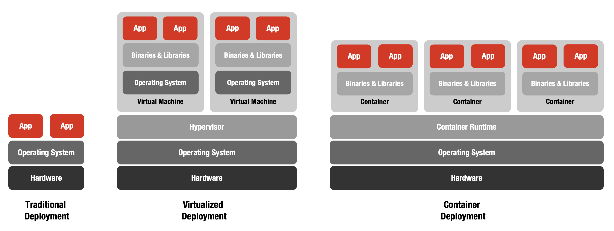

#### VIDEO
[Container](https://sos-de-fra-1.exo.io/exoscale-academy/videos/cce-container-01.mp4)


### Sample App

This sample app demonstration shows how traditional software deployment looks. A little JavaScript spins up a web server and runs the sample app on the server. It demonstrates how easy it is to run web-based applications, but you must install and run Node.js beforehand. In addition, you have to use the proper versions of the software components and take care of all dependencies (runtime environments, libraries, etc.). Otherwise, the app will not run properly.


This is the source code of our sample app:

```JavaScript
const express = require('express')
const app = express()
const port = 3000
app.get('/', (req, res) => { 
    res.send('Hello World!')
})
app.listen(port, () => {
    console.log(`Example app listening at http://localhost:${port}`)
})
```

Take the code into action:

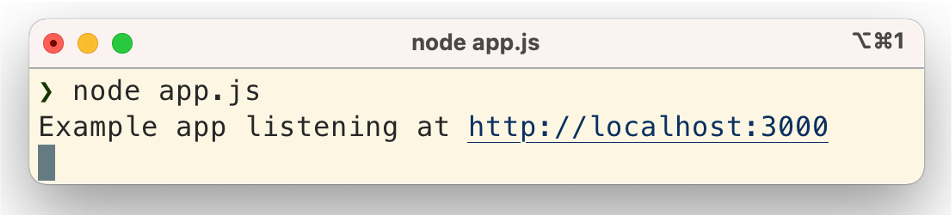

The application at work, displaying Hello World!:

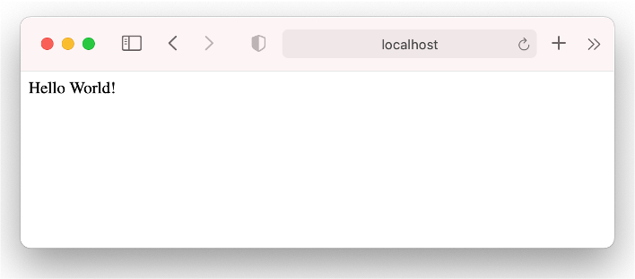

Look behind the curtain and see how this software approach works; the demo video shows you the significant steps necessary to run the `node.js` sample app.


### Running Apps

Let’s revisit the steps required to run our Node.js sample app.

#### What do I need to run an app in a container?

- The correct version of Node.js
- All required app dependencies (easily managed with a package manager like NPM)

#### As your application grows, you may also need:

- A database (along with its setup and configuration)
- A private network for secure communication between services

Running an app in a container requires the right runtime and dependencies. As your application grows, you’ll often need additional services like databases and secure networking, making containers a flexible foundation for scalable and complex applications.


### Dependencies

#### Installing Dependencies

Containers simplify dependency management by packaging all necessary software and dependencies together, eliminating the need for manual installation steps like setting up repositories or installing runtimes and libraries on the host system (e.g. Ubuntu).

##### Install Repository
`$ curl -fsSL https://deb.nodesource.com/setup_current.x | sudo -E bash –sudo apt-get update`

##### Install NodeJS
`$ sudo apt-get install -y nodejs`

##### Install Dependencies of the App
`$ npm install`

#### Running Apps

Containers make running applications straightforward: you simply start the container, and the app runs automatically—eliminating manual setup and ensuring a consistent environment every time.

##### Run App
`$ node app.js` 


### Containers

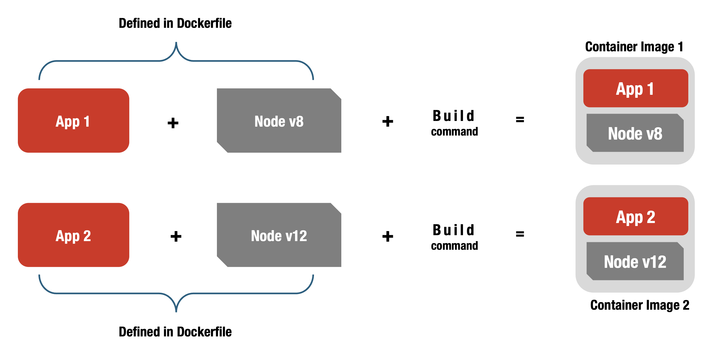

Containers package applications and their dependencies into isolated, portable units, making deployment and management consistent across different environments.

#### VIDEO
[Sample App](https://sos-de-fra-1.exo.io/exoscale-academy/videos/cce-container-02.mp4)

#### VIDEO
[DEMO: Sample App](https://sos-de-fra-1.exo.io/exoscale-academy/videos/cce-demo-sample-app.mp4)


### Dockerfile

- `FROM node:22-alpine`  
  Sets the base image.

- `RUN apk add --no-cache python g++ make`  
  Installs extra tools needed by the app.

- `WORKDIR /app`  
  Sets the working directory to `/app`.

- `COPY . .`  
  Copies all files from your project into the container.

- `RUN npm install`  
  Installs app dependencies.

- `CMD ["node", "src/index.js"]`  
  Starts the app.

A Dockerfile automates creating a container by defining the setup steps. This ensures your app runs the same way every time you deploy.


### Build & Run

#### `docker build`
In our example, the first step is to build the `hello-world` container with the `> docker build` command.

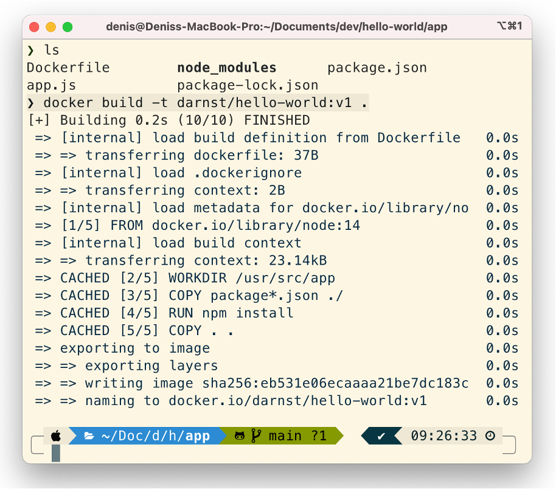

#### `docker run`
In our example, the second step is to run the `hello-world` container with the `> docker run` command.

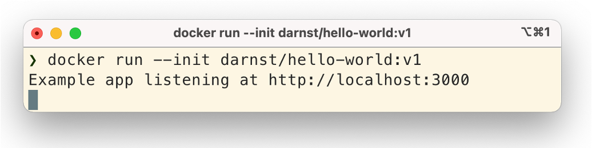

Building and running containers is simple: use `docker build` to create a container image, then `docker run` to launch the container. This process ensures consistent, repeatable application deployment.

#### VIDEO
[Dockerfile](https://sos-de-fra-1.exo.io/exoscale-academy/videos/cce-container-03.mp4)

#### VIDEO
[DEMO: Dockerfile](https://sos-de-fra-1.exo.io/exoscale-academy/videos/cce-demo-dockerfile.mp4)


### Docker Hub

Docker Hub provides a convenient, publicly available repository for managing, storing, retrieving, and sharing container images. Unlike traditional IT, where custom solutions are often needed, the container ecosystem includes services like Docker Hub by default. For Docker containers, Docker Hub offers a simple, integrated way to use and distribute container images.

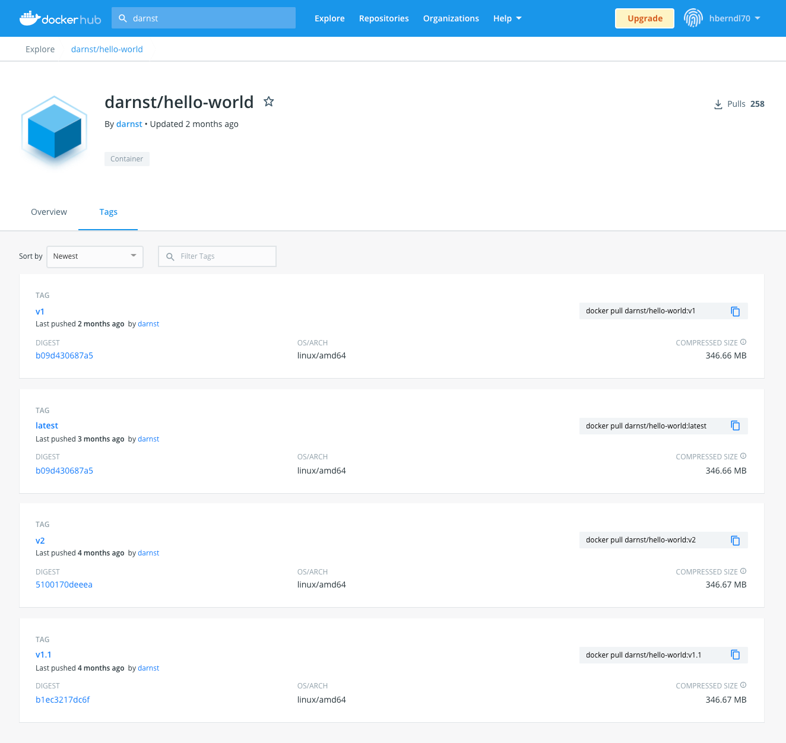

#### VIDEO
[Docker Hub](https://sos-de-fra-1.exo.io/exoscale-academy/videos/cce-container-04.mp4)

#### VIDEO
[DEMO: Docker Hub](https://sos-de-fra-1.exo.io/exoscale-academy/videos/cce-demo-dockerhub.mp4)

## What's next?

### From Docker To Kubernetes

Docker makes it easy to run containerized applications locally or on a server. However, as your environment grows to dozens or hundreds of applications, you need advanced tools to automate, coordinate, and scale workloads efficiently. 

Kubernetes provides this orchestration, allowing you to manage containers at scale, ensure high availability, and maintain flexible operations. With Kubernetes, you can build a robust, scalable infrastructure that meets the demands of modern, always-on operations, such as those enabled by Exoscale.

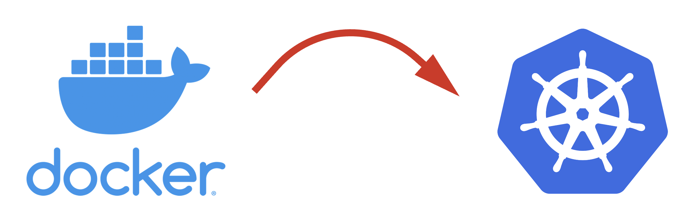

#### VIDEO
[What's next?](https://sos-de-fra-1.exo.io/exoscale-academy/videos/cce-container-05.mp4)


## Kubernetes

#### VIDEO
[Kubernetes](https://sos-de-fra-1.exo.io/exoscale-academy/videos/cce-kubernetes-01.mp4)


## Basic Commands

### Basic Commands

It’s time to get hands-on with Kubernetes. In this section, we’ll introduce some fundamental `kubectl` commands to help you interact with your cluster. 
```
$ kubectl version
$ kubectl get nodes
$ kubectl get pods

```

You’ll learn how to check your cluster’s status, list resources, and explore variations of common commands. To understand this new world, let's examine some simple applications of the `kubectl` command.

#### Variations of: `kubectl get pods`
```
$ kubectl get pods --all-namespaces
$ kubectl get pods -A
$ kubectl get pods –n namespacename
$ kubectl get pods –o wide

```

Here are some common variations of the `kubectl get pods` command, allowing you to list pods across all namespaces, specify a particular namespace, or display more detailed information.


### Simple Examples

Let's start with basic examples using `hello-world` and `ubuntu` containers to get hands-on Kubernetes experience.

#### `hello-world` Container  
This command creates a new Pod named `test-app` running the `darnst/hello-world` image, which deploys a simple Node.js web server.
```
$ kubectl run test-app --image=darnst/hello-world

```

#### `ubuntu` Container  
This command opens an interactive terminal session in a Pod running Ubuntu, which is automatically removed after exit.

This command launches an interactive Ubuntu shell session:
```
$ kubectl run my-shell -i --rm --tty --image=ubuntu -- bash

```

#### VIDEO
[Basic Commands](https://sos-de-fra-1.exo.io/exoscale-academy/videos/cce-kubernetes-02.mp4)

## Cluster

### Cluster Structure

Let's examine the Kubernetes Cluster and its components. Although it is a complex structure, the beauty of SKS is that we manage the complexity. Kubernetes as a managed service remains a very flexible solution because the possibility of shaping the services with add-ons makes it very customizable.

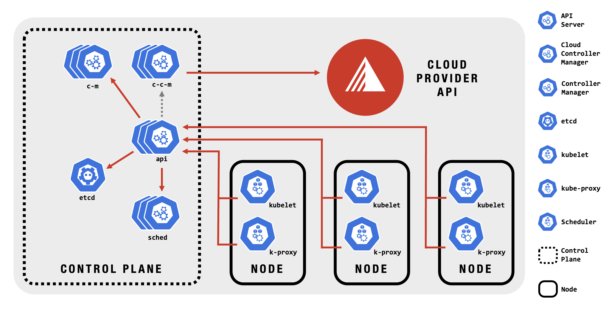

#### VIDEO
[Cluster](https://sos-de-fra-1.exo.io/exoscale-academy/videos/cce-kubernetes-03.mp4)


## Resources

### Resources

Before you start deploying applications with Kubernetes, it’s important to understand its core building blocks. In this section, we’ll introduce important Kubernetes resources that form the backbone of scalable and reliable cloud-native applications.

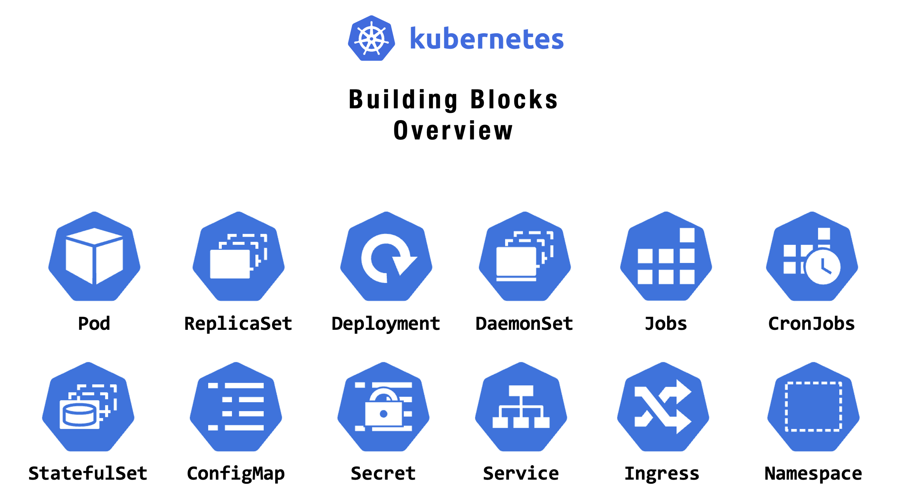

### Pod
A Pod is the smallest deployable unit in Kubernetes, comprising one or more containers that share storage, networking, and configuration. Containers in a Pod use the same IP address and port space, facilitating easy communication and resource sharing, while remaining isolated from other Pods. Pods are typically used to host tightly coupled application components that need to run together.


#### Pod - Key Features 
* __Smallest Deployable Unit__    
Represents a single instance of a running process in a cluster.
* __Multiple Containers Support__   
Can host one or more tightly coupled containers.
* __Shared Resources__    
Containers inside a pod share storage volumes, a network IP, and port space.
* __Managed by Controllers__    
Higher-level objects like Deployments or ReplicaSets are used for scaling and recovery, often managing pods.
* __Ephemeral by Design__   
Pods can be created, destroyed, and replaced dynamically as needed.
* __Unique IP Address__   
Each pod gets a unique IP within the cluster for communication and service discovery.
* __Flexible Use Cases__    
Suitable for single app instances, sidecar patterns, or tightly integrated tasks.
* __Co-located Processes__    
Containers can communicate over localhost and share data through volumes.

#### Pod - Details 
Pods are the basic building blocks to run containers inside of Kubernetes. Every Pod holds at least one container and provides a shared network namespace for its containers, while the container runtime handles the control of the container’s execution. If all containers terminate, the Pod terminates too. Mounting storage, setting environment variables, and feeding information into the container are done on the Pod level. Pods are the smallest deployable units of computing that you can create and manage in Kubernetes.

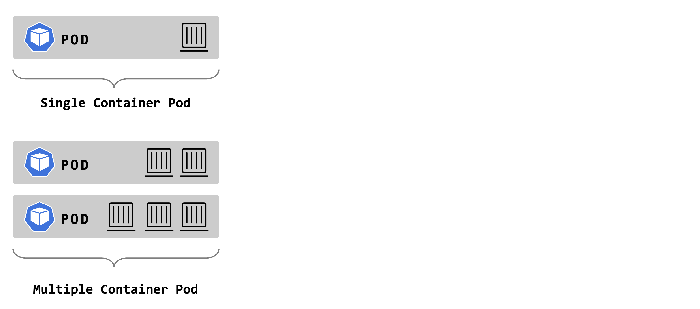

#### Pod - Example
```
apiVersion: v1
kind: Pod
metadata:
  name: hello-pod
spec:
  containers:
    - name: hello
      image: busybox
      command: ["sh", "-c", "echo Hello, Kubernetes! && sleep 3600"]
```

#### VIDEO
[Pod](https://sos-de-fra-1.exo.io/exoscale-academy/videos/cce-resources-01.mp4)

### ReplicaSet

A ReplicaSet in Kubernetes ensures that a specified number of identical Pod replicas are running at all times. It automatically manages Pod replication, creation, and replacement in response to failures or scale changes, providing high availability, scalability, and fault tolerance for applications. ReplicaSets are often used as part of Deployments, allowing easy rolling updates and rollbacks.


#### ReplicaSet - Key Features
* __Ensures Pod Count__   
Maintains a specified number of identical pod replicas at all times.
* __Self-healing__    
The system automatically replaces failed or deleted pods to match the desired state.
* __Label Selectors__   
Uses selectors to identify and manage its pods by matching labels.
* __Scaling__   
Supports manual or automatic scaling of pod replicas.
* __Supports Rolling Updates__    
Enables non-disruptive updating of applications via integration with Deployments.
* __Works with Services__   
Pairs with services to help load-balancing network traffic across pods.
* __Declarative Management__    
The desired state is set through a manifest; the ReplicaSet handles enforcement.

#### ReplicaSet - Details
A ReplicaSet's purpose is to maintain a stable set of replica Pods running at any given time to guarantee the availability of a specified number of identical Pods. However, a Deployment is a higher-level concept that manages ReplicaSets and provides declarative updates to Pods and other useful features. Therefore, Deployments are recommended instead of using ReplicaSets directly.

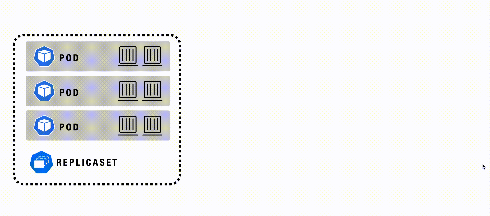

#### ReplicaSet - Example
```
apiVersion: apps/v1
kind: ReplicaSet
metadata:
  name: nginx-replicaset
spec:
  replicas: 3
  selector:
    matchLabels:
      app: nginx
  template:
    metadata:
      labels:
        app: nginx
    spec:
      containers:
        - name: nginx
          image: nginx:1.25
          ports:
            - containerPort: 80
```

#### VIDEO
[ReplicaSet](https://sos-de-fra-1.exo.io/exoscale-academy/videos/cce-resources-02.mp4)

### Deployment

A Deployment in Kubernetes automates the management, scaling, and rollout of containerized applications across a cluster. It manages ReplicaSets and Pods, ensuring the actual state matches the desired state. Deployments provide a declarative, reliable way to update and roll back applications as needed.


#### Deployment - Key Features 
* __Declarative Updates__    
Enables controlled, predictable updates of containerized applications.
* __Manages ReplicaSets and Pods__    
Automatically creates, scales, and manages ReplicaSets and their Pods.
* __Rollouts and Rollbacks__    
Supports rolling updates and easy rollback to previous versions.
* __Self-healing__    
Restores failed Pods and maintains the desired state automatically.
* __Scaling__   
This feature allows manual or automatic scaling of applications.
* __Declarative Configuration__   
Uses YAML or JSON manifests to define application state.
* __Version History__   
Keeps a history of revisions for auditing and rollback.
* __Zero Downtime__   
Supports rolling updates to minimize application disruption.

#### Deployment - Details
A Deployment is a higher-order abstraction that controls the deployment and maintenance of a set of Pods. Behind the scenes, it uses a ReplicaSet to keep the Pods running, while offering sophisticated logic for deploying, updating, and scaling a set of Pods within a cluster. Deployments support rollbacks and rolling updates. Rollouts can be paused if needed.

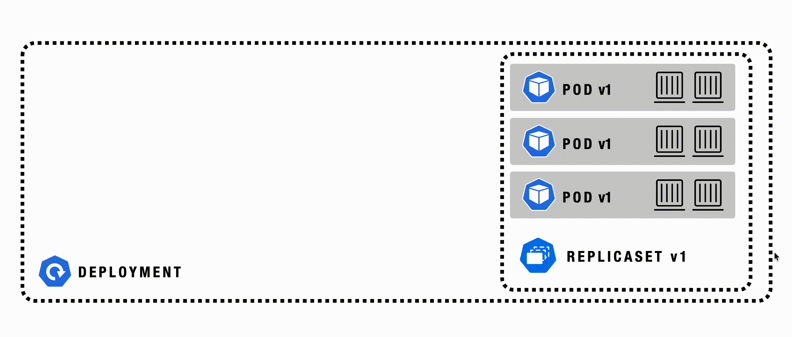

#### Deployment - Example
```
apiVersion: apps/v1
kind: Deployment
metadata:
  name: hello-deployment
spec:
  replicas: 2
  selector:
    matchLabels:
      app: hello
  template:
    metadata:
      labels:
        app: hello
    spec:
      containers:
        - name: hello
          image: busybox
          command: ["sh", "-c", "echo Hello, Deployment! && sleep 3600"]
```
#### VIDEO
[Deployment](https://sos-de-fra-1.exo.io/exoscale-academy/videos/cce-resources-03.mp4)

#### VIDEO
[DEMO: Deployment](https://sos-de-fra-1.exo.io/exoscale-academy/videos/cce-demo-deployment.mp4)

### DaemonSet

A Kubernetes DaemonSet ensures that a copy of a specific Pod runs on all or selected nodes in a cluster. It’s used to automatically deploy system-level services or background tasks that need to run on each node, such as monitoring agents or log collectors.


#### DaemonSet - Key Features 
- **Node-wide Pod Distribution**    
Ensures a copy of a Pod runs on all or selected nodes in the cluster.
- **Automated Deployment**    
The system automatically adds Pods to new nodes as they join the cluster.
- **Central Management**    
Allows management of node-level services from a single configuration.
- **Self-healing**    
The system replaces Pods on nodes if they fail or get deleted.
- **Selective Scheduling**    
This policy supports running Pods only on nodes matching specific labels.
- **System-level Workloads**    
This is ideal for running agents, log collectors, or monitoring tools on every node.
- **Consistent State**    
Ensures specified services are always present on target nodes.

#### DaemonSet - Details
DaemonSets are used to ensure essential components are automatically deployed and running on every node in the cluster. 

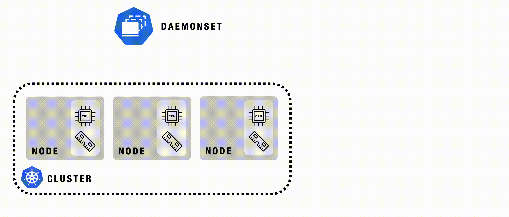

#### DaemonSet - Example
```
apiVersion: apps/v1
kind: DaemonSet
metadata:
  name: hello-daemonset
spec:
  selector:
    matchLabels:
      app: hello-daemon
  template:
    metadata:
      labels:
        app: hello-daemon
    spec:
      containers:
        - name: hello
          image: busybox
          command: ["sh", "-c", "echo Hello from every node! && sleep 3600"]
```

#### VIDEO
[DaemonSet](https://sos-de-fra-1.exo.io/exoscale-academy/videos/cce-resources-04.mp4)

### Job

A Job in Kubernetes is a resource that manages the execution of one or more Pods to completion. 
Unlike Deployments or ReplicaSets, which maintain ongoing applications, a Job ensures that a specified number of Pods run and finish successfully—for example, for a batch task, script, or data processing job. Once the work is complete, the Job ends, making it ideal for one-off or scheduled tasks.


#### Job - Key Features 
* __Guaranteed Completion__   
Ensures a specified number of Pods successfully finish their task.
* __Pod Management__    
Automatically creates, replaces, or restarts Pods as needed until the job is done.
* __Parallelism Support__   
Can run multiple Pods in parallel for faster or distributed work.
* __Retry on Failure__    
Retries Pods that fail execution, ensuring reliable completion.
* __Supports CronJobs__   
Can be used with CronJobs for scheduled, recurring batch tasks.
* __Automatic Cleanup__   
Optionally cleans up finished Pods automatically.

#### Job - Example
``` 
apiVersion: batch/v1
kind: Job
metadata:
  name: simple-job
spec:
  template:
    spec:
      containers:
        - name: hello
          image: busybox
          args:
            - /bin/sh
            - -c
            - echo "Hello from Kubernetes Job!"
      restartPolicy: OnFailure
```
**This Job**

- Runs a single Pod that prints a hello message.
- The Job is completed when the command finishes successfully.

#### VIDEO
[Job](https://sos-de-fra-1.exo.io/exoscale-academy/videos/cce-resources-05.mp4)

### CronJob

A CronJob is a workload object that runs jobs on a recurring schedule, similar to Unix cron jobs. It automates task execution within the cluster at specified times or intervals, making it useful for scheduled tasks like backups, report generation, or sending notifications.


#### CronJob - Key Features 
* __Scheduled Execution__   
Runs Jobs automatically on a defined schedule using cron syntax.
* __Automated Job Creation__    
Creates and manages Jobs at the scheduled times without manual intervention.
* __Concurrency Control__   
Supports limits on how many Jobs run simultaneously or overlap, helping manage resource usage.
* __Missed Schedule Handling__    
Can detect and handle missed runs, ensuring critical jobs aren’t skipped.
* __Job History Limits__    
Allows cleanup policies to retain or delete old Jobs and Pods, managing resource usage.
* __Flexible Scheduling__   
Supports complex time-based scheduling with standard cron expressions.

#### CronJob - Example
```
apiVersion: batch/v1
kind: CronJob
metadata:
  name: simple-cronjob
spec:
  schedule: "*/5 * * * *"
  jobTemplate:
    spec:
      template:
        spec:
          containers:
            - name: printer
              image: busybox
              args:
                - /bin/sh
                - -c
                - date; echo 'Hello from CronJob!'
          restartPolicy: OnFailure

```

**This CronJob**

- Runs every 5 minutes.
- Prints the date and a hello message.
- Restarts the job if it fails.

#### VIDEO
[CronJob](https://sos-de-fra-1.exo.io/exoscale-academy/videos/cce-resources-06.mp4)


### StatefulSet

A StatefulSet in Kubernetes is a resource used to manage stateful applications. Unlike Deployments, StatefulSets guarantee stable, unique network identities and persistent storage for each Pod. This makes them ideal for databases or applications that require data to persist across Pod restarts and need ordered deployment, scaling, and updates.

#### StatefulSet - Key Features 
* __Stable Network Identity__   
Each Pod gets a persistent, unique hostname, making it easy to identify and communicate with specific Pods.
* __Persistent Storage__    
Pods are associated with their own PersistentVolume. Even if a Pod is rescheduled, it will reconnect to the same storage. 
* __Consistent Pod Naming__   
Pods get predictable names (e.g., my-app-0, my-app-1), which helps with identification and management.
* __Ordered Deployment, Scaling, and Updates__    
Pods are created, deleted, and updated one at a time in a specific, predictable order, ensuring controlled rollout and teardown.
* __Graceful, Ordered Termination and Startup__   
This process ensures that Pods start up and terminate in sequence, providing reliability for stateful applications.

#### StatefulSet - Example
```
apiVersion: apps/v1
kind: StatefulSet
metadata:
  name: web
spec:
  serviceName: web
  replicas: 2
  selector:
    matchLabels:
      app: web
  template:
    metadata:
      labels:
        app: web
    spec:
      containers:
        - name: web
          image: nginx
          ports:
            - containerPort: 80
```

#### VIDEO
[StatefulSet](https://sos-de-fra-1.exo.io/exoscale-academy/videos/cce-resources-07.mp4)


### ConfigMap

A ConfigMap is a key-value store for non-confidential configuration data. It allows you to separate environment-specific config from container images, enabling flexible app configuration without hardcoding values and making applications more portable and easier to manage across environments.


#### ConfigMap - Key Features 
* __Data Storage__    
Stores configuration as key-value pairs or files for use as volumes.
* __Flexible Consumption__        
Can inject config as environment variables, command-line args, or mounted files.
* __Dynamic Configuration__      
Apps that re-read config files can adjust to ConfigMap updates without redeployment.
* __Environment Agnostic__        
Separates config from app code, easing deployment in different environments.

#### ConfigMap - Example
```
apiVersion: v1
kind: ConfigMap
metadata:
  name: app-config
data:
  LOG_LEVEL: info
  APP_MODE: production
---
apiVersion: v1
kind: Pod
metadata:
  name: cm-pod
spec:
  containers:
    - name: demo
      image: busybox
      command: ["sh", "-c", "env; sleep 3600"]
      envFrom:
        - configMapRef:
            name: app-config
```

#### VIDEO
[ConfigMap](https://sos-de-fra-1.exo.io/exoscale-academy/videos/cce-resources-08.mp4)


### Secret

A Secret securely stores sensitive information such as passwords, tokens, and keys, keeping them separate from application code and configuration. This separation reduces the risk of accidental exposure or unauthorized access. Unlike ConfigMaps, Secrets are designed specifically for confidential data and are base64-encoded and access-controlled to enhance security within the cluster.


#### Secret - Key Features 
* __Encryption at Rest__        
Secrets can be stored encrypted in the API server for added security.
* __Controlled Access__      
RBAC lets you tightly control which users or pods can access each Secret.
* __Flexible Consumption__        
Secrets can be used as environment variables, mounted as volumes, or accessed via the API.
* __Automatic Updates__      
Apps can automatically reload Secrets as they change, no redeploy needed.

#### Secret - Example
```
apiVersion: v1
kind: Secret
metadata:
  name: my-secret
type: Opaque
data:
  username: YWRtaW4=
  password: cGFzc3dvcmQ=
--- 
apiVersion: v1
kind: Pod
metadata:
  name: secret-pod
spec:
  containers:
    - name: app
      image: busybox
      command: ["sh", "-c", "echo $username; echo $password; sleep 3600"]
      env:
        - name: username
          valueFrom:
            secretKeyRef:
              name: my-secret
              key: username
        - name: password
          valueFrom:
            secretKeyRef:
              name: my-secret
              key: password
```

#### VIDEO
[Secret](https://sos-de-fra-1.exo.io/exoscale-academy/videos/cce-resources-09.mp4)


### Service

A Service exposes an application running on a set of Pods as a network service. It provides stable IP addresses and a DNS name for Pods, enabling load balancing across them. Services decouple work definitions from Pods, allowing seamless communication without service discovery changes.


#### Service - Key Features 
* __Stable Networking__   
Provides a consistent DNS name and IP for accessing a set of Pods, even as Pods are created or destroyed.
* __Service Discovery__   
Enables automatic discovery of services by other components in the cluster via DNS or environment variables.
* __Decoupling__    
Allows clients to access Pods without needing to know Pod IPs.
* __Port Mapping__    
Forwards requests from the Service port to the correct Pod port.
* __Load Balancing__    
Distributes traffic evenly across available Pods.

##### Service - Types
* __ClusterIP__   
Default type. Exposes the service on an internal IP within the cluster, accessible only inside the cluster.
* __NodePort__    
Exposes the service on a static port on each node’s IP, making it accessible outside the cluster via `<NodeIP>:<NodePort>`.
* __LoadBalancer__    
Provisions an external load balancer (if supported by the cloud provider) to expose the service externally.
* __ExternalName__    
Maps the service to a DNS name external to the cluster.

#### Headless Service Type
A Headless Service is a special Service type in Kubernetes created by setting `clusterIP: None. Unlike a regular Service, it does not assign a stable cluster IP or load-balance traffic. Instead, it makes DNS queries for the service return the individual Pod IPs directly.

* __No Cluster IP__   
Set clusterIP: None in the manifest.
* __Direct Pod Access__   
DNS queries resolve to Pod IPs, enabling direct communication (good for StatefulSets).
* __Service Discovery__   
Clients can reach specific Pods, making it useful for apps needing stable network identities, like databases.
* __Typical usage__   
Used with StatefulSets to provide stable network identities and direct access to each Pod in the set.

#### Service - Example
```
apiVersion: apps/v1
kind: Deployment
metadata:
  name: nginx-deploy
spec:
  replicas: 2
  selector:
    matchLabels:
      app: nginx
  template:
    metadata:
      labels:
        app: nginx
    spec:
      containers:
        - name: nginx
          image: nginx:1.25
          ports:
            - containerPort: 80
---
apiVersion: v1
kind: Service
metadata:
  name: nginx-service
spec:
  selector:
    app: nginx
  ports:
    - port: 80
      targetPort: 80
```

#### VIDEO
[Service](https://sos-de-fra-1.exo.io/exoscale-academy/videos/cce-resources-10.mp4)

#### VIDEO
[DEMO: Service](https://sos-de-fra-1.exo.io/exoscale-academy/videos/cce-demo-service.mp4)

### Ingress

Kubernetes Ingress manages external access to services, routing HTTP/HTTPS traffic to the right pods. It supports host and path-based routing, SSL termination, and integrates with reverse proxies, enabling flexible and secure application delivery within the cluster.


#### Ingress - Key Features 
* __Path-Based Routing__        
Routes traffic to different services based on URL paths.
* __Host-Based Routing__        
Directs traffic to services based on the request's hostname.
* __TLS/SSL Support__      
Centralizes SSL/TLS termination and certificate management for secure connections.
* __Custom Rules__        
Enables flexible, complex routing with user-defined rules.
* __Load Balancing__        
Distributes incoming requests across service instances for reliability and scalability.
* __Centralized Management__        
Simplifies service access and routing management from one location.

#### Ingress - Configuration

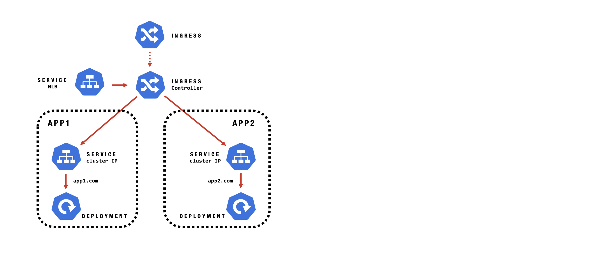

#### Ingress - Traffic Flow: `Local`

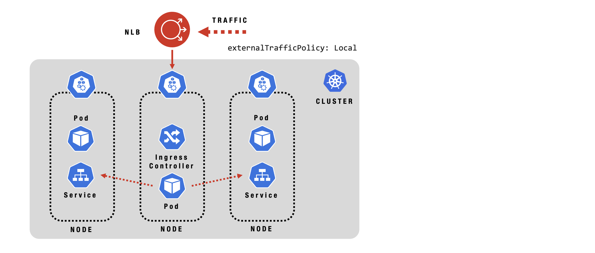

#### Ingress - Traffic Flow: `Cluster`

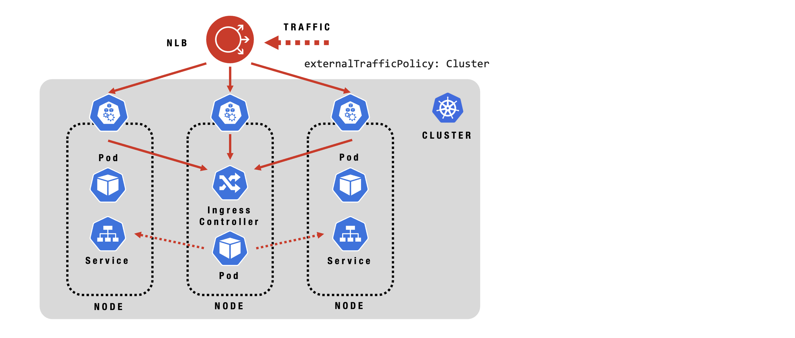

#### Ingress - Example
```
apiVersion: v1
kind: Service
metadata:
  name: web-service
spec:
  selector:
    app: web
  ports:
    - port: 80
      targetPort: 8080
---
apiVersion: networking.k8s.io/v1
kind: Ingress
metadata:
  name: web-ingress
spec:
  rules:
    - host: example.com
      http:
        paths:
          - path: /
            pathType: Prefix
            backend:
              service:
                name: web-service
                port:
                  number: 80
```

#### VIDEO
[Ingress](https://sos-de-fra-1.exo.io/exoscale-academy/videos/cce-resources-11.mp4)

#### VIDEO
[DEMO: Ingress](https://sos-de-fra-1.exo.io/exoscale-academy/videos/cce-demo-ingress.mp4)

### Namespace

A Namespace in Kubernetes offers a method to partition cluster resources among multiple users, teams, or projects. Namespaces create logical separation within a single cluster, making it possible to manage different environments, set resource quotas, and enforce access controls independently for each group. This approach is ideal for organizing resources efficiently and preventing naming conflicts in large, shared clusters.

#### Namespace - Key Features
* __Resource Isolation__        
Keeps resources for different users, teams, or projects separate within the same cluster.
* __Access Control__        
Works with RBAC and policies to limit who can view or modify resources in each namespace.
* __Resource Quotas__      
Let's you enforce quotas and limits for compute, memory, and object counts per namespace.
* __Easy Management__      
Kubectl and automation tools support namespace targeting for streamlined operations.
* __Unique Naming Scope__      
Allows resources to have the same names in different namespaces, preventing naming collisions.
* __Environment Organization__        
Simplifies separating dev, staging, and prod resources within one cluster.
* __Policy Enforcement__        
Enables application of network policies and security controls at the namespace level.

#### Namespace - Example
```
apiVersion: v1
kind: Namespace
metadata:
  name: my-namespace
---
apiVersion: v1
kind: Pod
metadata:
  name: demo-pod
  namespace: my-namespace
spec:
  containers:
    - name: demo
      image: busybox
      command: ["sh", "-c", "echo Hello from my-namespace; sleep 3600"]
```
#### VIDEO
[Namespace](https://sos-de-fra-1.exo.io/exoscale-academy/videos/cce-resources-12.mp4)


## Workloads

### Workloads

However, you don’t need to manage Pods directly. Instead, you use higher-level workload resources like:

* ReplicaSet
* Deployment
* DaemonSet
* Job 
* CronJob
* StatefulSet


These resources configure controllers that automatically maintain the desired number and type of Pods, matching your specified state and simplifying workload management.

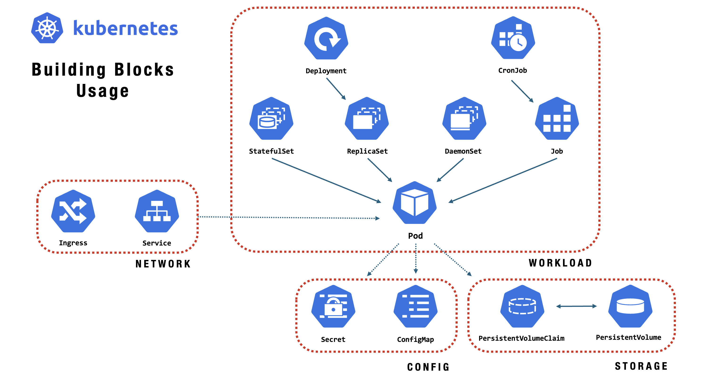

### Manifest
Kubernetes excels through its declarative model for managing infrastructure. By describing your desired configuration in YAML manifest files, you eliminate the need for repetitive manual commands and enable automated, consistent operations across your environment.


* __Declarative__ - Define your entire app and infrastructure in YAML files.
* __Deployment__ - Apply resources with `kubectl apply -f filename.yaml`.
* __Deletion__ - Delete resources with `kubectl delete -f filename.yaml`.
* __Stateless__ - No need to track the state manually.

#### Manifest - Key Features
* __Declarative Configuration__   
Manifests let you define the desired state of your resources, such as Deployments, Services, and ConfigMaps.
* __Resource Specification__    
Each manifest clearly specifies the resource's type, metadata, and configuration.
* __Repeatability and Consistency__   
Applying the same manifest repeatedly yields the same result, ensuring reliable setups.
* __Version Control Friendly__    
Manifests are code files, so you can store, review, and manage them in version control systems like Git.
* __Supports All Resources__    
You can create, update, or delete any Kubernetes resource using manifests.
* __Batch Operations__    
Multiple resources can be defined in a single manifest file and managed together.

#### Manifest - Tricks
Creating a manifest from scratch can be time-consuming, but there are helpful tools to make the process easier. You can quickly generate a manifest using the `kubectl` command with the `--dry-run=client -o yaml` option. 
```
$ kubectl run test-app --image=darnst/hello-world --dry-run=client -o yaml
```
Alternatively, you can copy and modify example manifests directly from the:

[Kubernetes Documentation on Deployments](https://kubernetes.io/docs/concepts/workloads/controllers/deployment/#creating-a-deployment)

> __! NOTE__
This method may not be available for all resource types.


### Update
Updating in Kubernetes is a controlled, automated process driven by updating your desired state in manifest files, ensuring reliable and consistent changes with built-in support for rollouts and rollbacks. 
The update process in Kubernetes is designed to allow changes to applications and resources with minimal disruption.


#### Update - Key Features
* __Rolling Updates__   
Kubernetes gradually replaces old Pods with new ones in a rolling update, keeping the application available and preventing downtime.
* __Declarative Changes__   
Edit the manifest file to update your application's configuration or image to the new desired state.
* __Apply Changes__   
Use `kubectl apply -f your-manifest.yaml` to apply the updates.
* __Automated Management__    
The system continuously monitors and reconciles the cluster, ensuring resources always match the updated manifest.
* __Status & Rollback__   
You can monitor the update progress with `kubectl rollout status` and revert to a previous version if needed, using `kubectl rollout undo.

#### Update - Process
Kubernetes manifests are versatile—used to create, orchestrate, and update resources. By declaring the desired new state and applying the manifest, Kubernetes automatically manages updates. It follows a defined workflow to update components and safely remove old versions, helping maintain a stable and consistent environment.

#### Update - Process
Kubernetes manifests are versatile—used to create, orchestrate, and update resources. By declaring the desired new state and applying the manifest, Kubernetes automatically manages updates. It follows a defined workflow to update components and safely remove old versions, helping maintain a stable and consistent environment.

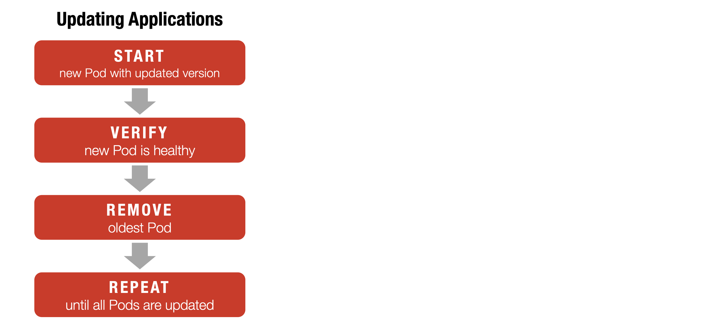

### Rollouts
The `kubectl` command enables rollouts and updates for containerized applications and their Kubernetes resources. Rolling updates let you deploy new versions with zero downtime by gradually replacing old Pods with new ones. You can use `kubectl rollout` to monitor deployment status or undo changes if a rollout fails, returning to a previous version. Kubernetes’s declarative design and revision tracking enable reliable, zero-downtime updates, rollbacks, and consistent desired state.

* __Zero Downtime__   
Updates are applied without interrupting application availability.
* __Safety__    
Automated health checks ensure each new Pod is running correctly before proceeding.
* __Replacement__   
Old Pods are replaced with new ones, rather than being updated in place.
* __Versioning__    
Every deployment keeps track of versions and revisions to support easy auditing.
* __Rollback__    
Failed updates can be quickly undone, restoring previous working versions.

#### VIDEO
[Workloads](https://sos-de-fra-1.exo.io/exoscale-academy/videos/cce-workloads-01.mp4)

#### VIDEO
[DEMO: Update](https://sos-de-fra-1.exo.io/exoscale-academy/videos/cce-demo-update.mp4)


## Storage

### Storage

Kubernetes Volumes provide a way for containers to share and persist data. They are essential for managing storage needs in containerized applications.

Reliable data storage is crucial for today’s workloads, whether handling temporary files or critical application data. Kubernetes offers flexible storage options—from short-lived volumes to persistent storage—using __Volumes__, __Persistent Volumes__, and a variety of integrated __Storage Technologies__. Understanding these is key to building scalable, resilient apps.

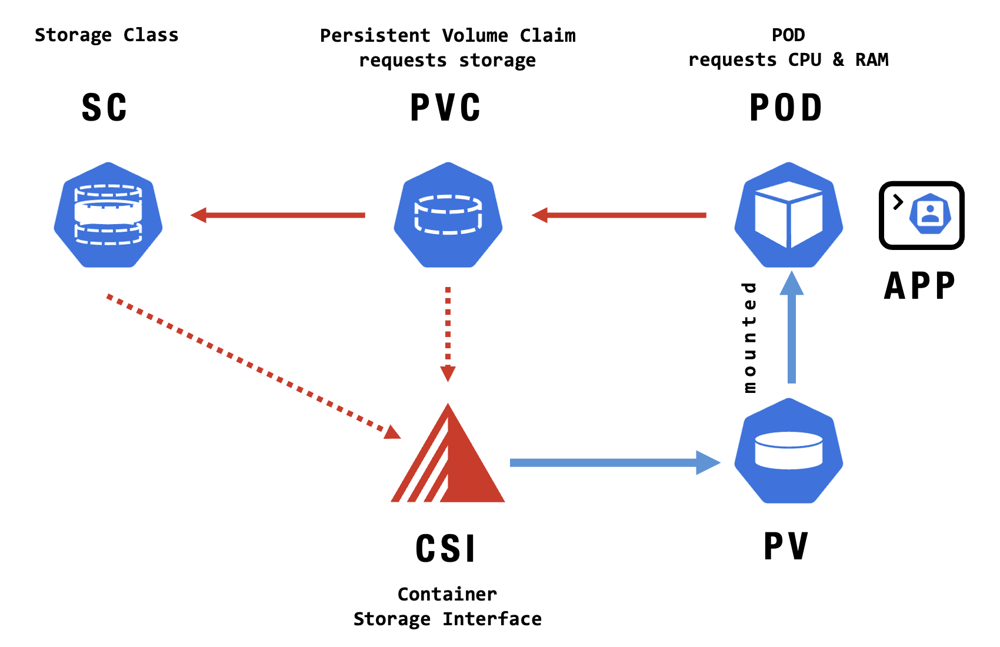

#### VIDEO
[Storage](https://sos-de-fra-1.exo.io/exoscale-academy/videos/cce-storage-01.mp4)


### Volumes

Kubernetes Volumes provide a way for containers to share and persist data. They are essential for managing storage needs in containerized applications.

A volume in Kubernetes is a storage resource attached to a Pod, allowing containers to store, share, and access data. Volumes enable data to persist beyond individual containers and facilitate sharing between containers in the same Pod. They are defined and managed in Kubernetes manifests (YAML files), specifying how storage is provided to each Pod.

Kubernetes supports many types of storage that you can use as volumes, including:

* __EmptyDir__    
Temporary storage shared between containers in a Pod. It is deleted when the Pod is removed.
* __Network Volumes__   
Such as NFS or cloud-provider volumes, enabling persistent, shared storage across Pods.
* __ConfigMaps and Secrets__    
Used to inject configuration data or sensitive information into containers.

#### VIDEO
[Volumes](https://sos-de-fra-1.exo.io/exoscale-academy/videos/cce-storage-02.mp4)


### Persistent Volumes

Persistent Volumes in Kubernetes offer durable, reliable storage for stateful applications, ensuring data remains safe even when Pods are deleted or rescheduled.

Kubernetes simplifies container management, but handling data persistence is key. Persistent Volumes (PVs) enable storage that outlives Pods. For databases, consider managed services like Exoscale’s DBaaS. For stateful workloads, use StatefulSets with Block Storage.

* __Persistent Volume__   
is a cluster resource, similar to a node, representing a storage piece. It can be created by an administrator or dynamically through a StorageClass (SC).
* __Lifecycle Independence__    
PVs exist independently of the Pods. They persist even when the Pods using them are deleted, thereby retaining data across Pod restarts and rescheduling.


* __Persistent Volume (PV)__    
is a piece of storage in the cluster that has been provisioned by an administrator or dynamically provisioned using storage classes. PVs are independent of a Pod's lifecycle when it uses storage. They encapsulate implementation details about storage, including whether NFS, iSCSI, cloud-provider storage systems, or other storage technologies back it.
* __Persistent Volume Claim (PVC)__   
is a user's request for storage in Kubernetes, specifying size, access modes, and other needs. It abstracts storage configuration, enabling Kubernetes to match requests with suitable Persistent Volumes (PVs). Once bound to a PV, the storage is accessible to the user's application.
* __Persistent Volume Access Mode__   
defines how a volume can be accessed after it is mounted on a node.

#### Provisioning
* Static Provisioning
An administrator manually creates PVs specifying the storage details.
* Dynamic Provisioning
When a Persistent Volume Claim (PVC) is created, Kubernetes uses an SC to provision a PV to fulfill the claim automatically.

#### Binding
Kubernetes attempts to find an available PV that matches the PVC's specified resources and access modes. If found, it binds the PV to the PVC.

#### Using
Once a PV is bound to a PVC, Pods can mount and use the storage by referencing the PVC.

#### Reclaiming
When a PVC is deleted, the PV enters a reclaim phase determined by its reclaim policy:
* Retain
The PV remains in the cluster, retaining its data. It needs to be manually cleaned up and reused.
* Recycle
The PV data is scrubbed and becomes available again (deprecated in newer versions).
* Delete
The PV and its associated storage are deleted.

#### Benefits
* Data Persistence
Provide a way to persist data beyond the lifecycle of individual Pods, enabling stateful applications.
* Decoupling of Storage and Compute
Independently manage storage and compute resources, allowing for flexible scaling and management.
* Centralized Storage Management
Simplifies the storage administration by abstracting the underlying storage infrastructure.

#### Use Cases
* Databases
Where data persistence, performance, and integrity are crucial.
* Content Management Systems (CMS)
Where multiple instances need access to shared data.
* File Storage
For applications requiring shared access to multiple node files.

#### VIDEO
[Persistent Volumes](https://sos-de-fra-1.exo.io/exoscale-academy/videos/cce-storage-03.mp4)

#### VIDEO
[DEMO: Storage](https://sos-de-fra-1.exo.io/exoscale-academy/videos/cce-demo-storage.mp4)


### Technologies

Kubernetes supports a variety of storage solutions—local, block, and object—plus cloud-native technologies like OpenEBS, Portworx, and Rook, enabling flexible, scalable, and persistent data management for any containerized application.

Kubernetes’s flexibility enables it to integrate with a wide range of storage technologies, both proprietary and open-source, for persistent storage needs.

* __Local Storage__   
is suitable only for temporary, ephemeral data and should not be used for persistent needs, as its contents do not survive Pod rescheduling.
* __Block Storage__   
provides high-performance, low-latency storage by exposing storage blocks directly to workloads. Available from cloud providers and on-premises, it’s ideal for databases and stateful applications. Block Storage can be reattached across instances, making it a strong fit for StatefulSets with Persistent Volume Claims (PVCs).
* __Object Storage__    
is typically accessed by applications using S3-compatible libraries or mounted as PVCs via tools like Mountpoint. It’s best for storing static data, not high-transaction workloads, due to limited IOPS.
* __OpenEBS (CNCF Project)__    
delivers open-source, cloud-native storage designed for seamless Kubernetes integration
* __Rook (CNCF Project)__   
is a popular open-source solution that brings advanced storage orchestration, enabling storage that is self-scaling, self-healing, and production-ready for Kubernetes.
* __Portworx__    
specializes in high-availability container storage for Kubernetes, providing host-attached volumes with protocol-based auto-tuning for performance.


### Exoscale Storage
Exoscale Storage offers flexible options: Local Storage for temporary data, Object Storage for scalable, S3-compatible static data needs, and high-performance Block Storage ideal for databases and StatefulSets. Each type is designed to match specific workload requirements.

#### Local Storage


* __High Performance__    
Local NVMe/SSD storage provides low-latency, high-throughput disk access for IOPS-intensive workloads, with no network bottlenecks.
* __Predictability__    
Performance is consistent and directly tied to the physical hardware specs of your instance since storage isn’t shared between nodes.
* __Simplicity__    
Storage is automatically provisioned with the VM, requiring no additional setup of external or networked volumes.
* __Cost Efficiency__   
Local storage is typically less expensive per GB than network-attached options, as you’re not incurring SAN or additional redundancy costs.
* __Useful for Ephemeral/Stateless Workloads__    
Stateless workloads such as caches, batch jobs, and CI/CD runners benefit from the performance and lifecycle alignment offered by fast local disks.


* __Persistence/Lifecycle Tied to Node__    
Data stored locally is lost if the node fails or is removed, making this option unsuitable for critical stateful workloads.
* __No Cross-Node Data Access__   
Data on local storage is only accessible to Pods running on the same node, limiting flexibility for rescheduling and fail-over.
* __Manual Recovery/Backups__   
Snapshots and backups require explicit management, and recovering from node loss is more complex than with managed storage.
* __Not Ideal for All State Persistence__   
Local storage is risky for workloads needing durable, replicated, or cross-zone data unless you implement higher-level HA or regular backups.
* __Scheduling Complexity__   
Pods using local PersistentVolumes need careful scheduling with node affinity and persistent volume configuration to ensure correct placement.


#### Object Storage (SOS)


* __Durability & Availability__   
SOS offers high durability and availability, ensuring data persists independently of any specific node or VM.
* __Scalability__   
Object storage can hold large volumes of data and scales easily for expanding workloads and big artifacts.
* __Accessibility__   
Data in SOS is accessible from any Pod or service with credentials, supporting sharing across nodes and clusters.
* __Backup and Disaster Recovery__    
SOS is well-suited for backups and disaster recovery thanks to its durability and features like versioning.
* __Integration__   
SOS’s S3-compatible API enables seamless use with Kubernetes tools and backup solutions designed for S3.


* __Performance/Latency__   
Network-attached, so it has higher latency and lower throughput than local or block storage—less ideal for high-performance workloads.
* __Not a POSIX Filesystem__    
Can’t be mounted like a regular filesystem; access requires S3-compatible tools or SDKs.
* __Eventual Consistency__    
Some operations (like listings) may show delays in reflecting changes due to eventual consistency.
* __Access Management Complexity__    
Managing access and permissions is more complex than attaching a volume to a Pod.
* __Usage Patterns Requirement__    
Best for large, immutable files; not suited for workloads needing fast, small file access or direct database storage.


#### Block Storage


* __Durability & Persistence__    
Block storage volumes are persistent and remain available even if the node they are on is deleted or replaced.
* __High Performance__    
Provides better throughput and lower latency than network object storage, making it suitable for transactional databases and other stateful workloads.
* __Attach/Detach Flexibility__   
Volumes can be attached or detached from nodes as needed, enabling Pod rescheduling and flexible workload management.
* __Kubernetes Integration__    
Supports CSI (Container Storage Interface) drivers, so it’s easy to provision PersistentVolumes and use standard Kubernetes storage constructs.
* __Data Protection Features__    
Supports snapshots for backups and point-in-time recovery.


* __Network Dependency__    
As network-attached storage, performance may be lower than local NVMe/SSD for the most latency-sensitive workloads.
* __Region/Zone Boundaries__    
Volumes are typically restricted to a single availability zone; they can’t be attached across zones, which limits multi-zone failover.
* __Management Overhead__   
Requires provisioning, attaching, and managing volumes, which is more operational work than ephemeral local storage.
* __Cost__    
Usually more expensive than local storage per GB due to durability, network attachment, and snapshot features.
* __Limited Scalability Compared to Object Storage__    
While scalable, block storage is not designed for the massively horizontal scaling of object storage.

#### Block Storage - Details
Exoscale's Block Storage offers a robust and distributed block device solution for Exoscale Compute instances, known for its redundancy and reliability. A Volume, a singular storage unit, can be partitioned and formatted to accommodate directories and files. One critical feature of Block Storage is the Snapshot, which captures the state of a volume at a specific point in time and allows users to create new volumes from that state.

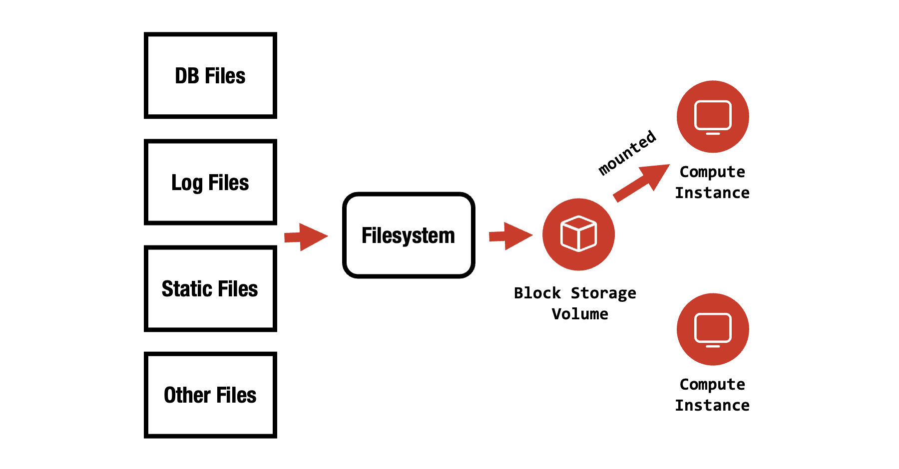

Exoscale's Block Storage provides high-performance network volumes, making it an optimal database choice. These volumes require integration using a Container Storage Interface (CSI) driver. Block Storage supports the `ReadWriteOnce` access mode, ensuring that volumes are persistent and can automatically detach and reattach to nodes when a Pod is rescheduled. Additionally, the system supports snapshots, allowing users to capture a volume's state at any moment and create new volumes from it. This feature underscores the redundancy and reliability of Exoscale's Block Storage.

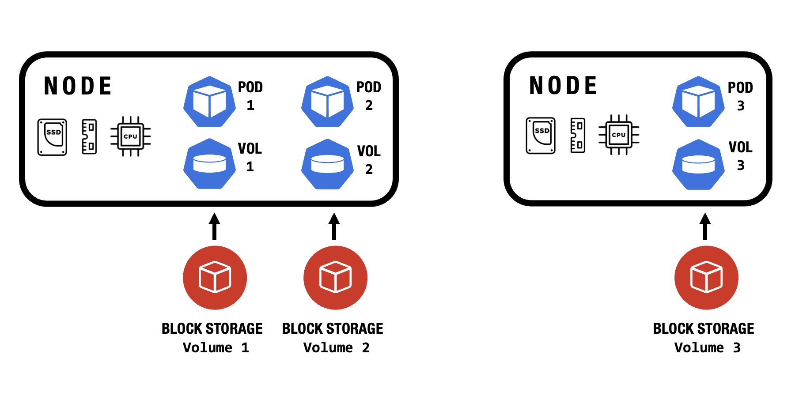

#### VIDEO
[Technologies](https://sos-de-fra-1.exo.io/exoscale-academy/videos/cce-storage-04.mp4)


## Exoscale CSI

### Exoscale CSI

The Exoscale CSI plugin lets you use Exoscale Block Storage with Kubernetes. You can install it easily when setting up your SKS cluster or manually from GitHub. 

#### What is it?
The Exoscale CSI driver is a Kubernetes-compatible storage plugin that enables dynamic provisioning and management of Exoscale Block Storage volumes as PersistentVolumes in your Kubernetes clusters.
This approach reduces manual intervention as everything is managed declaratively via Kubernetes manifests and the Exoscale API.

#### Benefits
* __Seamless Integration__    
Allows Kubernetes workloads to use Exoscale Block Storage natively, following standard Kubernetes storage patterns.
* __Dynamic Provisioning__    
Automates the creation and deletion of volumes as needed by your PersistentVolumeClaims, making stateful workload deployment more efficient.
* __Scalable & Flexible__   
Scales storage resources up or down per workload requirements and supports attaching/detaching volumes automatically.
* __Data Persistence__    
Ensures data survives Pod and node restarts, essential for running databases and StatefulSets.
* __Operational Simplicity__    
Reduces manual intervention as everything is managed declaratively via Kubernetes manifests and the Exoscale API.

### Exoscale CSI - Key Features 
* __Dynamic Provisioning__    
Volumes are created automatically when PVCs are requested.
* __Automation and Management__   
CSI add-on handles installation and driver management for you.
* __Kubernetes-native__   
Storage is managed with familiar Kubernetes objects like PVCs and StorageClasses.
* __Snapshots and Restoration__   
Supports easy snapshot creation and restore for backup and recovery.
* __Limitations__   
Volumes attach to only one node, can’t be resized online, and CSI can’t be disabled after it is enabled.
* __Activation__    
Enable CSI via CLI, portal, or Terraform when setting up or updating a cluster.

#### VIDEO
[Exoscale CSI](https://sos-de-fra-1.exo.io/exoscale-academy/videos/cce-exoscale-csi-01.mp4)


## Managed Solutions

### Managed Solutions

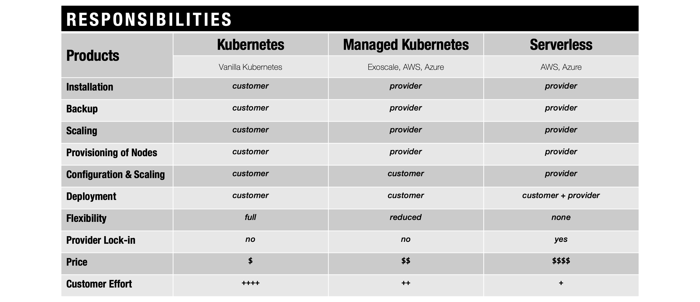


### Managed Kubernetes
Managed Kubernetes is a cloud service where the provider handles cluster setup, upgrades, and maintenance. This lets you focus on deploying and managing your applications, while enjoying simplified operations, scalability, and built-in support from the cloud platform.

Suppose you don't have the time, the budget, and the human resources to master all the complexity of Kubernetes on your own. In that case, your best option is to select a managed alternative to leverage the power of Kubernetes across your developer and infrastructure platforms.

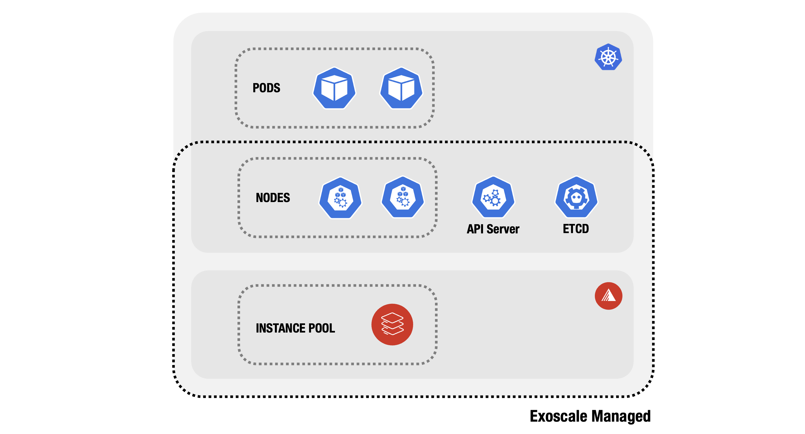


### Managed Ecosystem
Managed Kubernetes ecosystems combine orchestration with tools for monitoring, backup, CI/CD, security, and more. Services like SKS, APPUiO, and CK8s offer streamlined, customizable, and secure platforms that reduce operational overhead and support production needs.

#### Ecosystem
Kubernetes provides flexible, extensible building blocks for developers and infrastructure platforms, but isn’t a traditional PaaS or just an orchestrator. It supports various workloads but doesn’t build apps, provide app services, or handle full machine management. Kubernetes offers many options and plugins for each layer, allowing teams to choose what best suits their needs.

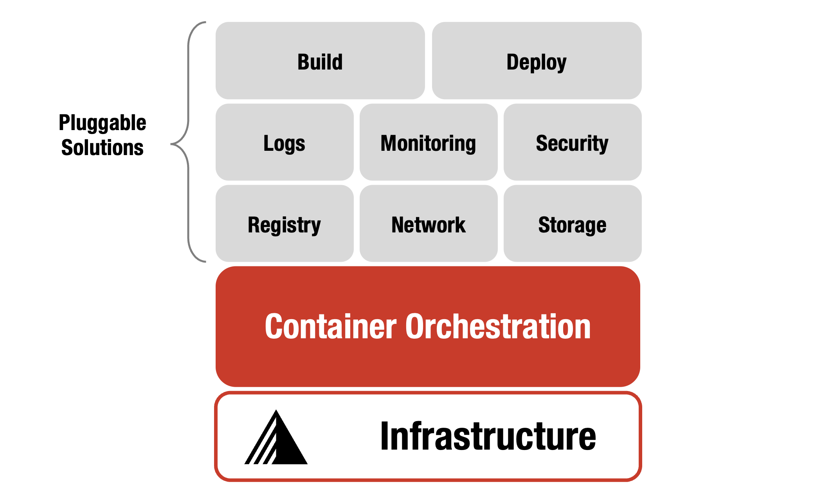

#### Managed Ecosystems
* __SKS__   
Exoscale’s SKS is a managed, vanilla Kubernetes service that’s easy to upgrade and highly flexible. You can launch clusters in seconds and manage them via portal, CLI, API, or tools. SKS covers the full lifecycle of the control plane and nodes.
* __APPUiO__    
VSHN’s APPUiO is a Kubernetes-based platform supporting DevOps with automation and self-service. It enhances collaboration and speeds up development, deployment, and operations. Its managed scope covers key ecosystem components, favoring convenience over full customization.
* __CK8s__    
Elastisys’ Compliant Kubernetes (CK8s) is a secure, CNCF-certified Kubernetes distribution tailored for regulatory compliance. It includes pre-configured, open-source components to simplify audits and enforce policies, and is delivered as a fully managed service.

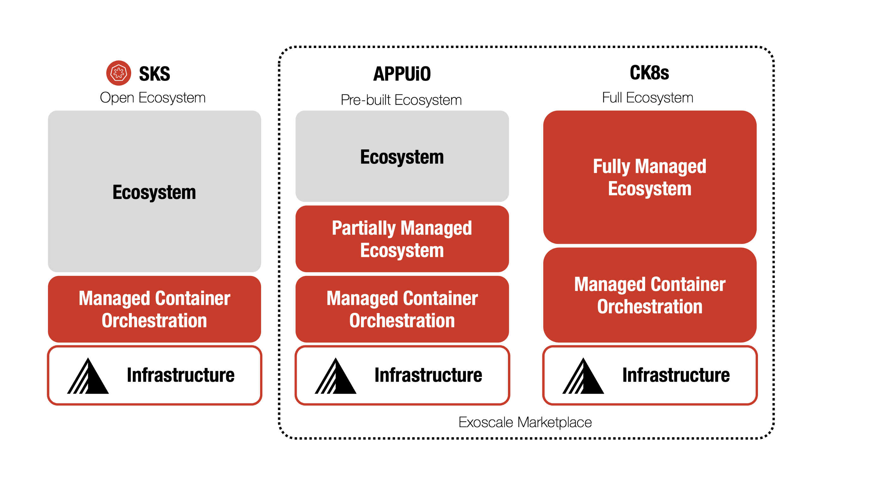

#### VIDEO
[Managed Solutions](https://sos-de-fra-1.exo.io/exoscale-academy/videos/cce-managed-solutions-01.mp4)

## Exoscale SKS

### Exoscale SKS

SKS is a fully managed Kubernetes platform from Exoscale that simplifies the deployment, management, and scaling of containerized applications. Exoscale handles cluster setup and maintenance, while SKS integrates smoothly with its networking and storage for high availability and security. Whether you’re new or experienced with Kubernetes, SKS provides a reliable, easy-to-use solution for modern application delivery.


#### Exoscale SKS - Key Features
* __Flexible NodePools__    
You can size NodePools as needed using any Exoscale instance type. It’s possible to combine Memory-Optimized and CPU-Optimized nodes within the same cluster for custom performance.
* __Full Cluster Lifecycle Management__   
SKS provides built-in commands to easily upgrade your Kubernetes control plane, ensuring seamless updates with minimal downtime and reducing errors.
* __Persistent Storage Options__    
Attach highly available block storage to your workloads with the Exoscale CSI driver or use object storage for file and backup management.
* __Integrated Load Balancer & Autoscaling__    
Exoscale Network Load Balancer support is directly integrated, and you can scale NodePools automatically with instance pools to meet changing demands.
* __High Availability Control Plane__   
With the Pro SKS plan, you benefit from a resilient, highly available Kubernetes control plane that keeps your workloads running reliably.
* __Deployment in Any Region__    
You can deploy your Kubernetes clusters in any Exoscale zone, so you can meet your specific requirements for latency, privacy, or redundancy.

#### VIDEO
[Exoscale SKS](https://sos-de-fra-1.exo.io/exoscale-academy/videos/cce-exoscale-sks-01.mp4)


## Operations

### Operations

Debugging IT systems is complex due to increased flexibility and performance demands. Efficient troubleshooting in agile and Kubernetes environments relies on practical CLI strategies across DevOps, monitoring, and operations. Exoscale Managed Kubernetes simplifies lifecycle management, letting teams focus on rapid development and resilient operations with scalable, easy-to-use infrastructure.

### Debugging
The process of identifying and resolving errors in IT systems—whether in code or infrastructure configurations—has become increasingly similar. However, the growing complexity and demands for flexibility, features, and performance make troubleshooting more challenging than ever. To help you get started with debugging, we’re sharing some simple command-line tricks that you can use right away.


### Troubleshooting
This section explores strategies for staying ahead in agile environments, focusing on running workloads with Kubernetes and leveraging CLI tools. We consider the entire lifecycle—including Development, Operations, Monitoring, DevOps, and Debugging—to highlight essential tasks and demonstrate practical approaches using simple solutions.

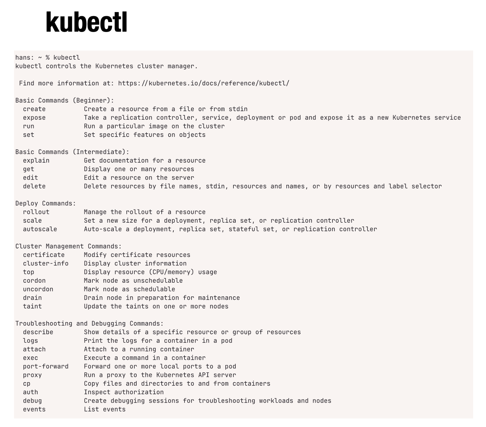


### Errors, Events, ...
When troubleshooting and debugging in Kubernetes, these basic `kubectl` commands are essential:

- `kubectl get pods -o wide`    
Lists all Pods along with extra details (such as node, status, and IP), providing a quick system overview.
- `kubectl describe pod PODNAME`    
Shows in-depth information about a Pod, including events and reasons for failures.
- `kubectl logs PODNAME`    
Retrieves application output logs from a container, crucial for diagnosing runtime or startup issues.
- `kubectl get events`    
Displays recent cluster events (watch namespaces), helping identify when and why incidents occurred.

Together, these commands give fast insights into Pod health, resource relationships, and recent changes—key for identifying and resolving issues in Kubernetes environments.

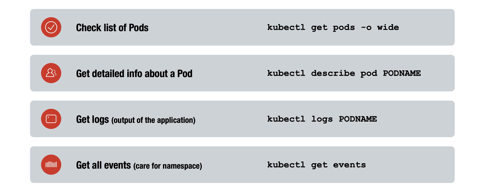

#### VIDEO
[DEMO: Operations](https://sos-de-fra-1.exo.io/exoscale-academy/videos/cce-demo-operations.mp4)


