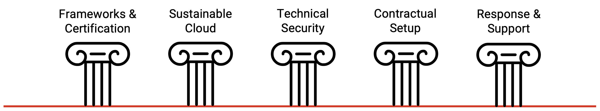
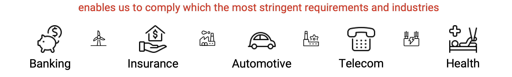
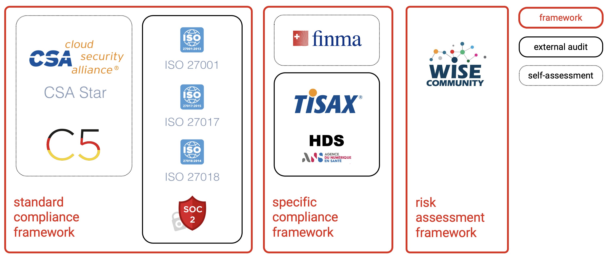
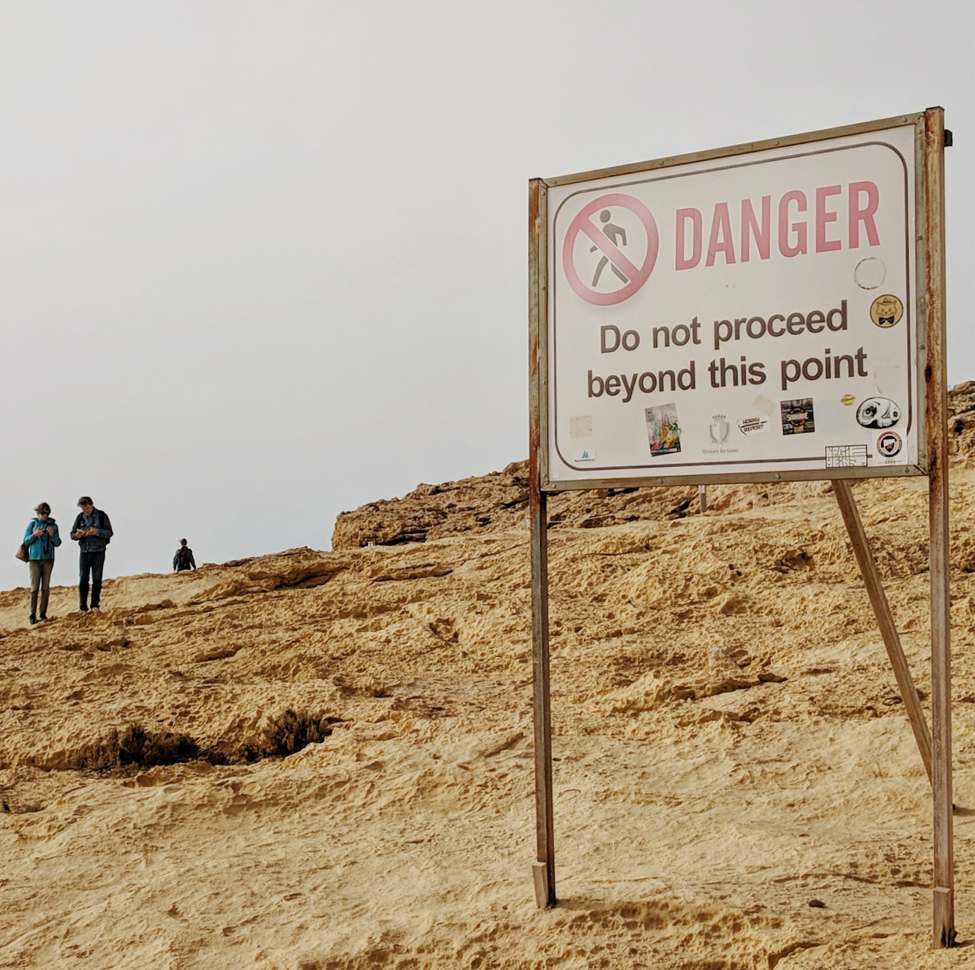
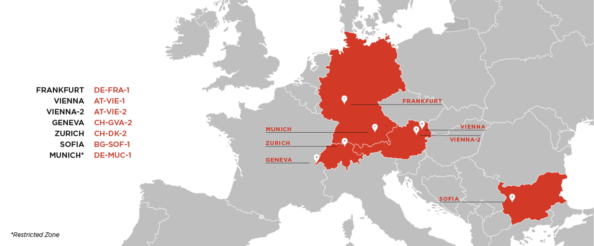
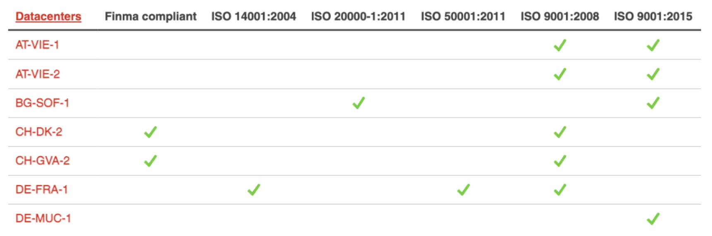
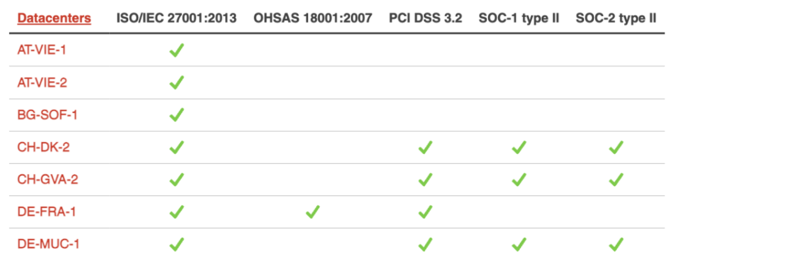

## Why Compliance?

### Is essential for business.

* Companies that comply with regulations are usually __more competitive__ than those that don't, as they can offer their products through any marketplace without any legal restriction. 

* Customers have __more trust__ in those companies because they know they're following quality standards and using safe materials for consumption. 

* __Learning more__ about compliance and why it is essential can help implement workplace programs that __follow established policies__, __codes__, and __standards__.

## Business Aspects of Compliance

### Why is compliance essential for businesses?

Here are five reasons why compliance is imperative for any business:

* __Enhancing__ customer trust
* __Increasing__ business revenue
* __Protecting__ from legal action
* __Improving__ internal processes
* __Avoiding__ fines and penalties

#### Enhancing customer trust
When customers know a company complies with the law and quality standards, they're more likely to trust the brand and purchase its products and services. This is possible because they understand that the law protects their interests and health, and the standards set by the company consider their preferences and expectations. Enhancing customer trust is one of the most important goals of an organization, as this can improve brand awareness and avoid complaints and product returns. This can help a business increase its revenue, improve its reputation, avoid adverse publicity, and expand its customer base.

#### Increasing business revenue
When a company demonstrates compliance, other businesses might purchase a high volume of its products, allowing it to increase its business-to-business operations. This is possible because most companies want to buy regulated products and avoid the risks associated with non-regulated items. Customers also tend to buy more products and services from companies that follow set rules because they understand they are not offering illegal or dangerous products. In addition, they can verify the quality standards the company is using and how it's meeting them.

#### Protecting the company from legal action
Lawsuits are usually filed against a company if unsatisfied customers or the public discover the business is avoiding regulations to save money in operations costs or generate more profit. By complying with regulations, companies can protect themselves from legal action and demonstrate that they've been operating according to the law. Inspections from regulatory agencies are necessary, as they can corroborate that the company is following all legal requirements. It's also imperative that the company ensures its employees have the proper certifications and receive adequate training.

#### Improving internal processes
Compliance officers can improve the company's internal processes by ensuring employees understand and follow the policies. They create training programs or ask suppliers and vendors to provide each employee with the training required to operate specific equipment. Companies usually establish standards, codes, and procedures to benefit their operations, guarantee quality levels, and ensure the safety of their employees. This way, the company provides that the processes involved in its daily operations follow a procedure and that emergency protocols are in place to prevent accidents and non-programmed shutdowns.

#### Avoiding fines and penalties
When government agencies find a company violating a law, they can impose fines and penalties. Businesses can avoid these penalties and access government programs or legally granted benefits by complying with regulations. They can also evade legal costs or any other punishment that can stop their operations, affecting their marketing campaigns, sales, employees' morale, customer service, and investment in new equipment.

## What is Compliance?

### Definition

* Compliance is __adhering to rules__, such as laws, standards, codes, and policies. Governments usually establish these rules to ensure that all organizations __legally conduct__ their __business__ activities. 

* Companies can also __set rules__ and standards to ensure employees perform their activities according to specific parameters and guidelines. 

* Governments and organizations can __enforce rules__ through regulatory bodies, agencies, or departments that monitor each business activity and assess how employers and employees follow the set rules.

### Example

For instance, a government can use a health and safety program to oversee and regulate construction sites within a province or territory. This program can check the construction company's safety provisions in its work setting and ensure those precautions align with the provincial regulations. In addition, the company can create a department or a position, such as a safety officer or manager, to oversee how its employees use the machinery and equipment in their workplace. They can also create a safety committee and ensure all employees can access training.

## What is Cloud Compliance?

### Definition

Cloud Compliance is the art and science of complying with regulatory standards of cloud usage following industry guidelines and local, national, and international laws, like:

* __PCI DSS__ protects credit card information handling
* __HIPAA__ protects a patient's healthcare information
* __SOX__ protects the financial information of public companies
* __GLBA__ protects the data of financial institution customers
* ...

However, they all share a unified goal: __keeping sensitive data secure__.

### Security is a Shared Responsibility

Cloud involves infrastructure the organization doesn't own and manage. Hence, many __organizations share responsibility with cloud providers__ for access control.

The __cloud provider__ updates and controls access to the components it administers, including the host operating system, virtualization software, hardware, and facilities. 

The __organization__, in turn, retains responsibility for updating, patching, and controlling access to the components it layers on top of the cloud infrastructure—applications, _guest_ operating systems, and security software. 

The organization's responsibility includes configuring any firewall services provided by the cloud provider that the organization uses for policy enforcement.

This partnership is often described as:

* __cloud provider__ is responsible for the security __of__ _the cloud_
* __organization__ is responsible for the access to its resources __in__ _the cloud_

#### Demystifying Acronyms 

If you dive into the realm of compliance, you stumble upon an endless number of acronyms related to standards and compliance frameworks; here is a list of the most often encounters depending on your geography:

* __HIPAA__ ... _Health Insurance Portability and Accountability Act_ - mandates the security of electronic healthcare information, confidentiality and privacy of health-related information, and information access for insurance.

* __PCI DSS__ ... _Payment Card Industry Data Security Standard_ - set of security standards enables all organizations to accept, process, store, and transmit credit card and financial information.

* __GLBA__ ... _Gramm-Leach-Bliley Act_ - organizations must communicate how user information is shared and protected, provide the right to opt out, and apply specific mandated protections.

* __PIPEDA__ ... _Personal Information Protection and Electronic Documents Act_ - provides rules for organizations to handle user information in commercial activities.

* __EU GDPR__ ... _General Data Protection Regulation_ - is the most stringent privacy and security regulation, mandates an exhaustive set of requirements on organizations handling the data of European Union (EU) residents. Furthermore, GDPR imposes harsh penalties for noncompliance.

* __SOX__ ... _Sarbanes–Oxley Act_ - mandates requirements on financial disclosures, audits, and controls of information systems processing financial information.

* __NIST__ ... _National Institute of Standards and Technology_ - provides guidelines on technology-related standards, security, innovation, and economic competitiveness.

* __FedRAMP__ ... _Federal Risk and Authorization Management Program_ - is a standardized program for the security assessment and evaluation of cloud-based systems.

* __HDS__ ... _Certification Hébergeur de Données de Santé_ - Health Data Hosting Certification ensures to treat personal health details as sensitive data. It is regulated by law to protect our rights. As a result, this critical information has to be hosted with an adequate security level. The HDS Reference System defines these requirements.

## Exoscale's Strategy

### The Five Pillars

### Frameworks & Certifications

## Standard Compliance

### Framework

#### ISO 27001 

_Information Security Management specifies a set of requirements that helps organizations manage their assets' security._

ISO 27001 is a globally recognized standard for information security management. It provides a framework for managing and protecting sensitive information assets like customer data, financial information, and intellectual property. The standard outlines a systematic approach to managing information security risks, including risk assessment, risk treatment, and continuous monitoring and improvement. Organizations that implement ISO 27001 can demonstrate to customers, partners, and regulators that they have a robust information security management system in place. The standard covers many security controls, including physical security, access controls, network security, and incident management.

#### ISO 27017

_Information Security Controls for cloud services is a code of practice that provides guidelines on managing information security controls._

ISO 27017 is a standard that provides guidelines for cloud service providers on implementing adequate information security controls in their cloud environments. The standard is based on ISO 27001, which provides a framework for information security management, but it also includes additional rules and guidelines specific to cloud computing.

ISO 27017 covers a range of essential security controls for cloud service providers, including data segregation, access control, encryption, logging and monitoring, and incident management. It also includes guidance on managing risks related to third-party cloud services, such as software-as-a-service (SaaS) or infrastructure-as-a-service (IaaS) providers.

By implementing ISO 27017, cloud service providers can demonstrate to their customers that they have implemented adequate security controls to protect their data and systems in the cloud. It can also help cloud service providers comply with regulatory requirements related to data protection and privacy.

#### ISO 27018

_Personally Identifiable Information (PII) protection is a code of practice that helps secure PII for the public cloud computing environment._

ISO 27018 is a standard that provides guidelines for protecting Personally Identifiable Information (PII) in public cloud environments. It is based on ISO 27001, which provides a framework for information security management, but it also includes additional controls and guidelines specific to protecting PII in the cloud.

ISO 27018 covers a range of security controls necessary for cloud service providers, including data protection, retention, portability, and transparency. It also includes guidance on managing risks related to third-party cloud services, such as software-as-a-service (SaaS) or infrastructure-as-a-service (IaaS) providers.

By implementing ISO 27018, cloud service providers can demonstrate to their customers that they have implemented adequate security controls to protect their PII in the cloud. It can also help cloud service providers comply with regulatory requirements related to data protection and privacy, such as the European Union's General Data Protection Regulation (GDPR).

#### SOC 2

_Design, implement, and operate controls to meet security, availability, processing integrity, confidentiality, and privacy objectives._

SOC 2 (Service Organization Control 2) is an audit report that assures the security, availability, processing integrity, confidentiality, and privacy of a service organization's systems and data. It is conducted by an independent auditor based on the Trust Services Criteria established by the American Institute of Certified Public Accountants (AICPA).

SOC 2 audits evaluate a service organization's data security and privacy controls, including physical and logical access controls, network security, system monitoring and alerting, data backup and recovery, and incident management. The audit also assesses the effectiveness of the organization's policies and procedures related to data management, including data classification, retention, and disposal.

The SOC 2 report provides a detailed description of the service organization's controls and includes an opinion from the auditor on the effectiveness of those controls. Service organizations often use it to demonstrate to their customers that they have implemented adequate security and privacy controls and to provide assurance that their systems and data are protected.

#### CSA STAR

_Is a third-party independent, technology-neutral assessment and certification of the security of a cloud service provider._

The Cloud Security Alliance (CSA) Security, Trust, and Assurance Registry (STAR) is a program that provides a framework for cloud service providers to demonstrate their security and compliance capabilities. The program includes a registry of cloud service providers that have completed a self-assessment or an independent audit against the CSA's Cloud Controls Matrix (CCM) and Consensus Assessments Initiative Questionnaire (CAIQ).

The CSA STAR program provides a comprehensive set of criteria for assessing the security and compliance of cloud service providers, including data protection, identity and access management, compliance, and risk management. It also provides tools and resources for cloud service providers to improve their security and compliance capabilities, such as CCM and CAIQ.

By participating in the CSA STAR program, cloud service providers can demonstrate to their customers and partners that they have implemented adequate security and compliance controls and have undergone an independent assessment of their security and compliance capabilities. This can increase transparency and trust in cloud services and give customers the information they need to make informed decisions about cloud service providers.

#### C5

_Is a cloud computing compliance criteria catalog (C5) to define a baseline security level for cloud computing._

The C5 (Cloud Computing Compliance Controls Catalog) is a set of cloud security and compliance standards developed by the German Federal Office for Information Security (BSI). The C5 criteria catalog provides a framework for assessing cloud service providers' security and compliance capabilities and is designed to help German government agencies and other organizations make informed decisions about cloud service providers.

The C5 criteria catalog covers a range of security and compliance controls, including data protection, access control, incident management, business continuity, and compliance with legal and regulatory requirements. It also includes specific requirements for cloud service providers related to data sovereignty, transparency, and auditability.

To comply with the C5 criteria catalog, cloud service providers must undergo an independent audit by a certified auditor, who evaluates the provider's security and compliance controls against the C5 criteria. The audit results are then made available to customers and partners, providing transparency and assurance about the provider's security and compliance capabilities.

The C5 criteria catalog is designed to help organizations assess cloud service providers' security and compliance capabilities and ensure that their data is protected in the cloud. It is particularly relevant for German government agencies and other organizations subject to strict data protection and security regulations.

## Specific Compliance 

### Framework

#### TISAX (Trusted Information Security Assessment Exchange)

_Is a certification designed for the automotive industry's assessment and exchange mechanism of information security._

TISAX stands for Trusted Information Security Assessment Exchange. It is a framework for information security assessments developed by the German Association of the Automotive Industry (VDA) to ensure the security of shared data among automotive industry suppliers.

TISAX is based on the ISO/IEC 27001 standard for information security management systems and is designed to ensure the confidentiality, integrity, and availability of information exchanged between automotive industry partners. TISAX assessments are conducted by accredited third-party auditors who evaluate a company's information security management system against defined criteria.

TISAX assessments cover various information security topics, including access control, data protection, incident management, business continuity, and physical security. Companies that complete a TISAX assessment are granted a TISAX certificate, demonstrating that they meet the information security requirements of the automotive industry.

TISAX certification is becoming increasingly important for companies that supply products or services to the automotive industry, as it demonstrates a commitment to information security and provides a competitive advantage in the marketplace.

#### HDS (Health Data Hosting)

_Is a certification designed to reinforce personal health data protection and build a trustworthy environment around eHealth and patient monitoring._

HDS, or Health Data Hosting, is a French legal framework regulating personal health data storage and processing. It applies to any company or organization that provides data hosting services for healthcare data in France.

Under the HDS framework, healthcare data must be stored and processed in compliance with strict security and privacy requirements. These include:

__Physical security__: HDS requires that data centers be equipped with adequate physical security measures, such as access controls, surveillance cameras, and fire suppression systems.

__Technical security__: HDS requires that data be encrypted at rest and in transit and that access to the data be restricted to authorized personnel.

__Organizational security__: HDS requires that data hosting providers implement various policies and procedures to ensure healthcare data's confidentiality, integrity, and availability.

__Privacy__: HDS requires that data hosting providers obtain explicit consent from patients to collect, store, and process their health data and comply with all applicable data protection laws and regulations.

Failure to comply with HDS requirements can result in significant penalties and fines. As such, healthcare data hosting providers in France must take HDS compliance very seriously and implement robust security and privacy measures to protect personal health data.

#### FINMA (Swiss Financial Market Supervisory Authority)

_Is a government financial regulation for supervising banks, insurance companies, stock exchanges, securities dealers, and other financial intermediaries in Switzerland._

FINMA stands for Swiss Financial Market Supervisory Authority. It is an independent regulatory body responsible for supervising and regulating financial institutions and markets in Switzerland. FINMA was established in 2009 as part of a comprehensive Swiss financial market supervisory system reform.

FINMA's primary mission is to ensure the stability and integrity of the Swiss financial system, protect investors and consumers, and combat financial crime. It supervises and regulates banks, insurance companies, securities dealers, asset managers, and other financial intermediaries operating in Switzerland.

FINMA has the authority to issue regulations, conduct investigations, and impose sanctions on financial institutions and individuals who violate Swiss financial laws and regulations. It also works closely with other national and international regulatory bodies to promote financial stability and combat cross-border financial crime.

FINMA plays a critical role in maintaining the integrity and stability of the Swiss financial system and ensuring that financial institutions and markets operate safely and soundly.

## Risk Assessment

### Framework

Understanding the risks that could significantly impact the organization and its ability to achieve its objectives is critical.

Risks are typically grouped into three categories:

1. __Business__ Risks 
2. __Compliance__ Risks 
3. __Operational__ Risks 

#### Business Risks 
that could impact the organization's ability to achieve its objectives, for example, a natural disaster disrupting operations.

Business risk refers to the potential for financial loss or other negative consequences arising from internal or external factors affecting a company's ability to achieve its objectives. This can include risks related to market conditions, competition, regulatory changes, financial performance, operational issues, and other factors that can impact the success or sustainability of a business. Practical risk assessment and management strategies can help enterprises to identify and mitigate potential risks, minimize financial losses, and protect against other negative impacts.

#### Compliance Risks
that could lead to non-compliance with legal or regulatory requirements, for example, a data breach that leads to a fine from a data privacy regulatory body.

Compliance risk is the potential for financial loss or legal penalties arising from a company's failure to comply with laws, regulations, or industry standards. This can include risks related to data privacy, environmental regulations, labor laws, financial reporting requirements, and other areas of regulatory compliance. Non-compliance can result in fines, legal action, damage to reputation, and other negative consequences that can impact a company's financial performance and overall success. Practical risk assessment and management strategies can help businesses identify and address compliance risks, ensure regulatory compliance, and minimize the potential for financial and legal consequences.

#### Operational Risks
that could impact day-to-day operations, for example, a system failure that disrupts business processes.

Operational risk is the potential for financial loss or other negative consequences arising from a company's internal processes, systems, or human error. This can include risks related to technology failures, supply chain disruptions, employee misconduct, fraud, and other operational issues that can impact a company's ability to conduct business effectively. Operational risks can also arise from external events, such as natural disasters or cyberattacks. Practical risk assessment and management strategies can help enterprises to identify and mitigate potential operational risks, improve processes and systems, and minimize the potential for financial losses or other negative impacts.

## Compliance Security

### Security Referential

__Organizations__ can __need help maintaining__ an ever-growing number of __compliance standards__ and security frameworks. 

__Exoscale has extensive compliance documentation__ for various standards and security frameworks, __making it easy for organizations to meet__ all the __requirements__.

The Security Referential is a set of standards and best practices that we follow to ensure the security of our infrastructure and services. It includes guidelines on access control, network security, data protection, and incident response. 

The Security Referential is based on industry standards and is regularly updated to address new security threats and vulnerabilities. Customers can use the Security Referential as a reference for their security needs and compliance requirements.

### Certified Security

The __security of your data is our highest priority__, and we work hard to ensure that our platform meets the highest security standards. 

We believe trust is essential. Therefore, __we regularly undergo third-party audits__ to help you meet your compliance obligations. 

### Secure Control Framework

To maintain that documentation, __Exoscale has developed its security referential__ based on the 32 Control Domains of the SCF framework. 

This referential allows us to implement __a single set of security controls__ while __meeting all__ the requirements of the __targeted standards__ and frameworks.

#### Our Security Control Domains

1. Security & Privacy Governance
2. Asset Management
3. Business Continuity & Disaster Recovery
4. Capacity & Performance Planning
5. Change Management
6. Cloud Security
7. Compliance
8. Configuration Management
9. Continuous Monitoring
10. Cryptographic Protections
11. Data Classification & Handling
12. Embedded Technology
13. Endpoint Security
14. Human Resources Security
15. Identification & Authentication
16. Incident Response
17. Information Assurance
18. Maintenance
19. Mobile Device Management
20. Network Security
21. Physical & Environmental Security
22. Privacy
23. Project & Resource Management
24. Risk Management
25. Secure Engineering & Architecture
26. Security Operations
27. Security Awareness & Training
28. Technology Development & Acquisition
29. Third-Party Management
30. Threat Management
31. Vulnerability & Patch Management
32. Web Security

## Data Center

### Locations

All __Exoscale zones__ are hosted __in__ carefully selected __state-of-the-art data centers__. 

### Certifications

Data centers must __pass stringent__ criteria defined in our requirements, including various __security and quality certifications__.

## Sustainable Cloud

### Overview

At Exoscale, __we understand__ that __sustainability__ is a crucial concern for our customers and society. 

As a public cloud provider, __we are responsible__ for __operating__ in an __environmentally responsible__ manner, reducing our carbon footprint, and __minimizing__ our __environmental impact__. 

#### Focus Areas

* Renewable Energy
* Extended Server Fleet Life
* High-Density Rack Design
* Energy-Efficient Design
* Direct Shipping
* Data Center 

#### Exoscale's Believes

* Remote-First Approach
* Waste Heat Utilization
* Personal Commitment
* Leading Sustainability

#### Exoscale's Goals

* Multi-Criteria Life Cycle Assessment by 2023
* Certified Energy Management by 2024
* Impact Calculator for Our Clients by 2024
* 100% Renewable Energy by 2025

 

## Renewable Energy

### Overview

Currently, __90%__ of __our electricity__ comes __from renewable energy__ sources. This is a significant accomplishment demonstrating our commitment to __reducing__ our __carbon footprint__ and sourcing energy from environmentally responsible sources.

### Benefits

Renewable energy refers to the energy generated from natural resources that can be replenished relatively quickly. These resources include sunlight, wind, water, geothermal heat, and biomass. Unlike finite fossil fuels, which will eventually run out, renewable energy sources are sustainable and can be used indefinitely without depleting the resource.

Renewable energy technologies are becoming increasingly popular as the world seeks to reduce its reliance on fossil fuels and mitigate the effects of climate change. They are also becoming more affordable and efficient, making them a viable alternative to traditional energy sources.

Examples of renewable energy technologies include solar panels, wind turbines, hydroelectric power plants, geothermal power plants, and biomass energy systems. These technologies generate electricity and heat without producing greenhouse gas emissions, which makes them a cleaner and more sustainable option for powering homes, businesses, and communities.

## Extended Server Fleet Life

### Overview

The average age of our server fleet is over three years old, and we have __a program__ in place __to repurpose older servers__ for non-customer-facing workloads to keep them in __use as long as__ they are __practical__.

### Benefits

Extended Server Fleet Life refers to extending the lifespan of servers in a data center beyond their original expected lifespan. This is achieved by implementing regular maintenance, upgrades, and optimization measures to ensure that the servers continue operating efficiently and effectively.

By extending the life of servers, organizations can save money on purchasing new servers and reduce the environmental impact of disposing of old servers. It also helps to maintain a stable and consistent IT infrastructure, as there is less disruption caused by replacing servers.

However, it is essential to note that extending the lifespan of servers requires careful planning and management to ensure that they remain secure and reliable. Regular security updates and patches must be applied, and any hardware failures or issues must be addressed promptly to prevent downtime and data loss.

## High-Density Rack Design

### Overview

By packing more servers and other equipment into high-density racks, __Exoscale reduces__ its __overall data center footprint__ and the associated costs of building and maintaining a larger facility. In addition, smaller data centers require less energy to power and cool.

### Benefits

The high-density rack design is an approach to the layout and organization of server racks in a data center that maximizes the computing power that can be packed into a given space. This is achieved through specialized equipment and techniques for greater power and cooling efficiency, better cable management, and airflow.

High-density racks typically feature a more significant number of servers per rack than traditional designs, with each server consuming more power and generating more heat. High-density racks often incorporate hot-aisle/cold-aisle containment, in-row cooling units, and high-efficiency power supplies to accommodate this.

The benefits of high-density rack design include increased computing power, reduced footprint and energy consumption, and lower overall costs. However, it also requires careful planning and maintenance to ensure that the equipment remains cool and functional and has good power and cooling infrastructure to support the higher density.

## Energy-Efficient Design

### Overview

We design our servers and custom storage node chassis from carefully selected __components__ with __energy efficiency__ in mind and a strong focus on __reducing__ __energy__ requirements and __operating costs__.

### Benefits

Energy-efficient design refers to the practice of designing buildings, appliances, and other systems in a way that reduces energy consumption and waste. This can be achieved through various strategies such as using energy-efficient materials, optimizing insulation and ventilation, incorporating renewable energy sources, and implementing intelligent control systems. The goal of energy-efficient design is to minimize the amount of energy needed to operate a building or system, reducing energy costs and positively impacting the environment by reducing greenhouse gas emissions.

## Direct Shipping

### Overview

We __ship__ our __servers directly__ from the distributor to our data centers, __avoiding__ __unnecessary__ equipment __transport__ and __reducing__ our __carbon footprint__.

### Benefits

Direct shipping refers to shipping goods directly from the manufacturer or supplier to the customer, without any intermediaries such as wholesalers or retailers. In this method, the manufacturer or supplier handles the entire shipping process, including packaging, labeling, and delivery. Direct shipping is often used by e-commerce businesses that sell products online, allowing them to reduce costs and streamline their operations. It also allows for faster delivery times and greater control over the customer experience.

Direct shipping can have a positive impact on sustainability in several ways:

* __Reduced carbon footprint__ - Direct shipping eliminates the need for intermediaries, which can reduce the carbon footprint associated with transportation and logistics.

* __Less packaging waste__ - Direct shipping can lead to less packaging waste, as the manufacturer or supplier can use more sustainable packaging materials and avoid the need for additional packaging from intermediaries.

* __Efficient use of resources__ - Direct shipping allows manufacturers and suppliers to be more efficient in using resources, as they can control the entire shipping process and optimize their operations accordingly.

## Data Center

### Sustainability & Reliability

At Exoscale, we understand that the physical infrastructure of our data centers plays a critical role in the sustainability of our cloud computing services. Therefore, we carefully select our data centers based on several factors, including energy efficiency. In addition, we work with only the most environmentally responsible and forward-thinking providers to ensure our operations are as sustainable. Our stringent energy efficiency requirements include renewable energy sources, highly efficient cooling systems, and best-in-class power usage effectiveness (PUE) ratings. 

__By choosing Exoscale, you can be confident that your cloud computing needs are being met in a highly sustainable and reliable way.__

## Exoscale's Believes

### Overview

* Remote-First Approach
* Waste Heat Utilization
* Personal Commitment
* Leading Sustainability

### Remote-First Approach

Exoscale is a broadly distributed company. We believe in a __remote-first approach__ to work, which helps __reduce__ the impact of maintaining a __traditional office space__, such as __energy consumption__, __waste production__, and __commuting emissions__.

### Waste Heat Utilization

Always looking for new and innovative ways to minimize our environmental impact, we have started using the __waste heat generated by our lab__ infrastructure __to heat our Lausanne office__ space __in__ the __winter__ months.

### Personal Commitment

Our __employees are eager to reduce their environmental impact__. For example, many of our employees have been increasingly relying on trains to travel to our offsite meetings, which helps __reduce air travel__ emissions. In addition, many employees use __public transportation__, __biking__, and electric vehicles to commute to work.

### Leading Sustainability

This combination of remote work and environmental awareness is just one of the many ways __Exoscale leads the way in sustainable business practices__. 

Our __commitment to sustainability__ is a core __part of our company culture__. It drives everything we do, from our technology to our work.

## Exoscale's Goals

### Overview

* Multi-Criteria Life Cycle Assessment by 2023
* Certified Energy Management by 2024
* Impact Calculator for Our Clients by 2024
* 100% Renewable Energy by 2025

### Multi-Criteria Life Cycle Assessment by 2023
Exoscale is committed to conducting a __life cycle assessment__ of our products and services under ISO 14040. This analysis will __show our__ products and services __environmental impact__ throughout their life cycle, from raw materials to disposal. We aim to complete this analysis __by__ the end of __2023__.

Life Cycle Assessment (LCA) is a methodology used to evaluate the environmental impact of a product or service throughout its entire life cycle, from raw material extraction to disposal. ISO 14040 is a standard that provides guidelines for conducting LCA studies.

The LCA process consists of four phases: 

* goal and scope definition
* inventory analysis
* impact assessment
* interpretation

__Goal and scope definition__: This phase defines the goal and scope of the study, including the purpose, intended audience, and system boundaries. The study's goal may be to identify the environmental impact of a product or service, compare different products or services, or identify opportunities for improvement.

__Inventory analysis__: This phase involves collecting data on the inputs and outputs of the product or service throughout its life cycle. This includes raw material extraction, manufacturing, distribution, use, and disposal. The data collected is then used to create a life cycle inventory (LCI).

__Impact assessment__: This phase evaluates the potential environmental impacts of the product or service based on the LCI data. This includes assessing the impact on climate change, resource depletion, ecosystem quality, and human health.

__Interpretation__: This phase involves interpreting the results of the LCA study and communicating them to stakeholders. This includes identifying areas for improvement and making recommendations for reducing the environmental impact of the product or service.

Overall, the LCA process provides a comprehensive approach to evaluating the environmental impact of products and services and can be used to inform decision-making and improve sustainability.

### Certified Energy Management by 2024
Exoscale is in the process of implementing an __ISO 50001 Energy Management System__ (EnMS). This standard provides a framework for managing organizations' energy efficiency, reducing energy costs, and minimizing environmental impact. Our goal is to __complete__ an __audit__ against this standard __by 2024__.

ISO 50001 Energy Management System (EnMS) is a globally recognized standard that provides a framework for organizations to manage their energy consumption and improve energy efficiency. The standard outlines a systematic approach to energy management, including establishing energy policies, setting energy targets and objectives, implementing energy action plans, and monitoring and reviewing energy performance.

The goal of ISO 50001 is to help organizations reduce their energy consumption and associated costs while reducing greenhouse gas emissions and improving sustainability. The standard applies to all types of organizations, regardless of size or industry.

ISO 50001 certification can benefit organizations, including improved energy efficiency, reduced energy costs, enhanced environmental performance, and increased competitiveness. It can also help organizations to comply with energy-related regulations and demonstrate their commitment to sustainability and corporate social responsibility.

### Impact Calculator for Our Clients by 2024
Exoscale is committed to __providing__ the necessary __information__ and __tooling__, including an impact calculator, __for__ our clients to make __quantifiable GreenOps decisions__ about their cloud services' sustainability and environmental impact. Our goal is to launch this calculator __by 2024__.

### 100% Renewable Energy by 2025
Our locations in Germany and Switzerland are powered by 100% renewable energy, in Austria by 99%, and in Bulgaria by 45%. We are __committed to sourcing 100%__ of our __energy from renewable sources__ for all our locations __by 2025__.

## Technical Security

### Overview

* Secure
* Protect
* Control
* Secure Dev
* Bug Bounty Program
* Regular Pentest

### Secure - _secured by default_
* Secure Code
* Data Center Redundancy
* Network Redundancy 
* Power-Supply Redundancy

### Protect - _protected by default_
* Instances and Security Groups are closed by default
* Databases fully encrypted and filtered by default
* Secured Access Control Lists on all storage buckets
* Included DDOS Protection of the network

### Control - _fine-grained access control_
* Role-Based Access Control to Exoscale organizations
* Two-Factor Authentication supported
* Optional SSO configuration
* Full IAM for all API calls
* Audit Trail for all events

### Secure Dev - _world-class engineering_
* Code Review
* Change Management
* Secure Development Practices

### Bug Bounty Program - _crowdfunded security_
* Competitive Bounties
* 300 active Researchers taking part in the program
* __Bugcrowd__ a crowdsourced security platform. It is one of the internet's largest bug bounty and vulnerability disclosure companies.

### Regular Pentest - _timeboxed assessments_
* Annual Pentest 
* Performed by Third Parties
* Full Product Coverage

## Contractual Setup

### Overview

### Terms & Conditions - _client and supplier relations_

* Exoscale's Terms & Conditions - [exoscale.com/terms](https://www.exoscale.com/terms/)

#### T&C's Categories

1. __Definitions__
2. __The Services__
3. __Fees and Payment Modalities__
4. __Service Level Agreement__ (SLA)
5. __Use of the Services__
6. __Software Licenses__
7. __Proprietary Rights__
8. __Confidentiality__
9. __Warranties__
10. __Indemnification__
11. __Publicity__
12. __Force Majeure__
13. __Term and Termination__
14. __Miscellaneous Provisions__

### Data Privacy - _information usage and handling_

* Exoscale's Privacy Policy - [exoscale.com/privacy](https://www.exoscale.com/privacy/)

#### Privacy Policy

Exoscale collects only information you choose to give us and processes it with your consent or on a legal basis. Therefore, we gather as little personal information as we can to allow us to provide our services. 

Personal information is not sold to third parties and is used and processed as described on this page. Furthermore, we comply with the EU's Privacy Shield Framework and the General Data Protection Regulation (GDPR). As a result, we provide the same level of privacy protection regardless of your country of origin or location.

### Jurisdiction - _laws and courts_

#### Exoscale's Jurisdiction & Governing Law (T&C 14.8)  
These Terms and Conditions and any Order shall be governed by the laws of Switzerland. The Parties irrevocably submit to the exclusive jurisdiction of the courts of the canton of Vaud, district of Lausanne. 

## Response & Support

### Overview

At our cloud platform, we understand that running operations can be a challenging task. That's why we offer hands-on, direct contact with experienced engineers who power our cloud platform. In addition, we believe in building solid relationships with our customers and providing them with the support they need to succeed.

Whether you're a small business or a large enterprise, we care about your success. We are committed to helping you achieve your goals. Our team of engineers is always available to answer your questions, provide guidance, and assist you with any issues you may encounter.
We take pride in the support we offer our customers and believe that direct contact with our engineers is essential to providing the best possible service. Our engineers are not only experts in cloud computing, but they also have a deep understanding of the challenges businesses face when running operations.

We are committed to building long-term relationships with our customers and helping them grow their businesses. We aim to provide a reliable, secure, and scalable cloud platform that meets the needs of companies of all sizes. With our hands-on, direct contact approach, you can be confident that you have a trusted partner invested in your success.

#### Free support included
Free customer support is included. Just open and track tickets in the portal. 

#### Access to our engineers
Our experts will handle your problems and help you to run and scale production workloads.

#### Choose your plan
Pick the most suitable option for your requirements. 

### Support Plans - _your success is our goal_
Hands-on, direct contact with the engineers powering our cloud platform. We know running operations is challenging. We care about you no matter what size your company is.

#### Available Support Plans 

* __Built-In__ - included for all customers. Perfect for testers, developers, and non-critical applications.

* __Starter__ - for startups and SMEs running production infrastructures. Everything from Built-In, the four-hour guaranteed response time, additional authentication options, and detailed usage reporting.

#### Planned Support Plans

* __Pro__ - provides a one-hour response time, out-of-the-box services to detect and track events on the platform.

* __Enterprise__ -  provides a response time of 30 minutes (24/7), ticket, phone, or chat support, and your dedicated Customer Success Manager.

