## Experiences we want to change!

### Why Containers?

Many people have a complex job building, testing, and running systems based on old concepts and technology in today's IT — the results you can see below (Experiences we want to change!). Modern ways to build, test, and run IT systems are not adopted as broadly as possible. Hence, a lot of pain is still out there that we could ease by changing IT processes and utilizing the new ways.

### Experiences we want to change!

#### BUILD - Life of a Developer
Here you see a developer who brought her code into production, only to find out that it didn't run like on her laptop ...

#### TEST - Life of System Architects

Here you can see system architects who mistakenly made a load test on a production server ...

#### RUN - Life of a System Administrator
Here you can see a system administrator who was woken at 3 am to restart a process ...

## New Ideas & Concepts

### New Ideas & Concepts

As often in IT, great "new" ideas and concepts are recycled or borrowed from others. So it happened that the shipping industry was a big inspiration for optimizing IT infrastructure operations more than two decades ago.

The concept of a container to standardize the packing of goods, make them universal to handle and transport on different means of transportation to improve efficiency and reduce the transportation costs was a real success story for the transportation industry.

Replication of success is always desirable and sparked a new way of operating IT infrastructures indifferent of application on development, testing, or production.

Container Technology in the shipping industry
Instead of thinking up a separate way of shipping for each product, placing the goods in steel containers designed for pickup by the crane on the dock and fit into the ship is a more efficient way to do transport at scale.

 

In streamlining the processes and the loading of the goods in standardized containers, the goods can be moved as one unit in a space-saving and cost-effective manner.

Container Technology in the IT industry
Computer container technology in the IT industry addresses similar challenges to steel containers in the shipping industry:

* increase compatibility
* reduce dependencies
* develop, deploy and operate easier

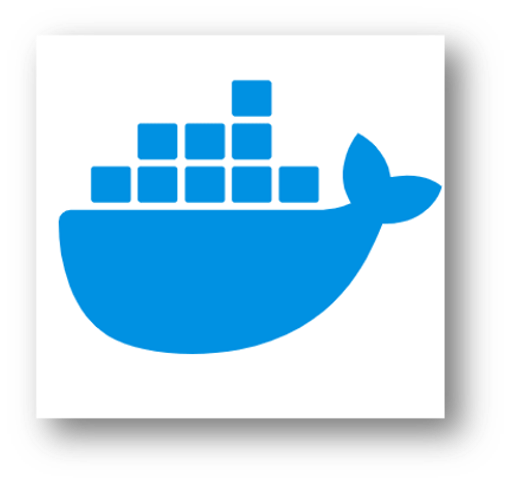 

In streamlining the processes and the apps' packaging in containers, deploying and running apps as one unit become a more performant and resource-effective process.

## Container Benefits

### Container Benefits

* __dev and ops separation of concerns__
create application container images at build/release time rather than deployment time, thereby decoupling applications from infrastructure

* __continuous development, integration, and deployment__
provides for reliable and frequent container image build and deployment with quick and efficient rollbacks – due to image immutability

* __environmental consistency across dev, test, and prod__
runs the same on a laptop as it does on an on-premises server, virtualized server, and in the cloud

* __OS distribution and cloud portability__
runs on Ubuntu, RHEL, CoreOS, on major public clouds, on-premises, and anywhere else

* __resource utilization and isolation benefits__
higher efficiency and density due to better utilization and predictable application performance due to isolation

* __loosely coupled, distributed, elastic microservices__
applications are broken into smaller, independent pieces and can be deployed and managed dynamically – not a monolithic stack running 
on one big single-purpose machine

* __agile application creation and deployment__
increased ease and efficiency of container image creation compared to VM image use

* __application-centric management__
raises abstraction level:
  * __from__ running applications on an OS using virtual hardware
  * __to__ running applications on an OS using logical resources

## History of Application Deployments

### History of Application Deployments

### Traditional Deployment

Early on, organizations ran applications on physical servers. There was no way to define resource boundaries for applications in a physical server, and this caused resource allocation issues. For example, if multiple applications run on a physical server, there can be instances where one application would take up most of the resources, and as a result, the other applications would underperform. A solution for this would be to run each application on a different physical server. But this did not scale as resources were underutilized, and it was expensive for organizations to maintain many physical servers.

### Virtualized Deployment

As a solution, virtualization was introduced. It allows you to run multiple Virtual Machines (VMs) on a single physical server's CPU. Virtualization allows applications to be isolated between VMs and provides a level of security as the information of one application cannot be freely accessed by another application. Virtualization allows better utilization of resources in a physical server and allows better scalability because an application can be added or updated easily, reduces hardware costs, and much more. With virtualization, you can present a set of physical resources as a cluster of disposable virtual machines. Each VM is a full machine running all the components, including its own operating system, on top of the virtualized hardware.

### Container Deployment

Containers are similar to VMs, but they have relaxed isolation properties to share the Operating System (OS) among the applications. Therefore, containers are considered lightweight. Similar to a VM, a container has its own file system, share of CPU, memory, process space, and more. As they are decoupled from the underlying infrastructure, they are portable across clouds and OS distributions.

## Without Container Orchestration

### Why Kubernetes?

Running services in containers tend to produce numerous containers pretty quick. Handling many containers with no additional aid is a very cumbersome job. Hence, an orchestration solution is necessary to run services in containers efficiently.

### Without Container Orchestration

* Think about scaling up services; it __increases manual work__.
* Think about fixing crashing nodes; it __increases manual work__.
* Think about the complexity of running new stuff in production; it __increases__.
* Think about the human cost of running those services; it __increases__.
* Scaling services/applications becomes more and more __difficult__.
* Public cloud provider resource usage becomes more and more __expensive__.

## Kubernetes in Plain English

### Kubernetes in Plain English

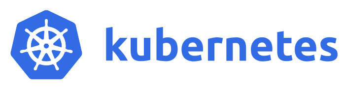

>__Containerization__ is this trend that’s __taking over the world__
to allow people to run all kinds of different applications
in a variety of different environments. When they do that,
they __need an orchestration solution__ in order to keep track
of all of those containers and schedule them and orchestrate them.
__Kubernetes is an increasingly popular way to do that__.

## Kubernetes ?

### Kubernetes ?

Google open-sourced the Kubernetes project in 2014. Kubernetes combines over 15 years of Google's experience running production workloads at scale with best-of-breed ideas and practices from the community.

The name Kubernetes originates from Greek, meaning helmsman or pilot.

>__Kubernetes is a portable, extensible, open-source platform for managing containerized workloads and services that facilitates both automation and declarative configuration.__

## Imperative vs Declarative

### Configuration Differences

>What a difference a configuration make :).

The significant change in this new IT world is that well-trained and practiced processes are outdated and useless. The imperative was the old world, you defined step-by-step guidance, and you also executed or overseen the execution of those configuration steps. The declarative way is to determine the desired state and an intelligent system conducts and supervises the configuration and operation steps.

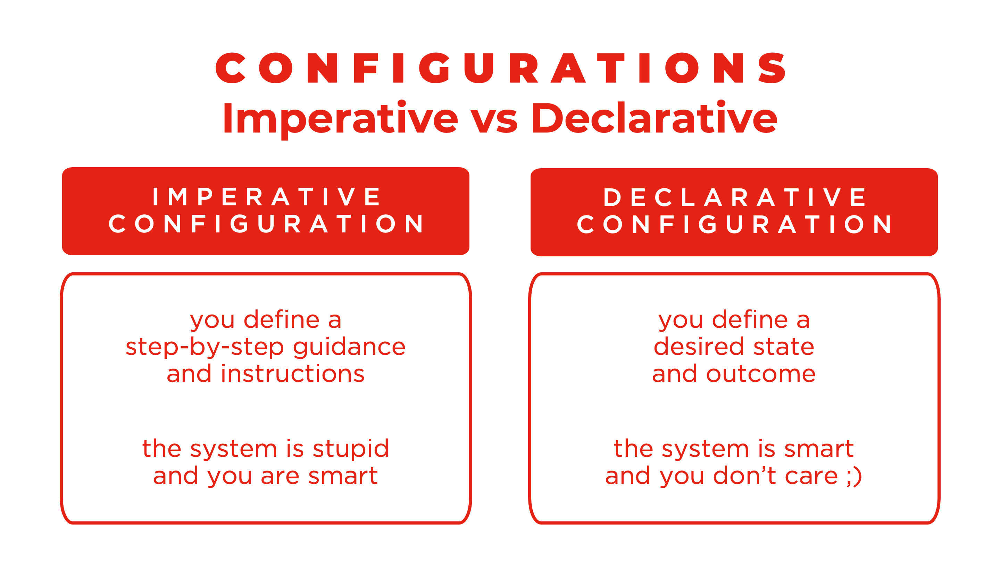

## Features

### Features

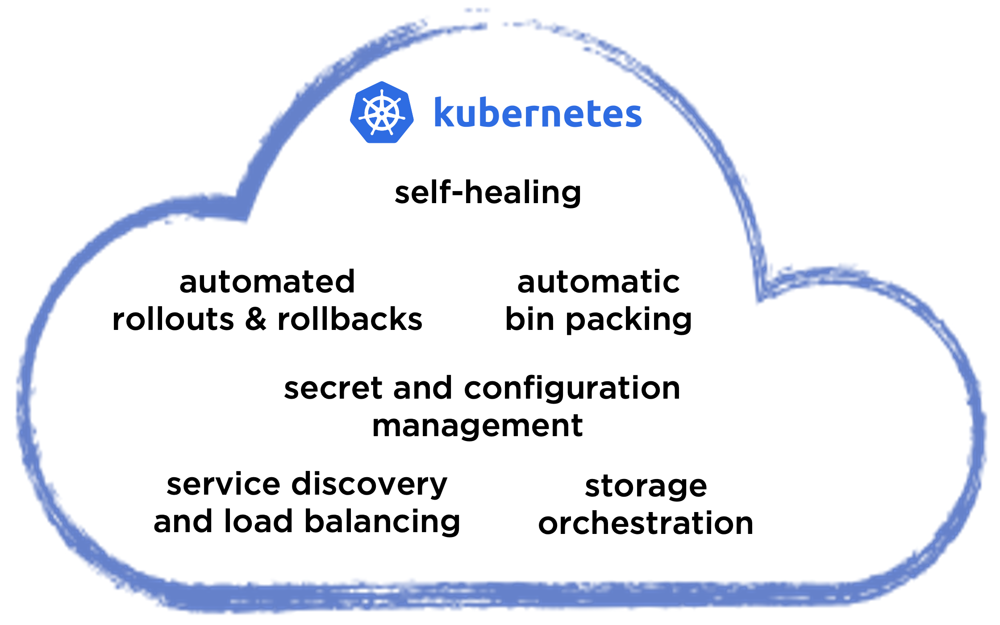

### Kubernetes provides the following features 

#### self-healing
Kubernetes restarts containers that fail, replaces containers, kills containers that don't respond to your user-defined health check, and doesn't advertise them to clients until they are ready to serve.

#### automatic bin packing
you provide Kubernetes with a cluster of nodes that it can use to run containerized tasks. You tell Kubernetes how much CPU and RAM each container needs. Kubernetes can fit containers onto your nodes to make the best use of your resources.

#### automated rollouts and rollbacks
you can describe the desired state for your deployed containers using Kubernetes. It can change the actual state to the desired state at a controlled rate; e.g. you can automate Kubernetes to create new containers, remove existing containers and adopt all their resources to the new container.

#### secret and configuration management
Kubernetes lets you store and manage sensitive information, such as passwords, OAuth tokens, and SSH keys. You can deploy and update secrets and application configuration without rebuilding your container images without exposing secrets in your setup.

#### service discovery and load balancing
Kubernetes can expose a container using the DNS name or using their IP address. If traffic to a container is high, Kubernetes can load balance and distribute the network traffic to stabilize the deployment.

#### storage orchestration
Kubernetes allows you to automatically mount a storage system of your choice, such as local storages, public cloud providers, and more.

## Kubernetes ...

### Kubernetes is ...

... __providing__ the building blocks for creating developer and infrastructure platforms but preserves user choice and flexibility where it is essential.

... __extensible__, and lets users integrate their logging, monitoring, alerting, and many more solutions because it is not monolithic, and these solutions are optional and pluggable.

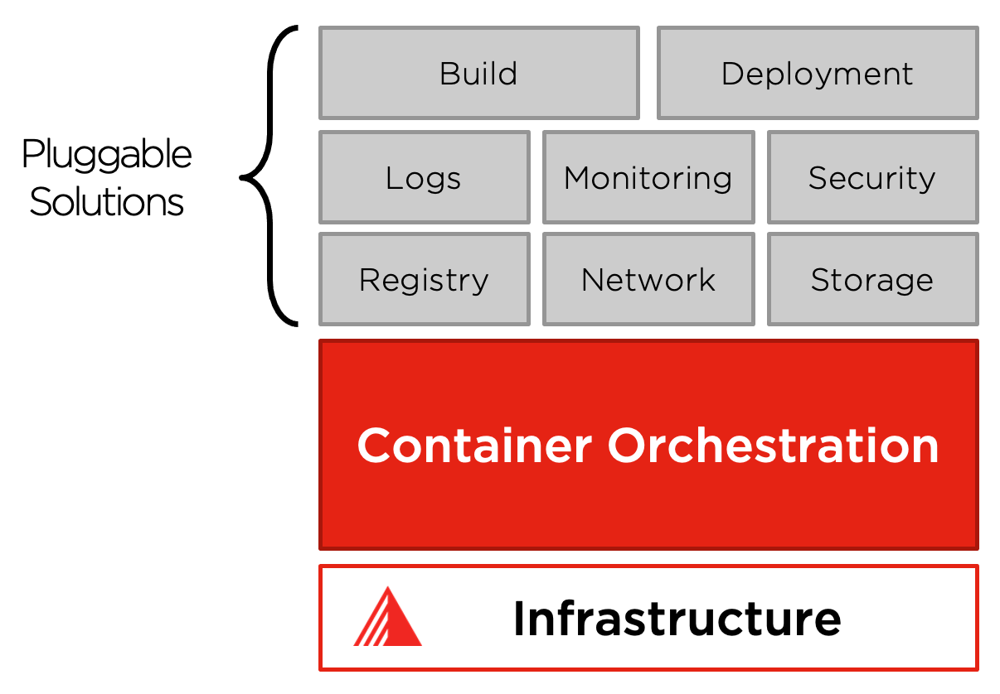

### Kubernetes does NOT ...

... __limit the types of applications supported__.

Kubernetes aims to support a highly diverse workload, including stateless, stateful, and data-processing workloads. If an application can run in a container, it should run great on Kubernetes.

... __deploy source code and does not build your application__.

Organizational cultures determine Continuous Integration, Delivery, and Deployment (CI/CD) workflows and preferences and technical requirements.

... __provide application-level services__;

such as middleware, data-processing frameworks, databases, caches, nor cluster storage systems as built-in services. Application access through portable mechanisms the components mentioned above - both are running Kubernetes.

... __provide nor adopt any comprehensive machine management__.

The task requires additional components for system configuration, system management & maintenance, etc...

### Kubernetes is NOT ...

... __a traditional, all-inclusive PaaS system__.

Kubernetes operates at the container level rather than at the hardware level. It provides some generally helpful features common to PaaS offerings, such as deployment, scaling, load balancing.

... __a mere orchestration system__.

It eliminates the need for orchestration. The definition of orchestration is executing a defined workflow:

* first, do A, then B, then C → __imperative__.

Kubernetes comprises independent, composable control processes that continuously drive the current state:

* towards the desired state → __declarative__.

## Important Building Blocks

### Important Building Blocks

An application running on Kubernetes is a workload. Whether your workload is a single component or several that work together, on Kubernetes, you run it inside a set of Pods. In Kubernetes, a Pod represents a set of running containers on your cluster.

A critical fault on the node where your Pod runs means that all the Pods on that node fail. Kubernetes treats that level of failure as final: you would need to create a new Pod to recover, even if the node later becomes healthy. However, to make life easier, you don't need to manage each Pod directly.

Instead, you can use workload resources that address a set of Pods on your behalf. These resources configure controllers that ensure the correct number and right kind of Pods are running to match the state you specified.
Kubernetes provides several built-in workload resources: Pods, ReplicaSet, Deployment, DaemonSet, Ingress, and CronJob, to name a few of those building blocks.

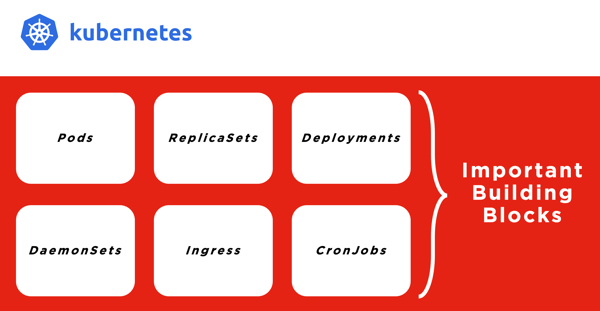

## PODs

### PODs

Pods are the basic building blocks to run containers inside of Kubernetes. Every Pod holds at least one container and controls the execution of that container. If all containers terminate, the Pod terminates too. Mounting storage, setting environment variables, and feed information into the container are all functions provided by the Pod.

Pods are the smallest deployable units of computing that you can create and manage in Kubernetes. Pods in a Kubernetes cluster are used in two main ways:

* __Pods that run a single container__

The "one-container-per-Pod" model is the most common Kubernetes use case; in this case, you can think of a Pod as a wrapper around a single container; Kubernetes manages Pods rather than managing the containers directly.

* __Pods that run multiple containers that need to work together__

A Pod can encapsulate an application composed of multiple co-located containers tightly coupled and need to share resources. These co-located containers form a single cohesive unit of service—for example, one container serving data stored in a shared volume to the public. In contrast, a separate sidecar container refreshes or updates those files. The Pod wraps these containers, storage resources, and an ephemeral network identity together as a single unit.

## REPLICASETs

### REPLICASETs

A ReplicaSet's purpose is to maintain a stable set of replica Pods running at any given time to guarantee the availability of a specified number of identical Pods. However, a Deployment is a higher-level concept that manages ReplicaSets and provides declarative updates to Pods and other useful features. Therefore, Deployments are recommended instead of directly using ReplicaSets.

## DEPLOYMENTs

### DEPLOYMENTs

A Deployment is a higher-order abstraction that controls deploying and maintaining a set of Pods. Behind the scenes, it uses a ReplicaSet to keep the Pods running, but it offers sophisticated logic for deploying, updating, and scaling a set of Pods within a cluster. Deployments support rollbacks and rolling updates. Rollouts can be paused if needed.

## DEAMONSETs

### DEAMONSETs

DaemonSets have many use cases – one frequent pattern is to use DaemonSets to install or configure each host node. DaemonSets provide a way to ensure that a Pod copy is running on every node in the cluster. As a cluster grows and shrinks, the DaemonSet spreads these specially labelled Pods across all nodes.

## INGRESS

### INGRESS

Route traffic to and from the cluster. Provide a single SSL endpoint for multiple applications. Many implementations of an ingress allow you to customize your platform. Ingresses provide a way to declare that they should channel traffic from the outside of the cluster into destination points within the cluster. One single external Ingress point can accept traffic destined to many internal services.

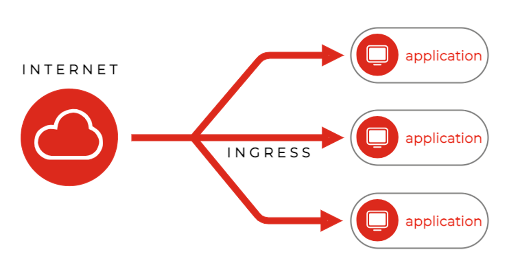

## CRONJOBs

### CRONJOBs

Use familiar `cron` syntax to schedule tasks. CronJobs are part of the Batch API for creating short-lived non-server tools. CronJobs provide a method for scheduling the execution of Pods. They are excellent for running periodic tasks like backups, reports, and automated tests.

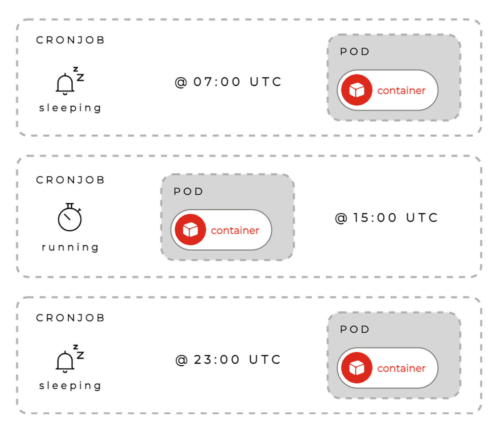

## Managed Kubernetes

### Managed Kubernetes

Suppose you don't have the time, the budget, and the human resources to master all the complexity of Kubernetes on your own. In that case, your best option is to select a managed alternative to benefit from the power of Kubernetes in your developer and infrastructure platforms.

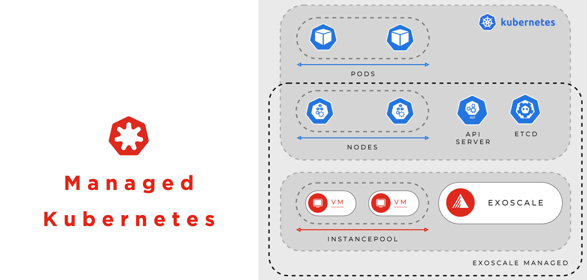

A simple who is responsible for what and pain versus gain comparison from available solutions should paint a clear picture of the golden mean, which is managed Kubernetes for most newcomers to the topic at hand.

> To say that __Kubernetes is the leading container orchestration platform__ is an understatement. It’s the only container orchestration platform that counts. However, to say that Kubernetes is complex is also an understatement. __The learning curve is both steep and long.__

## Managed Ecosystems

### Container Orchestration Ecosystem

While Kubernetes solves the orchestration part, additional components are needed to deploy and run containers smoothly in production.

Container lifecycle management as well as monitoring, backup, CI/CD, security, logging and registration are all activities needed in container orchestration.

K8s comes with multiple options and plugins for each layer.
Each team has its preferences for ecosystem decisions.

### Managed Container Orchestration Ecosystems

#### SKS
Exoscale's Scalable Kubernetes Service (SKS) built into the platform's core based on vanilla Kubernetes. Easily upgradeable to go along with the progress of the Kubernetes project. A fully open ecosystem with the flexibility to choose all additional pluggable solutions based on your needs. Start a production Kubernetes cluster in seconds. Run from the portal, CLI, API and configuration management tools. The managed service scope is the Kubernetes Cluster, precisely the total lifecycle management of the control plane and the nodes.

#### APPUiO
VSHN's APPUiO is the leading Kubernetes based Container Platform for the design, development and operation of applications. Based on reliable Open Source concepts, such as Docker and Kubernetes, APPUiO supports the DevOps approach. Development, deployment and operation processes are accelerated through automation and self-service. The cooperation between software developers and business organization is also improved. The managed service scope extends into parts of the ecosystem of pluggable Kubernetes solutions, increasing user comfort and reducing user flexibility in individual tool selection.

#### CK8s
Elastisys' Compliant Kubernetes (CK8s) is a security-hardened, CNCF certified Kubernetes distribution that allows organizations to enjoy the benefits of Kubernetes while fulfilling regulatory requirements – all the way from development to deployment to operations and audits. Compliant Kubernetes comes pre-configured with CNCF approved open source projects that make life easier at audits and enforces compliance policies for your workloads, helping fulfil regulatory standards. You can rely on pre-configured templates and best practices and define your policies to achieve your regulatory goals. The managed service scope is fully managed.

## Scalable Kubernetes Service

### Scalable, On-demand Kubernetes Cluster

Start with a privacy-minded public cloud to host from single applications to complex architectures. Deploy a production-ready cluster in 90 seconds and manage it with a simple web portal, CLI, API or your choice of tools (Terraform).

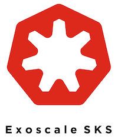

### SKS Features

#### Access to all compute instance types

It is your cluster on your terms. Size the Node-Pools as needed, using all instance types available. Attach one Node-Pool with Memory-Optimized instances and another one with CPU-Optimized ones.

#### Full cluster lifecycle management

Kubernetes is a fast-changing platform, and versions roll out fast. SKS has built-in commands to upgrade your control plane seamlessly – minimizing downtimes and errors.

#### Integration with NLB and Instance Pools

Manage ingress traffic with Exoscale Network Load Balancer support directly integrated into SKS management. Scale pools from Kubernetes using Instance Pools.

#### High-Availability control plane

With the PRO SKS plan, benefit from a resilient HA Kubernetes control plane, so your workloads are always up.

#### Simple and transparent pricing

With a free STARTER version and an affordable PRO plan, SKS provides straightforward pricing. Nodes are charged their usual rate with no extra cluster management fee.

#### All zones
Deploy your cluster where you need to, in the region that suits your latency, privacy or redundancy strategy.

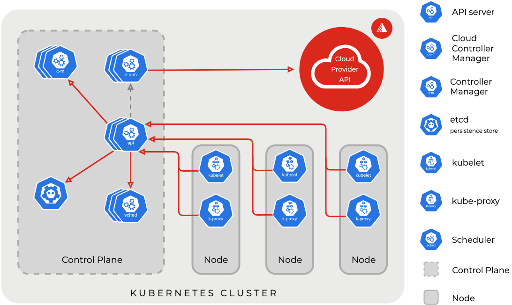

## Packaging & Pricing

### Packaging & Pricing

[SKS Pricing](https://www.exoscale.com/pricing/#sks)

