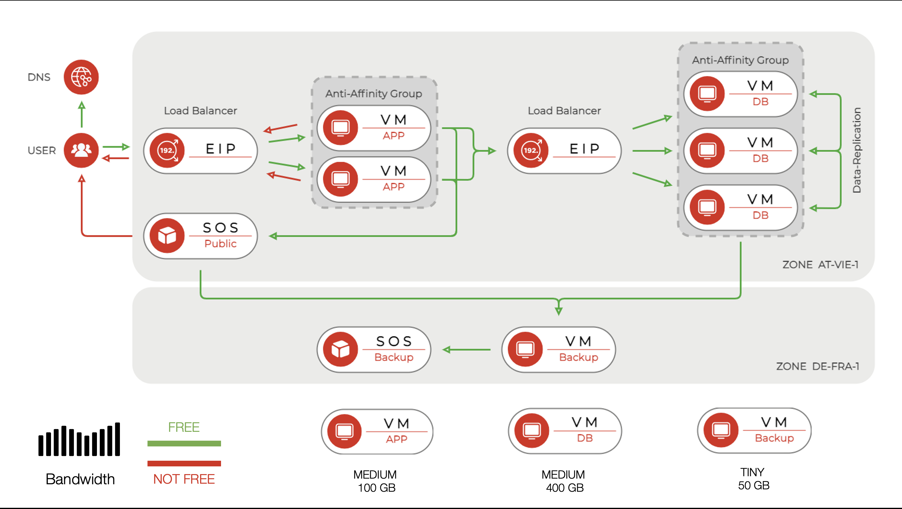
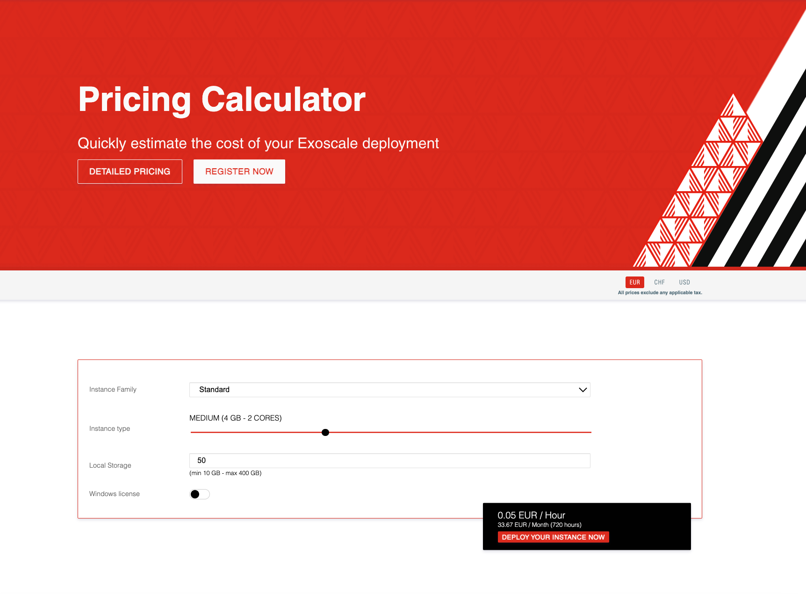

## Typical Web Application

### A Typical Web Application

Our example architecture consists of the following explained components, and it demonstrates the practical usage of several products together and the associated costs. 

#### Application Servers
run the web application. The application reads from the DB servers via the Elastic IP v2, and users access this web service via another Elastic IP v2 that distributes traffic evenly among them. Upload user files to the Public File Bucket. Installed in an Anti-Affinity group.

#### Database Server
operate a shared database (MySQL, MongoDB, etc.) that is capable of replicating data. Installed in an anti-affinity group to ensure that the individual components are never on the same physical host. 

#### Backup Server
responsible for reading the data and uploading it to the Backup Bucket object storage. 

#### Public File Bucket
stores and publishes user files, such as profile pictures, and makes them publicly available.

#### Backup Bucket
holds the backups of the DB servers and the Public File Bucket.

#### Elastic IP
in v2 is used as a simple load balancer in this scenario that distributes traffic evenly.

#### Exoscale DNS
responsible for resolving the service domain name (example.com).





#### VIDEO
[A Typical Web Application](https://sos-de-fra-1.exo.io/exoscale-academy/videos/typical_web_app.mp4)


## Calculate Product Pricing

### Calculate Product Pricing

Usually, you want to know the cost for a resource on a monthly basis, like you know your cost for other subscriptions like your mobile data plan, Spotify, Netflix and so forth.

The official pricing can be found on the web <a href="https://www.exoscale.com/pricing/" target="_blank">__exoscle.com/pricing __</a>
and in the official price list. There you can find hourly pricing for the different products. In the Exoscale realm, we calculate with 720 hours per month, and other cloud providers use, e.g. 730 hours per month, this information is relevant if you want to compare monthly pricing.


#### Application Server Instances Calculation
```
2 x 720 x (100 x 0.00014 + 0.04666) = €87.35/month
```
* 2x Medium (€0.04666/h)
* 100 GB disk (€0.00014/h/GB)
* 720 hours per month

#### Database Server Instances Calculation
```
3 x 720 x (400 x 0.00014 + 0.04666) = €221.75/month
```
* 3x Medium (€0.04666/h)
* 400 GB disk (€0.00014/h/GB)
* 720 hours per month

#### Backup Server Instance Calculation
```
1 x 720 x (50 x 0.00014 + 0.01458) = €15.54/month
```
* 1x Tiny (€0.01458/h)
* 50 GB disk (€0.00014/h/GB)
* 720 hours per month

#### Elastic IP Calculation
```
2 x 720 x 0.01389 = €20.00/month
```
* 2x Elastic IP v2 (€0.01389/h)
* 720 hours per month

#### Exoscale DNS Calculation
```
1x SMALL = €1/month
```
* 1x SMALL
* monthly subscription

With DNS you enrol to a monthly recurring subscription, automatically renewed.
Every package entitles you to register up to the indicated number of zones.

```
SMALL     ( 1 Zone  =   €1/month)
MEDIUM    (10 Zones =   €5/month)
LARGE     (50 Zones =  €25/month)
``` 

## Calculate Scenario Pricing

### Calculate Scenario Pricing

For an overall scenario pricing, we have to add up all component prices - like the ones we calculated before - in our scenario, add data transfers to the internet and amount of storage in rest to the equation.

Additional storage costs are associated with the Simple Object Storage (SOS). A scalable, reliable, and cost-effective solution to support your application. Backup or serve your data from any Exoscale zone with no hidden fees, using your existing S3-compatible tooling and a familiar API.


#### Application Server Data Transfer Calculation
```
6 x 720 x 1.42 GB = 6134.40 GB/month
```
* data transfer to the Internet: 1000 GB/month
* free tier definition = 1.42 GB/h/instance

The free tier for our web-application consisting of 6 instances is 6134 GB; the monthly data transfer is 1000 GB to the Internet; hence it is below the free tier for our scenario.


#### Public File Bucket Calculation
```
200 x 0.020 + 10000 x 0.020 = €204.00/month
```
* 200 GB data stored
* 10 TB data transferred (10000 GB)


#### Backup Bucket Calculation
```
1000 x 0.020 = €20.00/month
```
* 1 TB data stored (1000 GB)


#### Calculation of Complete Scenario

```
Application Server Instances            €  87.35/month
Database Server Instances               € 221.75/month
Backup Server Instance	                €  15.54/month
Elastic IP	                            €  20.00/month
DNS	                                    €   1.00/month
Application Server Data Transfer        €   0.00/month
Public File Bucket	                    € 204.00/month
Backup Bucket                           €  20.00/month
------------------------------------------------------
TOTAL                                   € 569.64/month
```

## Pricing Calculator

### Pricing Calculator

A simple and convenient tool to get product pricing for various configurations
always available here:

<a href="http://www.exoscale.com/calculator/" target="_blank">__www.exoscale.com/calculator__</a>
   



