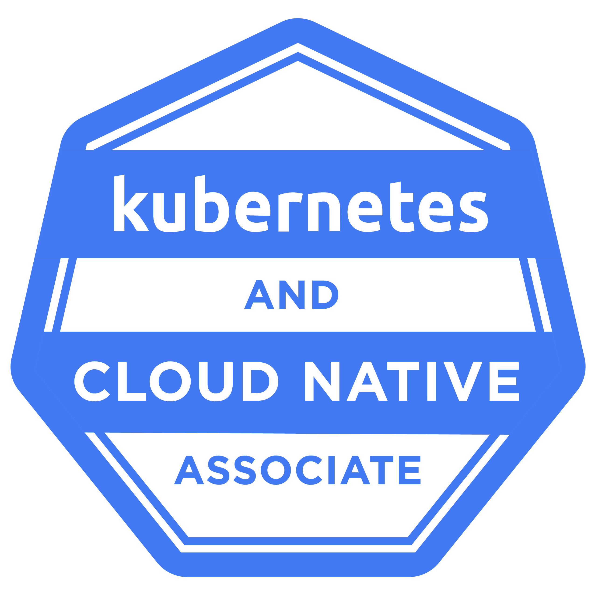
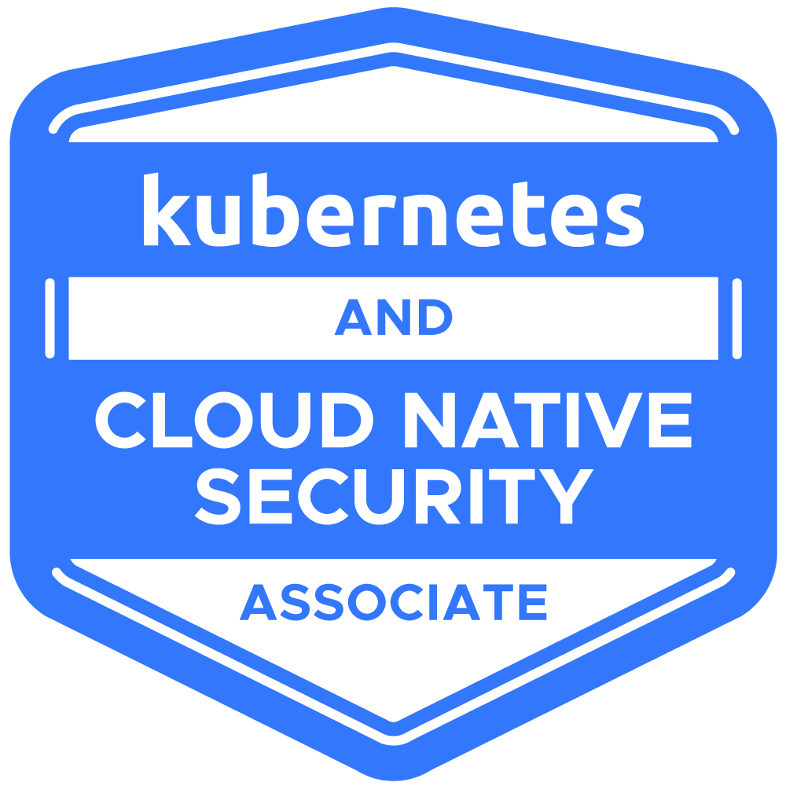
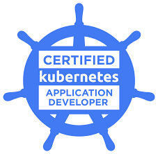
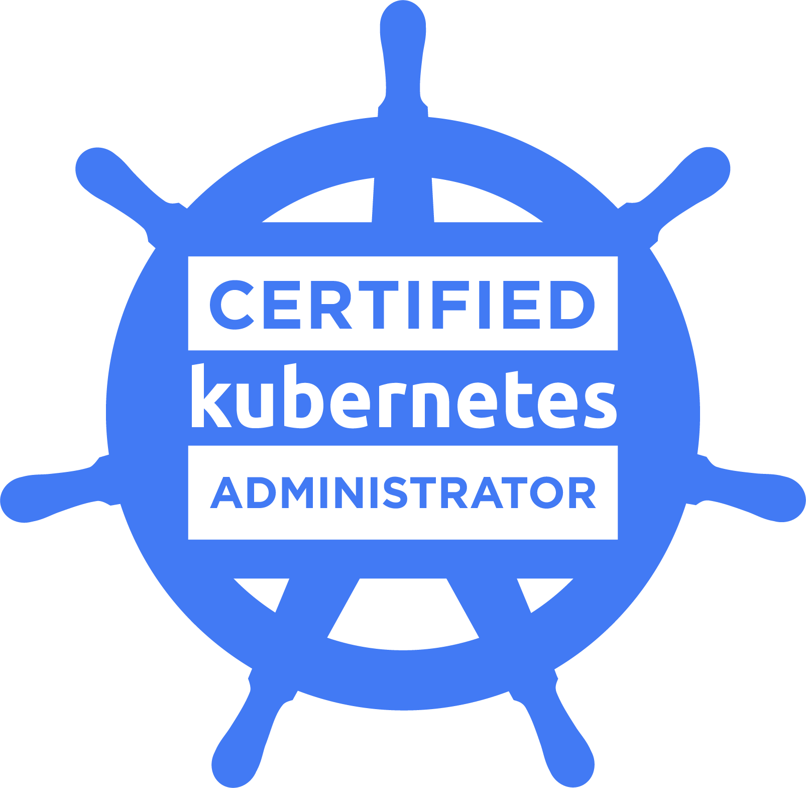
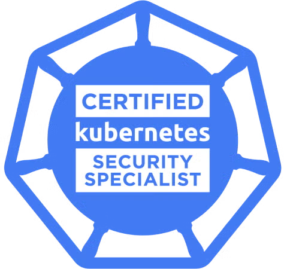
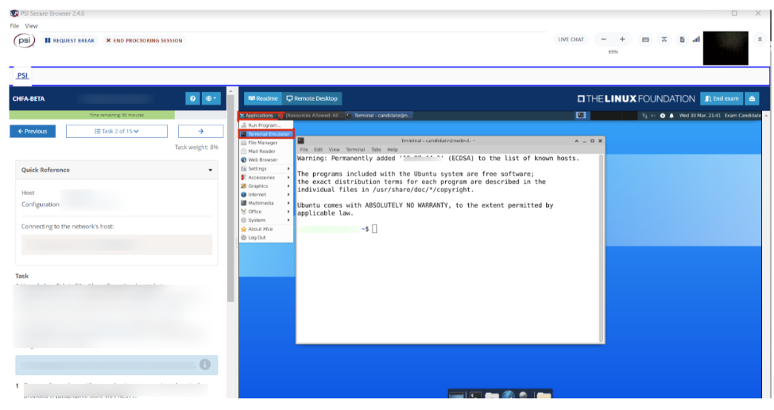

## Several certifications available

The [CNCF](https://cncf.io) delivers several Kubernetes certifications, which are listed in the following table.

| Certification                                         | Type     ||
|-------------------------------------------------------|----------|---------------------------------------------|
| Kubernetes and Cloud Native Associate (KCNA)          | MCQ |  |
| Kubernetes and Cloud Native Security Associate (KCSA) | MCQ |  |
| Certified Kubernetes Application Developer (CKAD)     | Practice |  |
| Certified Kubernetes Administrator (CKA)              | Practice      |   |
| Certified Kubernetes Security Specialist (CKS)<br/>*passing the CKA is a requirement before passing the CKS| Practice |   |

If you pass all those certifications, you become a [https://www.cncf.io/training/kubestronaut/](https://www.cncf.io/training/kubestronaut/).

## Expectation for the CKA

The following table summarizes the distribution of the CKA questions across 5 main subjects.

|                         Subject                    |  %  |
|----------------------------------------------------|-----|
| Cluster Architecture, Installation & Configuration | 25% |
| Workloads & Scheduling                             | 15% |
| Services & Networking                              | 20% |
| Storage                                            | 10% |
| Troubleshooting                                    | 30% |

## CKA Environment

The CKA is a 2h exam. It contains 15/20 questions and requires at least 66% correct answers. This exam is remotely proctored, so you can take it from home (or any other quiet location) at a time that best suits your schedule.

Before launching the exam, which you do via your [Linux Foundation Training Portal](https://trainingportal.linuxfoundation.org/access/saml/login), you need to perform a couple of prerequisites including making sure the PSI Browser works correctly on your environment. This browser gives you access to the remote Desktop you'll use during the exam.



## Tips & tricks

### Tools

Make sure you have a basic knowledge of

- vi/vim

As this editor is available on almost all Linux distributions, knowing the basic commands is important to be able to create/edit a file quickly.

- openssl

The following command can be useful to verify the content of a certificate.

```bash
openssl x509 -in cert.crt -noout -text
```

- systemd / systemctl / journalctl

systemd related commands are useful to start/restart/stop and get the logs of processes.

```bash
# Restart kubelet
systemctl restart kubelet

# Check kubelet logs
journalctl -u kubelet
```

- sysctl

You may need this tool to change ipv4 forwarding or other networking things

```bash
# Check is ipv4 forwarding is enabled
sysctl net.ipv4.ip_forward

# Enable ipv4 forwarding
sysctl -w net.ipv4.ip_forward=1

# Disable ipv4 forwarding
sysctl -w net.ipv4.ip_forward=0
```

- dpkg

During the exam you may be requested to install a package from its .deb file

```bash
sudo dpkg -i my-package.deb
```

- crictl

crictl is a command-line interface for CRI-compatible container runtimes. It can be used to inspect and debug container runtimes and applications (pods / containers) on a Kubernetes node. During the exam, you may be asked to install crictl.

```bash
wget https://github.com/kubernetes-sigs/cri-tools/releases/download/v1.33.0/crictl-v1.33.0-linux-amd64.tar.gz
tar xvf crictl-v1.33.0-linux-amd64.tar.gz 
sudo mv crictl /usr/local/bin/
```


you should be given the exact name/path of the package


### Aliases

Definiing a couple of aliases at the very beginning of the examination could save time.

```bash
alias k=kubectl
export dr=”--dry-run=client -o yaml”
export fd=”--grace-period=0 --force”
```

### Imperative commands

Don’t create specifications manually, instead use ```--dry-run=client -o yaml``` as in these examples.

```bash
k run nginx --image=nginx:1.20 --dry-run=client -o yaml > pod.yaml
k create deploy www --image=nginx:1.20 --replicas=3 --dry-run=client -o yaml > deploy.yaml
k create role create-pod --verb=create --resource=pods --dry-run=client -o yaml > role.yaml
```

Quickly change the current Namespace.

```bash
k config set-context --current --namespace=dev
```

Don't wait for the grace period to get rid of a Pod.

```bash
k delete po nginx --force --grace-period=0
```

### Reference guide

The [Kubectl quick reference guide](https://kubernetes.io/docs/reference/kubectl/quick-reference/) is a must-read.

### Access to am exam simulator

Registering for the CKA gives you access to two sessions of the official Exam simulator. I hightly recommend using these sessions once you're almost ready.


The CKA is Very practical, so make sure you practice a lot!
