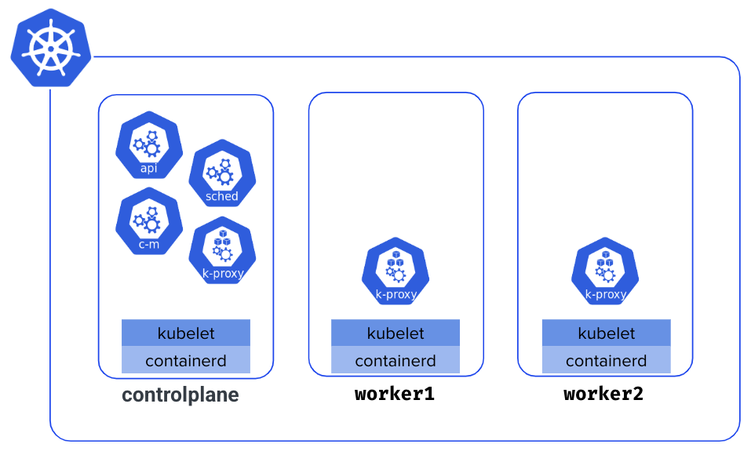
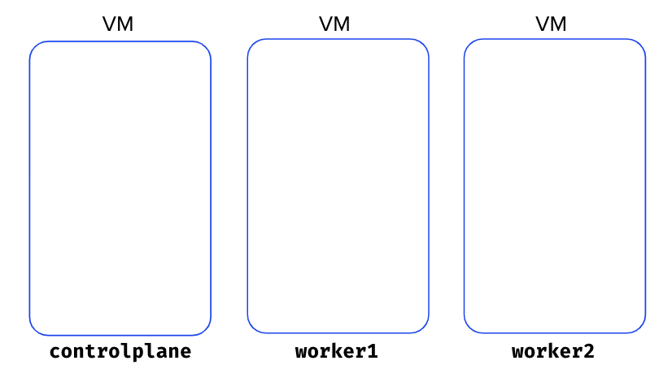
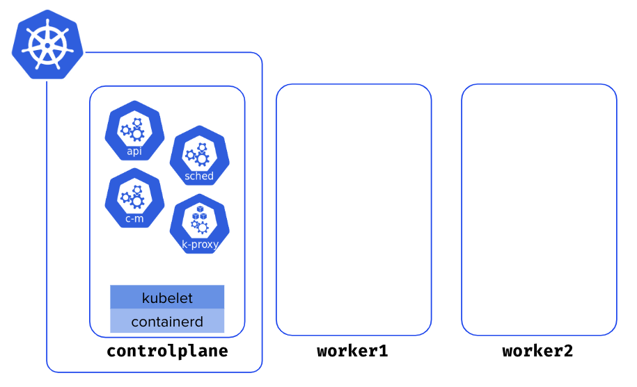

This section guides you in creating of a 3-nodes Kubernetes cluster using [kubeadm](https://kubernetes.io/docs/reference/setup-tools/kubeadm/) bootstrapping tool. This is an important step as you will use this cluster throughout this workshop.

The cluster you'll create is composed of 3 Nodes named **controlplane**, **worker1** and **worker2**. The **controlplane** Node runs the cluster components (API Server, Controller Manager, Scheduler, etcd), while **worker1** and **worker2** are the worker Nodes in charge of running the containerized workloads.



## Provisioning VMs


This workshop requires [Multipass](https://multipass.run) for VM management, especially for the Challenges section. The scripts are specifically designed for Multipass environments.


[Multipass](https://multipass.run) is a lightweight VM manager from [Canonical](https://canonical.com/) that makes creating local VMs simple and fast. Once you have installed Multipass, create the VMs as follows:

```bash
multipass launch --name controlplane --memory 2G --cpus 2 --disk 10G
multipass launch --name worker1 --memory 2G --cpus 2 --disk 10G
multipass launch --name worker2 --memory 2G --cpus 2 --disk 10G
```



## Cluster initialization

Now that the VMs are created, you need to install some dependencies on each on them (a couple of packages including kubectl, containerd and kubeadm). To simplify this process we provide some scripts that will do this job for you. 

First, ssh on the **controlplane** VM and install those dependencies using the following command.

```bash
curl https://luc.run/kubeadm/controlplane.sh | VERSION="1.32" sh
```


You are requested to create a Kubernetes cluster in version 1.32, which is not the latest version. In the last part of this workshop, you'll learn how to upgrade it to version 1.33 which is the latest release.


Next, still from the **controlplane** VM, initialize the cluster.

```bash
sudo kubeadm init
```

The initialization should take a few tens of seconds. The list below shows all the steps it takes.

```bash
preflight                     Run pre-flight checks
certs                         Certificate generation
  /ca                           Generate the self-signed Kubernetes CA to provision identities for other Kubernetes components
  /apiserver                    Generate the certificate for serving the Kubernetes API
  /apiserver-kubelet-client     Generate the certificate for the API server to connect to kubelet
  /front-proxy-ca               Generate the self-signed CA to provision identities for front proxy
  /front-proxy-client           Generate the certificate for the front proxy client
  /etcd-ca                      Generate the self-signed CA to provision identities for etcd
  /etcd-server                  Generate the certificate for serving etcd
  /etcd-peer                    Generate the certificate for etcd nodes to communicate with each other
  /etcd-healthcheck-client      Generate the certificate for liveness probes to healthcheck etcd
  /apiserver-etcd-client        Generate the certificate the apiserver uses to access etcd
  /sa                           Generate a private key for signing service account tokens along with its public key
kubeconfig                    Generate all kubeconfig files necessary to establish the control plane and the admin kubeconfig file
  /admin                        Generate a kubeconfig file for the admin to use and for kubeadm itself
  /super-admin                  Generate a kubeconfig file for the super-admin
  /kubelet                      Generate a kubeconfig file for the kubelet to use *only* for cluster bootstrapping purposes
  /controller-manager           Generate a kubeconfig file for the controller manager to use
  /scheduler                    Generate a kubeconfig file for the scheduler to use
etcd                          Generate static Pod manifest file for local etcd
  /local                        Generate the static Pod manifest file for a local, single-node local etcd instance
control-plane                 Generate all static Pod manifest files necessary to establish the control plane
  /apiserver                    Generates the kube-apiserver static Pod manifest
  /controller-manager           Generates the kube-controller-manager static Pod manifest
  /scheduler                    Generates the kube-scheduler static Pod manifest
kubelet-start                 Write kubelet settings and (re)start the kubelet
upload-config                 Upload the kubeadm and kubelet configuration to a ConfigMap
  /kubeadm                      Upload the kubeadm ClusterConfiguration to a ConfigMap
  /kubelet                      Upload the kubelet component config to a ConfigMap
upload-certs                  Upload certificates to kubeadm-certs
mark-control-plane            Mark a node as a control-plane
bootstrap-token               Generates bootstrap tokens used to join a node to a cluster
kubelet-finalize              Updates settings relevant to the kubelet after TLS bootstrap
  /enable-client-cert-rotation  Enable kubelet client certificate rotation
addon                         Install required addons for passing conformance tests
  /coredns                      Install the CoreDNS addon to a Kubernetes cluster
  /kube-proxy                   Install the kube-proxy addon to a Kubernetes cluster
show-join-command             Show the join command for control-plane and worker node
```

Several commands are returned at the end of the installation process, which you'll use in the next part.



## Retrieving kubeconfig file

The first set of commands returned during the initialization step allows configuring **kubectl** for the current user. Run those commands from a shell in the **controlplane** Node.

```bash
mkdir -p $HOME/.kube
sudo cp -i /etc/kubernetes/admin.conf $HOME/.kube/config
sudo chown $(id -u):$(id -g) $HOME/.kube/config
```

You can now list the Nodes. You'll get only one Node as you've not added the worker Nodes yet.

```bash
$ kubectl get no
NAME           STATUS     ROLES           AGE    VERSION
controlplane   NotReady   control-plane   5m4s   v1.32.4
```


Your Kubernetes version may be different.


## Adding the first worker Node

As you've done for the **controlplane**, use the following command to install the dependencies (kubectl, containerd, kubeadm) on **worker1**.

```bash
curl https://luc.run/kubeadm/worker.sh | VERSION="1.32" sh
```

Then, run the join command returned during the initialization step. This command allows you to add worker nodes to the cluster.

```bash
sudo kubeadm join 10.81.0.174:6443 --token kolibl.0oieughn4y03zvm7 \
        --discovery-token-ca-cert-hash sha256:a1d26efca219428731be6b62e3298a2e5014d829e51185e804f2f614b70d933d
```


The token you'll get in this join command will differ from the one in this example.


## Adding the second worker Node

You need to do the same on **worker2**. First, install the dependencies.

```bash
curl https://luc.run/kubeadm/worker.sh | VERSION="1.32" sh
```

Then, run the join command to add this Node to the cluster.

```
sudo kubeadm join 10.81.0.174:6443 --token kolibl.0oieughn4y03zvm7 \
        --discovery-token-ca-cert-hash sha256:a1d26efca219428731be6b62e3298a2e5014d829e51185e804f2f614b70d933d
```

You now have cluster with 3 Nodes.


## Status of the Nodes

List the Nodes and notice they are all in **NotReady** status.

```bash
$ kubectl get nodes
NAME            STATUS     ROLES           AGE     VERSION
controlplane    NotReady   control-plane   9m58s   v1.32.4
worker1         NotReady   <none>          58s     v1.32.4
worker2         NotReady   <none>          55s     v1.32.4
```

If you go one step further and describe the **controlplane** Node, you'll get why the cluster is not ready yet.

```
…
KubeletNotReady              container runtime network not ready: NetworkReady=false reason:NetworkPluginNotReady message:Network plugin returns error: cni plugin not initialized
```


The cluster not operational as no network plugin has been installed


## Installing a network plugin 

Run the following commands from the **controlplane** Node to install **Cilium** in your cluster.

```bash
OS="$(uname | tr '[:upper:]' '[:lower:]')"
ARCH="$(uname -m | sed -e 's/x86_64/amd64/' -e 's/\(arm\)\(64\)\?.*/\1\2/' -e 's/aarch64$/arm64/')"
curl -L --remote-name-all https://github.com/cilium/cilium-cli/releases/latest/download/cilium-$OS-$ARCH.tar.gz{,.sha256sum}
sudo tar xzvfC cilium-$OS-$ARCH.tar.gz /usr/local/bin
cilium install
```


Many network plugins are available (WeaveNet, Calico, Flannel, Cilium, …). We use Cilium in this workshop as it's one of the most widely used.


After a few tens of seconds, you'll see your cluster is ready.

```bash
$ kubectl get nodes
NAME            STATUS   ROLES           AGE     VERSION
controlplane    Ready    control-plane   13m     v1.32.4
worker1         Ready    <none>          4m28s   v1.32.4
worker2         Ready    <none>          4m25s   v1.32.4
```

## Get the kubeconfig on the host machine

To avoid connecting to the **controlplane** Node to run the **kubectl** commands, copy the **kubeconfig** file from the **controlplane** to the host machine. Make sure to copy this file into $HOME/.kube/config so it automatically configures kubectl.


If you've created your VMs with Multipass, you can copy the **kubeconfig** file using the following commands.

```bash
multipass transfer controlplane:/home/ubuntu/.kube/config config
mkdir $HOME/.kube
mv config $HOME/.kube/config
```


You should now be able to direcly list the Nodes from the host machine.

```bash
$ kubectl get nodes
NAME            STATUS   ROLES           AGE     VERSION
controlplane    Ready    control-plane   13m     v1.32.4
worker1         Ready    <none>          4m28s   v1.32.4
worker2         Ready    <none>          4m25s   v1.32.4
```
